MDK的编译过程及文件类型全解
---------------------------

本章参考资料：MDK的帮助手册《ARM Development Tools》，点击MDK界面的“help-&gt;uVision Help”菜单可打开该文件。关于ELF文件格式，参考配套资料里的《ELF文件格式》文件。

在本章中讲解了非常多的文件类型，学习时请跟着教程的节奏，打开实际工程中的文件来了解。

相信您已经非常熟练地使用MDK创建应用程序了，平时使用MDK编写源代码，然后编译生成机器码，再把机器码下载到STM32芯片上运行，但是这个编译、下载的过程MDK究竟做了什么工作？它编译后生成的各种文件又有什么作用？本章节将对这些过程进行讲解，了解编译及下载过程有助于理解芯片的工作原理，这些知识对制作IAP(bootloader)以及读写控制器内部FLASH的应用时非常重要。

### 编译过程

#### 编译过程简介

首先我们简单了解下MDK的编译过程，它与其它编译器的工作过程是类似的，该过程见图 1‑1。

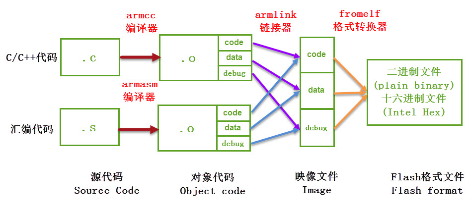

<span class="anchor" id="_Ref445195246"></span>图 1‑1 MDK编译过程

编译过程生成的不同文件将在后面的小节详细说明，此处先抓住主要流程来理解。

1.  编译，MDK软件使用的编译器是armcc和armasm，它们根据每个c/c++和汇编源文件编译成对应的以“.o”为后缀名的对象文件(Object Code，也称目标文件)，其内容主要是从源文件编译得到的机器码，包含了代码、数据以及调试使用的信息；

2.  链接，链接器armlink把各个.o文件及库文件链接成一个映像文件“.axf”或“.elf”；

3.  格式转换，一般来说Windows或Linux系统使用链接器直接生成可执行映像文件elf后，内核根据该文件的信息加载后，就可以运行程序了，但在单片机平台上，需要把该文件的内容加载到芯片上，所以还需要对链接器生成的elf映像文件利用格式转换器fromelf转换成“.bin”或“.hex”文件，交给下载器下载到芯片的FLASH或ROM中。

#### 具体工程中的编译过程

下面我们打开 “<span class="anchor" id="OLE_LINK5"><span class="anchor" id="OLE_LINK6"></span></span>多彩流水灯”的工程，以它为例进行讲解，其它工程的编译过程也是一样的，只是文件有差异。打开工程后，点击MDK的“rebuild”按钮，它会重新构建整个工程，构建的过程会在MDK下方的“Build Output”窗口输出提示信息，见图 1‑2。

&gt; 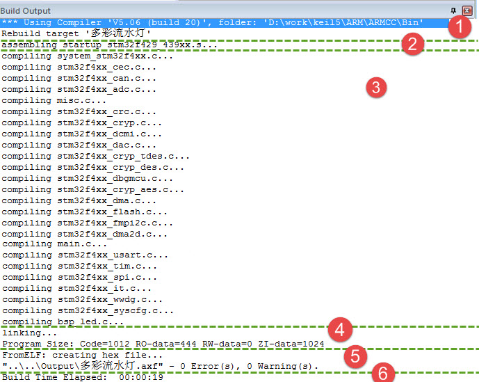
<span class="anchor" id="_Ref445201479"></span>图 1‑2 编译工程时的编译提示

构建工程的提示输出主要分6个部分，说明如下：

1.  提示信息的第一部分说明构建过程调用的编译器。图中的编译器名字是“V5.06(build 20)”，后面附带了该编译器所在的文件夹。在电脑上打开该路径，可看到该编译器包含图 1‑3中的各个编译工具，如armar、armasm、armcc、armlink及fromelf，后面四个工具已在图 1‑1中已讲解，而armar是用于把.o文件打包成lib文件的。

&gt; 
<span class="anchor" id="_Ref445201974"></span>图 1‑3 编译工具

1.  使用armasm编译汇编文件。图中列出了编译startup启动文件时的提示，编译后每个汇编源文件都对应有一个独立的.o文件。

2.  使用armcc编译c/c++文件。图中列出了工程中所有的c/c++文件的提示，同样地，编译后每个c/c++源文件都对应有一个独立的.o文件。

3.  使用armlink链接对象文件，根据程序的调用把各个.o文件的内容链接起来，最后生成程序的axf映像文件，并附带程序各个域大小的说明，包括Code、RO-data、RW-data及ZI-data的大小。

4.  使用fromelf生成下载格式文件，它根据axf映像文件转化成hex文件，并列出编译过程出现的错误(Error)和警告(Warning)数量。

5.  最后一段提示给出了整个构建过程消耗的时间。

构建完成后，可在工程的“Output”及“Listing”目录下找到由以上过程生成的各种文件，见图 1‑4。

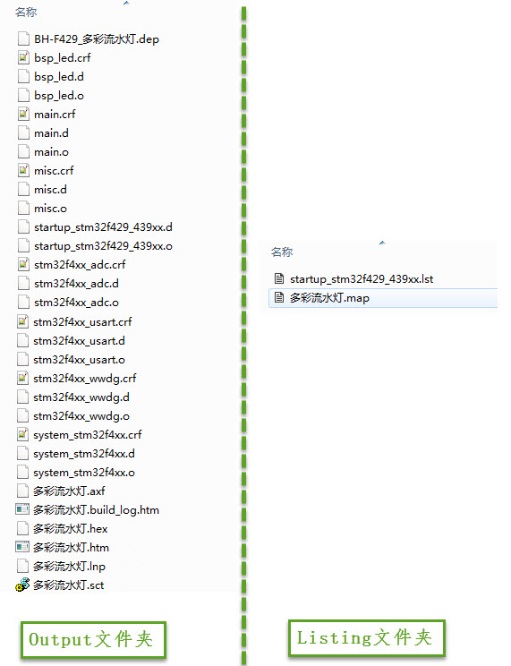
<span class="anchor" id="_Ref445221005"></span>图 1‑4 编译后Output及Listing文件夹中的内容

可以看到，每个C源文件都对应生成了.o、.d及.crf后缀的文件，还有一些额外的.dep、.hex、.axf、.htm、.lnp、.sct、.lst及.map文件。

### 程序的组成、存储与运行

#### CODE、RO、RW、ZI Data域及堆栈空间

在工程的编译提示输出信息中有一个语句“Program Size：Code=xx RO-data=xx RW-data=xx ZI-data=xx”，它说明了程序各个域的大小，编译后，应用程序中所有具有同一性质的数据(包括代码)被归到一个域，程序在存储或运行的时候，不同的域会呈现不同的状态，这些域的意义如下：

-   Code：即代码域，它指的是编译器生成的机器指令，这些内容被存储到ROM区。

-   RO-data：Read Only data，即只读数据域，它指程序中用到的只读数据，这些数据被存储在ROM区，因而程序不能修改其内容。例如C语言中const关键字定义的变量就是典型的RO-data。

-   RW-data：Read Write data，即可读写数据域，它指初始化为“非0值”的可读写数据，程序刚运行时，这些数据具有非0的初始值，且运行的时候它们会常驻在RAM区，因而应用程序可以修改其内容。例如C语言中使用定义的全局变量，且定义时赋予“非0值”给该变量进行初始化。

-   ZI-data：Zero Initialie data，即0初始化数据，它指初始化为“0值”的可读写数据域，它与RW-data的区别是程序刚运行时这些数据初始值全都为0，而后续运行过程与RW-data的性质一样，它们也常驻在RAM区，因而应用程序可以更改其内容。例如C语言中使用定义的全局变量，且定义时赋予“0值”给该变量进行初始化(若定义该变量时没有赋予初始值，编译器会把它当ZI-data来对待，初始化为0)；

-   ZI-data的栈空间(Stack)及堆空间(Heap)：在C语言中，函数内部定义的局部变量属于栈空间，进入函数的时候从向栈空间申请内存给局部变量，退出时释放局部变量，归还内存空间。而使用malloc动态分配的变量属于堆空间。在程序中的栈空间和堆空间都是属于ZI-data区域的，这些空间都会被初始值化为0值。编译器给出的ZI-data占用的空间值中包含了堆栈的大小(经实际测试，若程序中完全没有使用malloc动态申请堆空间，编译器会优化，不把堆空间计算在内)。

&gt; 综上所述，以程序的组成构件为例，它们所属的区域类别见表 1‑1。

<span class="anchor" id="_Ref445478294"></span>表 1‑1 程序组件所属的区域

| 程序组件                 | 所属类别      |
|--------------------------|---------------|
| 机器代码指令             | Code          |
| 常量                     | RO-data       |
| 初值非0的全局变量        | RW-data       |
| 初值为0的全局变量        | ZI-data       |
| 局部变量                 | ZI-data栈空间 |
| 使用malloc动态分配的空间 | ZI-data堆空间 |

#### 程序的存储与运行

RW-data和ZI-data它们仅仅是初始值不一样而已，为什么编译器非要把它们区分开？这就涉及到程序的存储状态了，应用程序具有静止状态和运行状态。静止态的程序被存储在非易失存储器中，如STM32的内部FLASH，因而系统掉电后也能正常保存。但是当程序在运行状态的时候，程序常常需要修改一些暂存数据，由于运行速度的要求，这些数据往往存放在内存中(RAM)，掉电后这些数据会丢失。因此，程序在静止与运行的时候它在存储器中的表现是不一样的，见图 1‑5。


<span class="anchor" id="_Ref445457431"></span>图 1‑5 应用程序的加载视图与执行视图

图中的左侧是应用程序的存储状态，右侧是运行状态，而上方是RAM存储器区域，下方是ROM存储器区域。

程序在存储状态时，RO节(RO section)及RW节都被保存在ROM区。当程序开始运行时，内核直接从ROM中读取代码，并且在执行主体代码前，会先执行一段加载代码，它把RW节数据从ROM复制到RAM， 并且在RAM加入ZI节，ZI节的数据都被初始化为0。加载完后RAM区准备完毕，正式开始执行主体程序。

编译生成的RW-data的数据属于图中的RW节，ZI-data的数据属于图中的ZI节。是否需要掉电保存，这就是把RW-data与ZI-data区别开来的原因，因为在RAM创建数据的时候，默认值为0，但如果有的数据要求初值非0，那就需要使用ROM记录该初始值，运行时再复制到RAM。

STM32的RO区域不需要加载到SRAM，内核直接从FLASH读取指令运行。计算机系统的应用程序运行过程很类似，不过计算机系统的程序在存储状态时位于硬盘，执行的时候甚至会把上述的RO区域(代码、只读数据)加载到内存，加快运行速度，还有虚拟内存管理单元(MMU)辅助加载数据，使得可以运行比物理内存还大的应用程序。而STM32没有MMU，所以无法支持Linux和Windows系统。

当程序存储到STM32芯片的内部FLASH时(即ROM区)，它占用的空间是Code、RO-data及RW-data的总和，所以如果这些内容比STM32芯片的FLASH空间大，程序就无法被正常保存了。当程序在执行的时候，需要占用内部SRAM空间(即RAM区)，占用的空间包括RW-data和ZI-data。应用程序在各个状态时各区域的组成见表 1‑2。

<span class="anchor" id="_Ref445467733"></span>表 1‑2 程序状态区域的组成

| 程序状态与区域             | 组成                     |
|----------------------------|--------------------------|
| 程序执行时的只读区域(RO)   | Code + RO data           |
| 程序执行时的可读写区域(RW) | RW data + ZI data        |
| 程序存储时占用的ROM区      | Code + RO data + RW data |

在MDK中，我们建立的工程一般会选择芯片型号，选择后就有确定的FLASH及SRAM大小，若代码超出了芯片的存储器的极限，编译器会提示错误，这时就需要裁剪程序了，裁剪时可针对超出的区域来优化。

### 编译工具链

在前面编译过程中，MDK调用了各种编译工具，平时我们直接配置MDK，不需要学习如何使用它们，但了解它们是非常有好处的。例如，若希望使用MDK编译生成bin文件的，需要在MDK中输入指令控制fromelf工具；在本章后面讲解AXF及O文件的时候，需要利用fromelf工具查看其文件信息，这都是无法直接通过MDK做到的。关于这些工具链的说明，在MDK的帮助手册《ARM Development Tools》都有详细讲解，点击MDK界面的“help-&gt;uVision Help”菜单可打开该文件。

#### 设置环境变量

调用这些编译工具，需要用到Windows的“命令行提示符工具”，为了让命令行方便地找到这些工具，我们先把工具链的目录添加到系统的环境变量中。查看本机工具链所在的具体目录可根据上一小节讲解的工程编译提示输出信息中找到，如本机的路径为“D:\\work\\keil5\\ARM\\ARMCC\\bin”。

##### 添加路径到PATH环境变量

本文以Win7系统为例添加工具链的路径到PATH环境变量，其它系统是类似的。

1.  右键电脑系统的“计算机图标”，在弹出的菜单中选择“属性”，见图 1‑6；


<span class="anchor" id="_Ref445540035"></span>图 1‑6 计算机属性页面

1.  在弹出的属性页面依次点击“高级系统设置”-&gt;“环境变量”，在用户变量一栏中找到名为“PATH”的变量，若没有该变量，则新建一个。编辑“PATH”变量，在它的变量值中输入工具链的路径，如本机的是“;D:\\work\\keil5\\ARM\\ARMCC\\bin”，注意要使用“分号;”让它与其它路径分隔开，输入完毕后依次点确定，见图 1‑7；


<span class="anchor" id="_Ref445540382"></span>图 1‑7 添加工具链路径到PATH变量

1.  打开Windows的命令行，点击系统的“开始菜单”，在搜索框输入“cmd”，在搜索结果中点击“cmd.exe”即可打开命令行，见图 1‑8；

&gt; 
<span class="anchor" id="_Ref445540788"></span>图 1‑8 打开命令行

1.  在弹出的命令行窗口中输入“fromelf”回车，若窗口打印出formelf的帮助说明，那么路径正常，就可以开始后面的工作了；若提示“不是内部名外部命令，也不是可运行的程序…”信息，说明路径不对，请重新配置环境变量，并确认该工作目录下有编译工具链。

这个过程本质就是让命令行通过“PATH”路径找到“fromelf.exe”程序运行，默认运行“fromelf.exe”时它会输出自己的帮助信息，这就是工具链的调用过程，MDK本质上也是如此调用工具链的，只是它集成为GUI，相对于命令行对用户更友好，毕竟上述配置环境变量的过程已经让新手烦躁了。

#### armcc、armasm及armlink 

接下来我们看看各个工具链的具体用法，主要以armcc为例。

##### armcc

armcc用于把c/c++文件编译成ARM指令代码，编译后会输出ELF格式的O文件(对象、目标文件)，在命令行中输入“armcc”回车可调用该工具，它会打印帮助说明，见图 1‑9


<span class="anchor" id="_Ref445542146"></span>图 1‑9 armcc的帮助提示

帮助提示中分三部分，第一部分是armcc版本信息，第二部分是命令的用法，第三部分是主要命令选项。

根据命令用法： armcc \[options\] file1 file2 ... filen ，在\[option\]位置可输入下面的“--arm”、“--cpu list”选项，若选项带文件输入，则把文件名填充在file1 file2…的位置，这些文件一般是c/c++文件。

例如根据它的帮助说明，“--cpu list”可列出编译器支持的所有cpu，我们在命令行中输入“armcc --cpu list”，可查看图 1‑10中的cpu列表。

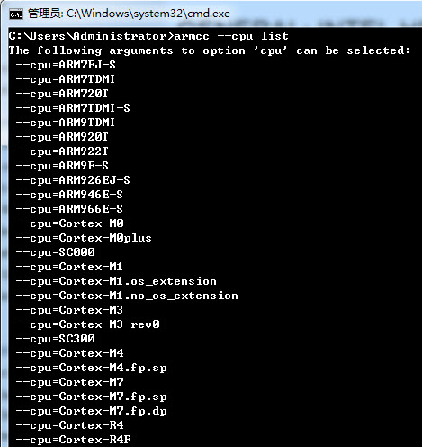
<span class="anchor" id="_Ref445543360"></span>图 1‑10 cpulist

打开MDK的Options for Targe-&gt;c/c++菜单，可看到MDK对编译器的控制命令，见图 1‑11。

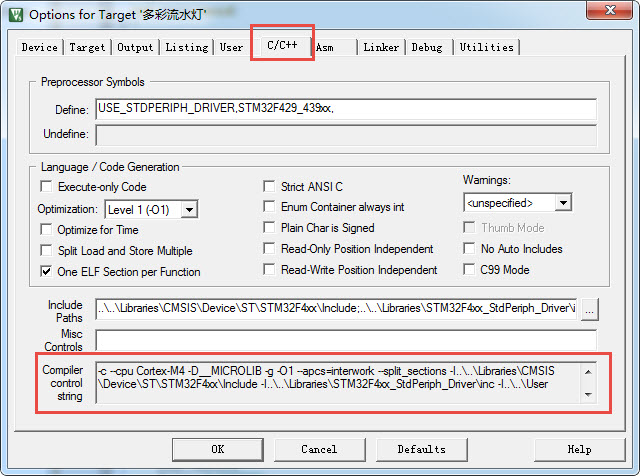
<span class="anchor" id="_Ref445543939"></span>图 1‑11 MDK的ARMCC编译选项

从该图中的命令可看到，它调用了-c、-cpu –D –g –O1等编译选项，当我们修改MDK的编译配置时，可看到该控制命令也会有相应的变化。然而我们无法在该编译选项框中输入命令，只能通过MDK提供的选项修改。

了解这些，我们就可以查询具体的MDK编译选项的具体信息了，如c/c++选项中的“Optimization：Leve 1（-O1）”是什么功能呢？首先可了解到它是“-O”命令，命令后还带个数字，查看MDK的帮助手册，在armcc编译器说明章节，可详细了解，如图 1‑9。


图 1‑12 编译器选项说明

利用MDK，我们一般不需要自己调用armcc工具，但经过这样的过程我们就会对MDK有更深入的认识，面对它的各种编译选项，就不会那么头疼了。

##### armasm

armasm是汇编器，它把汇编文件编译成O文件。与armcc类似，MDK对armasm的调用选项可在“Option for Target-&gt;Asm”页面进行配置，见图 1‑13。

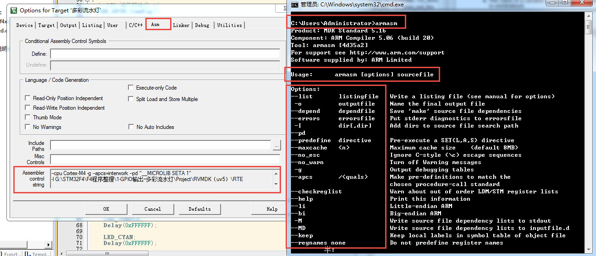
<span class="anchor" id="_Ref445545302"></span>图 1‑13 armasm与MDK的编译选项

##### armlink

armlink是链接器，它把各个O文件链接组合在一起生成ELF格式的AXF文件，AXF文件是可执行的，下载器把该文件中的指令代码下载到芯片后，该芯片就能运行程序了；利用armlink还可以控制程序存储到指定的ROM或RAM地址。在MDK中可在“Option for Target-&gt;Linker”页面配置armlink选项，见图 1‑14。

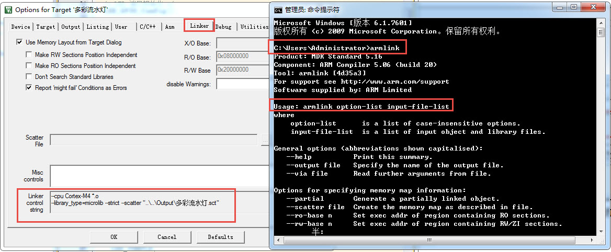
<span class="anchor" id="_Ref445554188"></span>图 1‑14 armlink与MDK的配置选项

链接器默认是根据芯片类型的存储器分布来生成程序的，该存储器分布被记录在工程里的sct后缀的文件中，有特殊需要的话可自行编辑该文件，改变链接器的链接方式，具体后面我们会详细讲解。

#### armar、fromelf及用户指令 

armar工具用于把工程打包成库文件，fromelf可根据axf文件生成hex、bin文件，hex和bin文件是大多数下载器支持的下载文件格式。

在MDK中，针对armar和fromelf工具的选项几乎没有，仅集成了生成HEX或Lib的选项，见图 1‑15。

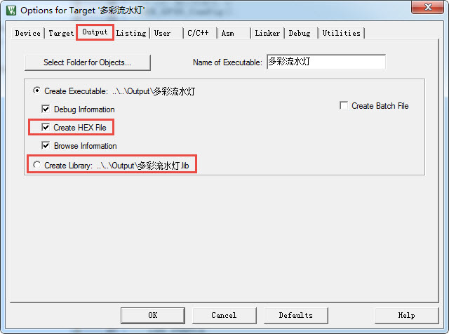
<span class="anchor" id="_Ref445555448"></span>图 1‑15 MDK中，控制fromelf生成hex及控制armar生成lib的配置

例如如果我们想利用fromelf生成bin文件，可以在MDK的“Option for Target-&gt;User”页中添加调用fromelf的指令，见图 1‑16。


<span class="anchor" id="_Ref445555858"></span>图 1‑16 在MDK中添加指令

在User配置页面中，提供了三种类型的用户指令输入框，在不同组的框输入指令，可控制指令的执行时间，分别是编译前(Before Compile c/c++ file)、构建前(Before Build/Rebuild)及构建后(After Build/Rebuild)执行。这些指令并没有限制必须是arm的编译工具链，例如如果您自己编写了python脚本，也可以在这里输入用户指令执行该脚本。

图中的生成bin文件指令调用了fromelf工具，紧跟后面的是工具的选项及输出文件名、输入文件名。由于fromelf是根据axf文件生成bin的，而axf文件又是构建(build)工程后才生成，所以我们把该指令放到“After Build/Rebuild”一栏。

### MDK工程的文件类型

除了上述编译过程生成的文件，MDK工程中还包含了各种各样的文件，下面我们统一介绍，MDK工程的常见文件类型见表 1‑3。

<span class="anchor" id="_Ref445221324"></span>表 1‑3 MDK常见的文件类型(不分大小写)

| 后缀                    | 说明                                                                                                                                                |
|-------------------------|-----------------------------------------------------------------------------------------------------------------------------------------------------|
| Project目录下的工程文件 |
| \*.uvguix               | MDK5工程的窗口布局文件，在MDK4中\*.UVGUI后缀的文件功能相同                                                                                          |
| \*.uvprojx              | MDK5的工程文件，它使用了XML格式记录了工程结构，双击它可以打开整个工程，在MDK4中\*.UVPROJ后缀的文件功能相同                                          |
| \*.uvoptx               | MDK5的工程配置选项，包含debugger、trace configuration、breakpooints以及当前打开的文件，在MDK4中\*.UVOPT后缀的文件功能相同                           |
| \*.ini                  | 某些下载器的配置记录文件                                                                                                                            |
| 源文件                  |
| \*.c                    | C语言源文件                                                                                                                                         |
| \*.cpp                  | C++语言源文件                                                                                                                                       |
| \*.h                    | C/C++的头文件                                                                                                                                       |
| \*.s                    | 汇编语言的源文件                                                                                                                                    |
| \*.inc                  | 汇编语言的头文件(使用“$include”来包含)                                                                                                              |
| Output目录下的文件      |
| \*.lib                  | 库文件                                                                                                                                              |
| \*.dep                  | 整个工程的依赖文件                                                                                                                                  |
| \*.d                    | 描述了对应.o的依赖的文件                                                                                                                            |
| \*.crf                  | 交叉引用文件，包含了浏览信息(定义、引用及标识符)                                                                                                    |
| \*.o                    | 可重定位的对象文件(目标文件)                                                                                                                        |
| \*.bin                  | 二进制格式的映像文件，是纯粹的FLASH映像，不含任何额外信息                                                                                           |
| \*.hex                  | Intel Hex格式的映像文件，可理解为带存储地址描述格式的bin文件                                                                                        |
| \*.elf                  | 由GCC编译生成的文件，功能跟axf文件一样，该文件不可重定位                                                                                            |
| \*.axf                  | 由ARMCC编译生成的可执行对象文件，可用于调试<span class="anchor" id="OLE_LINK7"><span class="anchor" id="OLE_LINK8"></span></span>，该文件不可重定位 |
| \*.sct                  | 链接器控制文件(分散加载)                                                                                                                            |
| \*.scr                  | 链接器产生的分散加载文件                                                                                                                            |
| \*.lnp                  | MDK生成的链接输入文件，用于调用链接器时的命令输入                                                                                                   |
| \*.htm                  | 链接器生成的静态调用图文件                                                                                                                          |
| \*.build\_log.htm       | 构建工程的日志记录文件                                                                                                                              |
| Listing目录下的文件     |
| \*.lst                  | C及汇编编译器产生的列表文件                                                                                                                         |
| \*.map                  | 链接器生成的列表文件，包含存储器映像分布                                                                                                            |
| 其它                    |
| \*.ini                  | 仿真、下载器的脚本文件                                                                                                                              |

这些文件主要分为MDK相关文件、源文件以及编译、链接器生成的文件。我们以“多彩流水灯”工程为例讲解各种文件的功能。

#### uvprojx、uvoptx、uvguix及ini工程文件

在工程的“Project”目录下主要是MDK工程相关的文件，见图 1‑17。


<span class="anchor" id="_Ref445223562"></span>图 1‑17 Project目录下的uvprojx、uvoptx、uvguix及ini文件

##### uvprojx文件

uvprojx文件就是我们平时双击打开的工程文件，它记录了整个工程的结构，如芯片类型、工程包含了哪些源文件等内容，见图 1‑18。

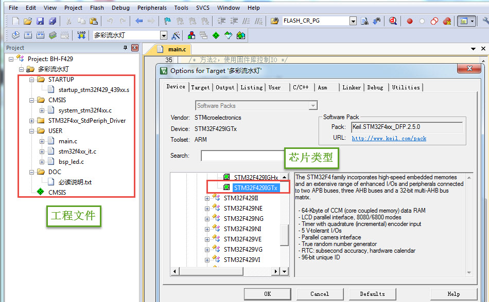
<span class="anchor" id="_Ref445297584"></span>图 1‑18 工程包含的文件、芯片类型等内容

##### uvoptx文件

uvoptx文件记录了工程的配置选项，如下载器的类型、变量跟踪配置、断点位置以及当前已打开的文件等等，见图 1‑19。

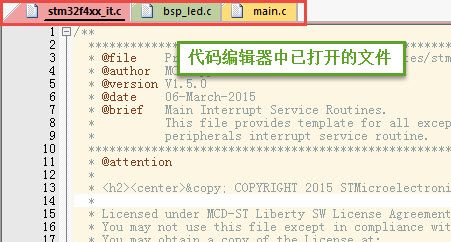
<span class="anchor" id="_Ref445297782"></span>图 1‑19 代码编辑器中已打开的文件

##### uvprojx文件

uvguix文件记录了MDK软件的GUI布局，如代码编辑区窗口的大小、编译输出提示窗口的位置等等。

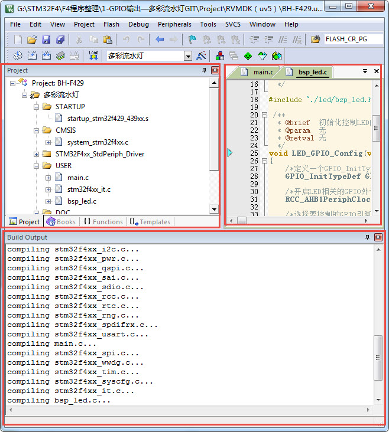

图 1‑20 记录MDK工作环境中各个窗口的大小

uvprojx、uvoptx及uvguix都是使用XML格式记录的文件，若使用记事本打开可以看到XML代码，见图 1‑17。而当使用MDK软件打开时，它根据这些文件的XML记录加载工程的各种参数，使得我们每次重新打开工程时，都能恢复上一次的工作环境。

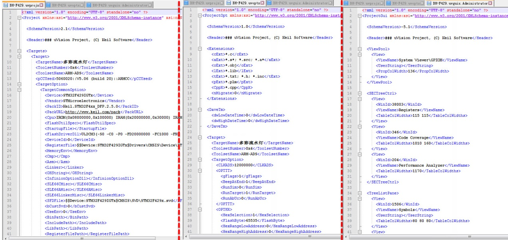

图 1‑21 使用记事本打开uvprojx、uvoptx及uvguix文件可看到XML格式的记录

这些工程参数都是当MDK正常退出时才会被写入保存，所以若MDK错误退出时(如使用Windows的任务管理器强制关闭)，工程配置参数的最新更改是不会被记录的，重新打开工程时要再次配置。根据这几个文件的记录类型，可以知道uvprojx文件是最重要的，删掉它我们就无法再正常打开工程了，而<span class="anchor" id="OLE_LINK3"><span class="anchor" id="OLE_LINK4"></span></span>uvoptx及uvguix文件并不是必须的，可以删除，重新使用MDK打开uvprojx工程文件后，会以默认参数重新创建uvoptx及uvguix文件。(所以当使用Git/SVN等代码管理的时候，往往只保留uvprojx文件)

#### 源文件

源文件是工程中我们最熟悉的内容了，它们就是我们编写的各种源代码，MDK支持c、cpp、h、s、inc类型的源代码文件，其中c、cpp分别是c/c++语言的源代码，h是它们的头文件，s是汇编文件，inc是汇编文件的头文件，可使用“$include”语法包含。编译器根据工程中的源文件最终生成机器码。

#### Output目录下生成的文件

点击MDK中的编译按钮，它会根据工程的配置及工程中的源文件输出各种对象和列表文件，在工程的<span class="anchor" id="OLE_LINK9"><span class="anchor" id="OLE_LINK10"></span></span>“Options for Targe-&gt;Output-&gt;Select Folder for Objects”和“Options for Targe-&gt;Listing-&gt;Select Folder for Listings”选项配置它们的输出路径，见图 1‑22和图 1‑23。

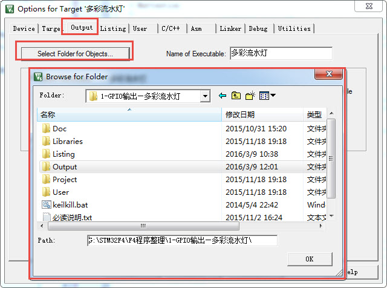
<span class="anchor" id="_Ref445300900"></span>图 1‑22 设置Output输出路径

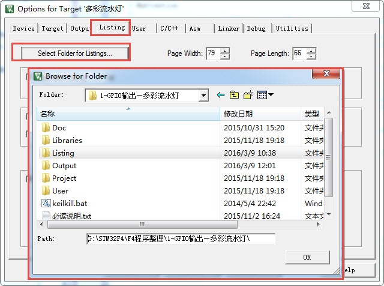
<span class="anchor" id="_Ref445300902"></span>图 1‑23设置Listing输出路径

编译后Output和Listing目录下生成的文件见图 1‑24。


<span class="anchor" id="_Ref445303701"></span>图 1‑24 编译后Output及Listing文件夹中的内容

接下来我们讲解Output路径下的文件。

##### lib库文件

在某些场合下我们不希望提供给第三方一个可用的代码库，但不希望对方看到源码，这个时候我们就可以把工程生成lib文件(Library file)提供给对方，在MDK中可配置“Options for Target-&gt;Create Library”选项把工程编译成库文件，见图 1‑25。

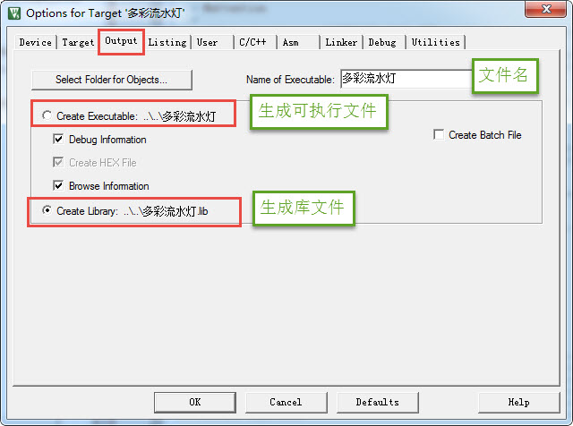
<span class="anchor" id="_Ref445301626"></span>图 1‑25 生成库文件或可执行文件

工程中生成可执行文件或库文件只能二选一，默认编译是生成可执行文件的，可执行文件即我们下载到芯片上直接运行的机器码。

得到生成的\*.lib文件后，可把它像C文件一样添加到其它工程中，并在该工程调用lib提供的函数接口，除了不能看到\*.lib文件的源码，在应用方面它跟C源文件没有区别。

##### dep、d依赖文件

\*.dep和\*.d文件(Dependency file)记录的是工程或其它文件的依赖，主要记录了引用的头文件路径，其中\*.dep是整个工程的依赖，它以工程名命名，而\*.d是单个源文件的依赖，它们以对应的源文件名命名。这些记录使用文本格式存储，我们可直接使用记事本打开，见图 1‑26和图 1‑27。

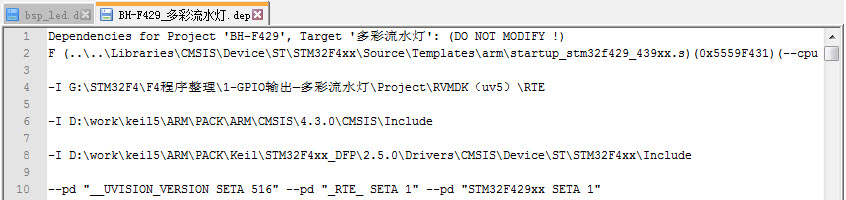
<span class="anchor" id="_Ref445304469"></span>图 1‑26 工程的dep文件内容

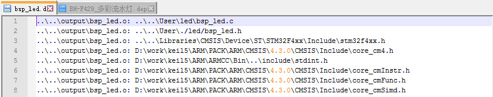
<span class="anchor" id="_Ref445304471"></span>图 1‑27 bsp\_led.d文件的内容

##### crf交叉引用文件

\*.crf是交叉引用文件(Cross-Reference file)，它主要包含了浏览信息(browse information)，即源代码中的宏定义、变量及函数的定义和声明的位置。

我们在代码编辑器中点击“Go To Definition Of ‘xxxx’”可实现浏览跳转，见图 1‑28，跳转的时候，MDK就是通过\*.crf文件查找出跳转位置的。

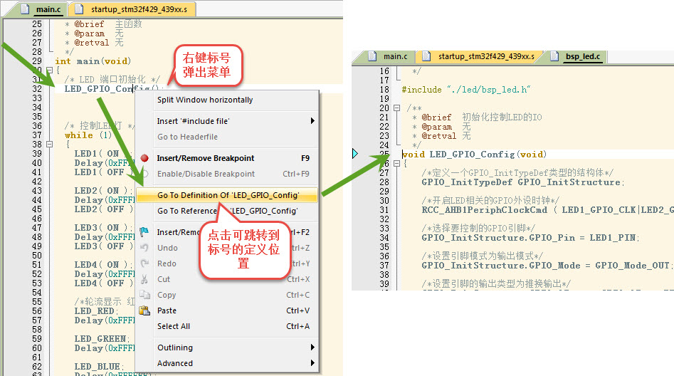
<span class="anchor" id="_Ref445296402"></span>图 1‑28 浏览信息

通过配置MDK中的“Option for Target-&gt;Output-&gt;Browse Information”选项可以设置编译时是否生成浏览信息，见图 1‑29。只有勾选该选项并编译后，才能实现上面的浏览跳转功能。


<span class="anchor" id="_Ref445296942"></span>图 1‑29 在Options forTarget中设置是否生成浏览信息

\*.crf文件使用了特定的格式表示，直接用文本编辑器打开会看到大部分乱码，见图 1‑30，我们不作深入研究。

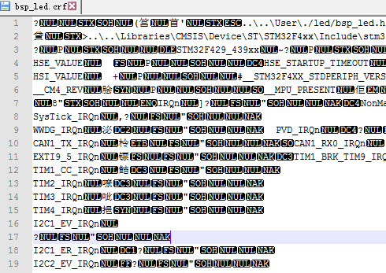
<span class="anchor" id="_Ref445296977"></span>图 1‑30 crf文件内容

##### o、axf及elf文件

\*.o、\*.elf、\*.axf、\*.bin及\*.hex文件都存储了编译器根据源代码生成的机器码，根据应用场合的不同，它们又有所区别。

###### ELF文件说明

\*.o、\*.elf、\*.axf以及前面提到的lib文件都是属于目标文件，它们都是使用ELF格式来存储的，关于ELF格式的详细内容请参考配套资料里的《ELF文件格式》文档了解，它讲解的是Linux下的ELF格式，与MDK使用的格式有小区别，但大致相同。在本教程中，仅讲解ELF文件的核心概念。

ELF是Executable and Linking Format的缩写，译为可执行链接格式，该格式用于记录目标文件的内容。在Linux及Windows系统下都有使用该格式的文件(或类似格式)用于记录应用程序的内容，告诉操作系统如何链接、加载及执行该应用程序。

目标文件主要有如下三种类型：

1.  可重定位的文件(Relocatable File)，包含基础代码和数据，但它的代码及数据都没有指定绝对地址，因此它适合于与其他目标文件链接来创建可执行文件或者共享目标文件。 这种文件一般由编译器根据源代码生成。

&gt; 例如MDK的armcc和armasm生成的\*.o文件就是这一类，另外还有Linux的\*.o 文件，Windows的 \*.obj文件。

1.  可执行文件(Executable File) ，它包含适合于执行的程序，它内部组织的代码数据都有固定的地址(或相对于基地址的偏移)，系统可根据这些地址信息把程序加载到内存执行。这种文件一般由链接器根据可重定位文件链接而成，它主要是组织各个可重定位文件，给它们的代码及数据一一打上地址标号，固定其在程序内部的位置，链接后，程序内部各种代码及数据段不可再重定位(即不能再参与链接器的链接)。

&gt; 例如MDK的armlink生成的\*.elf及\*.axf文件，(使用gcc编译工具可生成\*.elf文件，用armlink生成的是\*.axf文件，\*.axf文件在\*.elf之外，增加了调试使用的信息，其余区别不大，后面我们仅讲解\*.axf文件)，另外还有Linux的/bin/bash文件，Windows的\*.exe文件。

1.  共享目标文件(Shared Object File)， 它的定义比较难理解，我们直接举例，MDK生成的\*.lib文件就属于共享目标文件，它可以继续参与链接，加入到可执行文件之中。另外，Linux的.so，如/lib/ glibc-2.5.so，Windows的DLL都属于这一类。

###### o文件与axf文件的关系

根据上面的分类，我们了解到，\*.axf文件是由多个\*.o文件链接而成的，而\*.o文件由相应的源文件编译而成，一个源文件对应一个\*.o文件。它们的关系见图 1‑31。

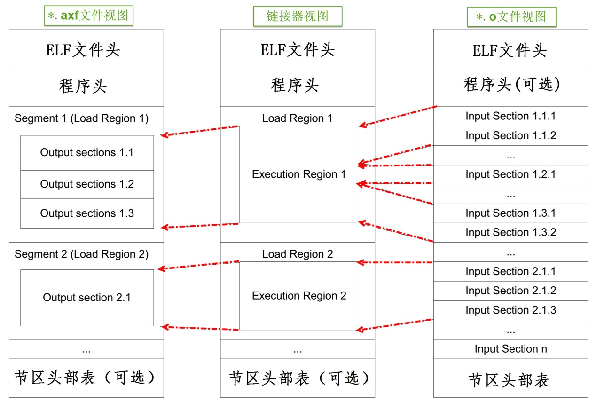
<span class="anchor" id="_Ref445561747"></span>图 1‑31\*.axf文件与\*.o文件的关系

图中的中间代表的是armlink链接器，在它的右侧是输入链接器的\*.o文件，左侧是它输出的\*axf文件。

可以看到，由于都使用ELF文件格式，\*.o与\*.axf文件的结构是类似的，它们包含ELF文件头、程序头、节区(section)以及节区头部表。各个部分的功能说明如下：

-   ELF文件头用来描述整个文件的组织，例如数据的大小端格式，程序头、节区头在文件中的位置等。

-   程序头告诉系统如何加载程序，例如程序主体存储在本文件的哪个位置，程序的大小，程序要加载到内存什么地址等等。MDK的可重定位文件\*.o不包含这部分内容，因为它还不是可执行文件，而armlink输出的\*.axf文件就包含该内容了。

-   节区是\*.o文件的独立数据区域，它包含提供给链接视图使用的大量信息，如指令(Code)、数据(RO、RW、ZI-data)、符号表(函数、变量名等)、重定位信息等，例如每个由C语言定义的函数在\*.o文件中都会有一个独立的节区；

-   存储在最后的节区头则包含了本文件节区的信息，如节区名称、大小等等。

总的来说，链接器把各个\*.o文件的节区归类、排列，根据目标器件的情况编排地址生成输出，汇总到\*.axf文件。例如，见图 1‑32，“多彩流水灯”工程中在“bsp\_led.c”文件中有一个LED\_GPIO\_Config函数，而它内部调用了“stm32f4xx\_gpio.c”的GPIO\_Init函数，经过armcc编译后，LED\_GPIO\_Config及GPIO\_Iint函数都成了指令代码，分别存储在bsp\_led.o及stm32f4xx\_gpio.o文件中，这些指令在\*.o文件都没有指定地址，仅包含了内容、大小以及调用的链接信息，而经过链接器后，链接器给它们都分配了特定的地址，并且把地址根据调用指向链接起来。

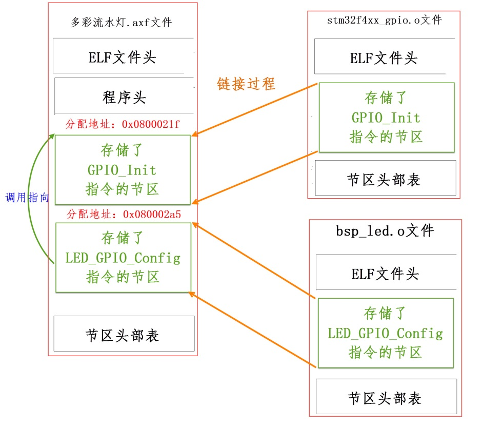
<span class="anchor" id="_Ref445579441"></span>图 1‑32 具体的链接过程

###### ELF文件头

接下来我们看看具体文件的内容，使用fromelf文件可以查看\*.o、\*.axf及\*.lib文件的ELF信息。

使用命令行，切换到文件所在的目录，输入“fromelf –text –v bsp\_led.o”命令，可控制输出bsp\_led.o的详细信息，见图 1‑33。 利用“-c、-z”等选项还可输出反汇编指令文件、代码及数据文件等信息，请亲手尝试一下。

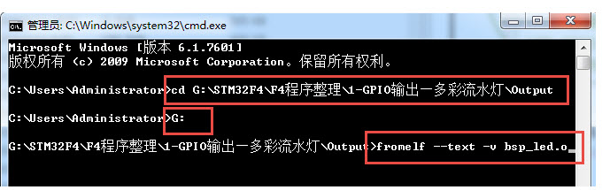
<span class="anchor" id="_Ref445580772"></span>图 1‑33 使用fromelf查看o文件信息

为了便于阅读，我已使用fromelf指令生成了“多彩流水灯.axf”、“bsp\_led”及“多彩流水灯.lib”的ELF信息，并已把这些信息保存在独立的文件中，在配套资料的<span class="anchor" id="OLE_LINK15"><span class="anchor" id="OLE_LINK16"></span></span>“elf信息输出”文件夹下可查看，见表 1‑4。

<span class="anchor" id="_Ref445712070"></span>表 1‑4 配套资料里使用fromelf生成的文件

| fromelf选项 | 可查看的信息         | 生成到配套资料里相应的文件                                  |
|-------------|----------------------|-------------------------------------------------------------|
| -v          | 详细信息             | bsp\_led\_o\_elfInfo\_v.txt/多彩流水灯\_axf\_elfInfo\_v.txt |
| -a          | 数据的地址           | bsp\_led\_o\_elfInfo\_a.txt/多彩流水灯\_axf\_elfInfo\_a.txt |
| -c          | 反汇编代码           | bsp\_led\_o\_elfInfo\_c.txt/多彩流水灯\_axf\_elfInfo\_c.txt |
| -d          | data section的内容   | bsp\_led\_o\_elfInfo\_d.txt/多彩流水灯\_axf\_elfInfo\_d.txt |
| -e          | 异常表               | bsp\_led\_o\_elfInfo\_e.txt/多彩流水灯\_axf\_elfInfo\_e.txt |
| -g          | 调试表               | bsp\_led\_o\_elfInfo\_g.txt/多彩流水灯\_axf\_elfInfo\_g.txt |
| -r          | 重定位信息           | bsp\_led\_o\_elfInfo\_r.txt/多彩流水灯\_axf\_elfInfo\_r.txt |
| -s          | 符号表               | bsp\_led\_o\_elfInfo\_s.txt/多彩流水灯\_axf\_elfInfo\_s.txt |
| -t          | 字符串表             | bsp\_led\_o\_elfInfo\_t.txt/多彩流水灯\_axf\_elfInfo\_t.txt |
| -y          | 动态段内容           | bsp\_led\_o\_elfInfo\_y.txt/多彩流水灯\_axf\_elfInfo\_y.txt |
| -z          | 代码及数据的大小信息 | bsp\_led\_o\_elfInfo\_z.txt/多彩流水灯\_axf\_elfInfo\_z.txt |

直接打开“elf信息输出”目录下的bsp\_led\_o\_elfInfo\_v.txt文件，可看到代码清单 1‑1中的内容。

<span class="anchor" id="_Ref445581649"></span>代码清单 1‑1 bsp_led.o文件的ELF文件头(可到“bsp_led_o_elfInfo_v.txt”文件查看)
```C 

 ========================================================================


 ** ELF Header Information


 File Name:

 .\bsp_led.o //bsp_led.o文件


 Machine class: ELFCLASS32 (32-bit) //32位机

 Data encoding: ELFDATA2LSB (Little endian) //小端格式

 Header version: EV_CURRENT (Current version)

 Operating System ABI: none

 ABI Version: 0

 File Type: ET_REL (Relocatable object) (1) //可重定位文件类型

 Machine: EM_ARM (ARM)


 Entry offset (in SHF_ENTRYSECT section): 0x00000000

 Flags: None (0x05000000)


 ARM ELF revision: 5 (ABI version 2)


 Built with

 Component: ARM Compiler 5.06 (build 20) Tool: armasm [4d35a2]

 Component: ARM Compiler 5.06 (build 20) Tool: armlink [4d35a3]


 Header size: 52 bytes (0x34)

 Program header entry size: 0 bytes (0x0) //程序头大小

 Section header entry size: 40 bytes (0x28)


 Program header entries: 0

 Section header entries: 246


 Program header offset: 0 (0x00000000) //程序头在文件中的位置(没有程序头)

 Section header offset: 507224 (0x0007bd58) //节区头在文件中的位置


 Section header string table index: 243


 =====================================================================

```
在上述代码中已加入了部分注释，解释了相应项的意义，值得一提的是在这个\*.o文件中，它的ELF文件头中告诉我们它的程序头(Program header)大小为“0 bytes”，且程序头所在的文件位置偏移也为“0”，这说明它是没有程序头的。

###### 程序头

接下来打开“多彩流水灯\_axf\_elfInfo\_v.txt”文件，查看工程的\*.axf文件的详细信息，见代码清单 1‑2。

<span class="anchor" id="_Ref445710279"></span>代码清单 1‑2 *.axf文件中的elf文件头及程序头(可到“多彩流水灯_axf_elfInfo_v.txt”文件查看)
```C 

 ===================================================================


 ** ELF Header Information


 File Name:

 .\多彩流水灯.axf //多彩流水灯.axf 文件


 Machine class: ELFCLASS32 (32-bit) //32位机

 Data encoding: ELFDATA2LSB (Little endian) //小端格式

 Header version: EV_CURRENT (Current version)

 Operating System ABI: none

 ABI Version: 0

 File Type: ET_EXEC (Executable) (2) //可执行文件类型

 Machine: EM_ARM (ARM)


 Image Entry point: 0x080001ad

 Flags: EF_ARM_HASENTRY + EF_ARM_ABI_FLOAT_SOFT (0x05000202)


 ARM ELF revision: 5 (ABI version 2)


 Conforms to Soft float procedure-call standard


 Built with

 Component: ARM Compiler 5.06 (build 20) Tool: armasm [4d35a2]

 Component: ARM Compiler 5.06 (build 20) Tool: armlink [4d35a3]


 Header size: 52 bytes (0x34)

 Program header entry size: 32 bytes (0x20)

 Section header entry size: 40 bytes (0x28)


 Program header entries: 1

 Section header entries: 15


 Program header offset: 335252 (0x00051d94) //程序头在文件中的位置

 Section header offset: 335284 (0x00051db4) //节区头在文件中的位置


 Section header string table index: 14


 =================================================================


 ** Program header #0


 Type : PT_LOAD (1) //表示这是可加载的内容

 File Offset : 52 (0x34) //在文件中的偏移

 Virtual Addr : 0x08000000 //虚拟地址(此处等于物理地址)

 Physical Addr : 0x08000000 //物理地址

 Size in file : 1456 bytes (0x5b0) //程序在文件中占据的大小

 Size in memory: 2480 bytes (0x9b0) //若程序加载到内存，占据的内存空间

 Flags : PF_X + PF_W + PF_R + PF_ARM_ENTRY (0x80000007)

 Alignment : 8 //地址对齐


 ===============================================================

```
对比之下，可发现\*.axf文件的ELF文件头对程序头的大小说明为非0值，且给出了它在文件的偏移地址，在输出信息之中，包含了程序头的详细信息。可看到，程序头的“Physical Addr”描述了本程序要加载到的内存地址“0x0800 0000”，正好是STM32内部FLASH的首地址；“size in file”描述了本程序占据的空间大小为“1456 bytes”，它正是程序烧录到FLASH中需要占据的空间。

###### 节区头

在ELF的原文件中，紧接着程序头的一般是节区的主体信息，在节区主体信息之后是描述节区主体信息的节区头，我们先来看看节区头中的信息了解概况。通过对比\*.o文件及\*.axf文件的节区头部信息，可以清楚地看出这两种文件的区别，见代码清单 1‑3。

<span class="anchor" id="_Ref445715072"></span>代码清单 1‑3 *.o文件的节区信息(“bsp_led_o_elfInfo_v.txt”文件)
```C 

 ====================================

 ** Section #4


 Name : i.LED_GPIO_Config //节区名


 //此节区包含程序定义的信息，其格式和含义都由程序来解释。

 Type : SHT_PROGBITS (0x00000001)


 //此节区在进程执行过程中占用内存。 节区包含可执行的机器指令。

 Flags :SHF_ALLOC + SHF_EXECINSTR (0x00000006)

 Addr : 0x00000000 //地址

 File Offset : 68 (0x44) //在文件中的偏移

 Size : 116 bytes (0x74) //大小

 Link : SHN_UNDEF

 Info : 0

 Alignment : 4 //字节对齐

 Entry Size : 0

 ====================================

```
这个节区的名称为LED\_GPIO\_Config，它正好是我们在bsp\_led.c文件中定义的函数名，这个节区头描述的是该函数被编译后的节区信息，其中包含了节区的类型(指令类型)、节区应存储到的地址(0x00000000)、它主体信息在文件位置中的偏移(68)以及节区的大小(116 bytes)。

由于\*.o文件是可重定位文件，所以它的地址并没有被分配，是0x00000000（假如文件中还有其它函数，该函数生成的节区中，对应的地址描述也都是0）。当链接器链接时，根据这个节区头信息，在文件中找到它的主体内容，并根据它的类型，把它加入到主程序中，并分配实际地址，链接后生成的\*.axf文件，我们再来看看它的内容，见代码清单 1‑4。

<span class="anchor" id="_Ref445715198"></span>代码清单 1‑4 *.axf文件的节区信息(“多彩流水灯_axf_elfInfo_v.txt”文件)
```C 

 ========================================================================

 ** Section #1


 Name : ER_IROM1 //节区名


 //此节区包含程序定义的信息，其格式和含义都由程序来解释。

 Type : SHT_PROGBITS (0x00000001)


 //此节区在进程执行过程中占用内存。 节区包含可执行的机器指令

 Flags : SHF_ALLOC + SHF_EXECINSTR (0x00000006)

 Addr : 0x08000000 //地址

 File Offset : 52 (0x34)

 Size : 1456 bytes (0x5b0) //大小

 Link : SHN_UNDEF

 Info : 0

 Alignment : 4

 Entry Size : 0


 ====================================

 ** Section #2


 Name : RW_IRAM1 //节区名


 //包含将出现在程序的内存映像中的为初始

 //化数据。 根据定义， 当程序开始执行， 系统

 //将把这些数据初始化为 0。

 Type : SHT_NOBITS (0x00000008)


 //此节区在进程执行过程中占用内存。 节区包含进程执行过程中将可写的数据。

 Flags : SHF_ALLOC + SHF_WRITE (0x00000003)

 Addr : 0x20000000 //地址

 File Offset : 1508 (0x5e4)

 Size : 1024 bytes (0x400) //大小

 Link : SHN_UNDEF

 Info : 0

 Alignment : 8

 Entry Size : 0

 ====================================

```
在\*.axf文件中，主要包含了两个节区，一个名为ER\_IROM1，一个名为RW\_IRAM1，这些节区头信息中除了具有\*.o文件中节区头描述的节区类型、文件位置偏移、大小之外，更重要的是它们都有具体的地址描述，其中 ER\_IROM1的地址为0x08000000，而RW\_IRAM1的地址为0x20000000，它们正好是内部FLASH及SRAM的首地址，对应节区的大小就是程序需要占用FLASH及SRAM空间的实际大小。

也就是说，经过链接器后，它生成的\*.axf文件已经汇总了其它\*.o文件的所有内容，生成的ER\_IROM1节区内容可直接写入到STM32内部FLASH的具体位置。例如，前面\*.o文件中的i.LED\_GPIO\_Config节区已经被加入到\*.axf文件的ER\_IROM1节区的某地址。

###### 节区主体及反汇编代码

使用fromelf的-c选项可以查看部分节区的主体信息，对于指令节区，可根据其内容查看相应的反汇编代码，打开“bsp\_led\_o\_elfInfo\_c.txt”文件可查看这些信息，见代码清单 1‑5。

<span class="anchor" id="_Ref445717407"></span>代码清单 1‑5 *.o文件的LED_GPIO_Config节区及反汇编代码(bsp_led_o_elfInfo_c.txt文件)
```C 

 ** Section #4 'i.LED_GPIO_Config' (SHT_PROGBITS) [SHF_ALLOC + SHF_EXECINSTR]

 Size : 116 bytes (alignment 4)

 <strong>Address: 0x00000000</strong>


 $t

 i.LED_GPIO_Config

 LED_GPIO_Config

 // 地址 内容 (ASCII码) 内容对应的代码

 // (无意义)

 <strong>0x00000000:</strong> e92d41fc -..A PUSH {r2-r8,lr}

 0x00000004: 2101 .! MOVS r1,#1

 0x00000006: 2088 . MOVS r0,#0x88

 <strong>0x00000008: f7fffffe .... BL RCC_AHB1PeriphClockCmd</strong>

 0x0000000c: f44f6580 O..e MOV r5,#0x400

 0x00000010: 9500 .. STR r5,[sp,#0]

 0x00000012: 2101 .! MOVS r1,#1

 0x00000014: f88d1004 .... STRB r1,[sp,#4]

 0x00000018: 2000 . MOVS r0,#0

 0x0000001a: f88d0006 .... STRB r0,[sp,#6]

 0x0000001e: f88d1007 .... STRB r1,[sp,#7]

 0x00000022: f88d0005 .... STRB r0,[sp,#5]

 0x00000026: 4f11 .O LDR r7,[pc,#68] ;

 0x00000028: 4669 iF MOV r1,sp

 0x0000002a: 4638 8F MOV r0,r7

 <strong>0x0000002c: f7fffffe .... BL GPIO_Init</strong>

 0x00000030: 006c l. LSLS r4,r5,#1

 /*....以下省略**/

```
可看到，由于这是\*.o文件，它的节区地址还是没有分配的，基地址为0x00000000，接着在LED\_GPIO\_Config标号之后，列出了一个表，表中包含了地址偏移、相应地址中的内容以及根据内容反汇编得到的指令。细看汇编指令，还可看到它包含了跳转到RCC\_AHB1PeriphClockCmd及GPIO\_Init标号的语句，而且这两个跳转语句原来的内容都是“f7fffffe”，这是因为还\*.o文件中并没有RCC\_AHB1PeriphClockCmd及GPIO\_Init标号的具体地址索引，在\*.axf文件中，这是不一样的。

接下来我们打开“多彩流水灯\_axf\_elfInfo\_c.txt”文件，查看\*.axf文件中，ER\_IROM1节区中对应LED\_GPIO\_Config的内容，见代码清单 1‑6。

<span class="anchor" id="_Ref445718275"></span>代码清单 1‑6*.axf文件的LED_GPIO_Config反汇编代码(多彩流水灯_axf_elfInfo_c.txt文件)
```C 

 i.LED_GPIO_Config

 LED_GPIO_Config

 <strong>0x080002a4:</strong> e92d41fc -..A PUSH {r2-r8,lr}

 0x080002a8: 2101 .! MOVS r1,#1

 0x080002aa: 2088 . MOVS r0,#0x88

 <strong>0x080002ac: f000f838 ..8. BL RCC_AHB1PeriphClockCmd ; 0x8000320</strong>

 0x080002b0: f44f6580 O..e MOV r5,#0x400

 0x080002b4: 9500 .. STR r5,[sp,#0]

 0x080002b6: 2101 .! MOVS r1,#1

 0x080002b8: f88d1004 .... STRB r1,[sp,#4]

 0x080002bc: 2000 . MOVS r0,#0

 0x080002be: f88d0006 .... STRB r0,[sp,#6]

 0x080002c2: f88d1007 .... STRB r1,[sp,#7]

 0x080002c6: f88d0005 .... STRB r0,[sp,#5]

 0x080002ca: 4f11 .O LDR r7,[pc,#68] ; [0x8000310] = 0x40021c00

 0x080002cc: 4669 iF MOV r1,sp

 0x080002ce: 4638 8F MOV r0,r7

 <strong>0x080002d0: f7ffffa5 .... BL GPIO_Init ; 0x800021e</strong>

 0x080002d4: 006c l. LSLS r4,r5,#1

 /*....以下省略**/

```
可看到，除了基地址以及跳转地址不同之外，LED\_GPIO\_Config中的内容跟\*.o文件中的一样。另外，由于\*.o是独立的文件，而\*.axf是整个工程汇总的文件，所以在\*.axf中包含了所有调用到\*.o文件节区的内容。例如，在“bsp\_led\_o\_elfInfo\_c.txt”(bsp\_led.o文件的反汇编信息)中不包含RCC\_AHB1PeriphClockCmd及GPIO\_Init的内容，而在“多彩流水灯\_axf\_elfInfo\_c.txt” (多彩流水灯.axf文件的反汇编信息)中则可找到它们的具体信息，且它们也有具体的地址空间。

在\*.axf文件中，跳转到RCC\_AHB1PeriphClockCmd及GPIO\_Init标号的这两个指令后都有注释，分别是“; 0x8000320”及“; 0x800021e”，它们是这两个标号所在的具体地址，而且这两个跳转语句的跟\*.o中的也有区别，内容分别为“f000f838e”及“f7ffffa5”(\*.o中的均为f7fffffe)。这就是链接器链接的含义，它把不同\*.o中的内容链接起来了。

###### 分散加载代码

学习至此，还有一个疑问，前面提到程序有存储态及运行态，它们之间应有一个转化过程，把存储在FLASH中的RW-data数据拷贝至SRAM。然而我们的工程中并没有编写这样的代码，在汇编文件中也查不到该过程，芯片是如何知道FLASH的哪些数据应拷贝到SRAM的哪些区域呢？

通过查看“多彩流水灯\_axf\_elfInfo\_c.txt”的反汇编信息，了解到程序中具有一段名为“\_\_scatterload”的分散加载代码，见代码清单 1‑7，它是由armlink链接器自动生成的。

<span class="anchor" id="_Ref445720606"></span>代码清单 1‑7 分散加载代码(多彩流水灯_axf_elfInfo_c.txt文件)
```C 


 .text

 __scatterload

 __scatterload_rt2

 0x080001e4: 4c06 .L LDR r4,[pc,#24] ; [0x8000200] = 0x80005a0

 0x080001e6: 4d07 .M LDR r5,[pc,#28] ; [0x8000204] = 0x80005b0

 0x080001e8: e006 .. B 0x80001f8 ; __scatterload + 20

 0x080001ea: 68e0 .h LDR r0,[r4,#0xc]

 0x080001ec: f0400301 @... ORR r3,r0,#1

 <strong>0x080001f0: e8940007 .... LDM r4,{r0-r2}</strong>

 0x080001f4: 4798 .G BLX r3

 0x080001f6: 3410 .4 ADDS r4,r4,#0x10

 0x080001f8: 42ac .B CMP r4,r5

 0x080001fa: d3f6 .. BCC 0x80001ea ; __scatterload + 6

 0x080001fc: f7ffffda .... BL __main_after_scatterload ; 0x80001b4

 $d

 0x08000200: 080005a0 .... DCD 134219168

 0x08000204: 080005b0 .... DCD 134219184

```
这段分散加载代码包含了拷贝过程(LDM复制指令)，而LDM指令的操作数中包含了加载的源地址，这些地址中包含了内部FLASH存储的RW-data数据。而 “\_\_scatterload ”的代码会被“\_\_main”函数调用，见代码清单 1‑8，\_\_main在启动文件中的“Reset\_Handler”会被调用，因而，在主体程序执行前，已经完成了分散加载过程。

<span class="anchor" id="_Ref445721066"></span>代码清单 1‑8 __main的反汇编代码（部分，多彩流水灯_axf_elfInfo_c.txt文件）
```C 

 __main

 _main_stk

 0x080001ac: f8dfd00c .... LDR sp,__lit__00000000 ; [0x80001bc] = 0x20000400

 .ARM.Collect$$$$00000004

 _main_scatterload

 <strong>0x080001b0: f000f818 .... BL __scatterload ; 0x80001e4</strong>

```
##### hex文件及bin文件

若编译过程无误，即可把工程生成前面对应的\*.axf文件，而在MDK中使用下载器(DAP/JLINK/ULINK等)下载程序或仿真的时候，MDK调用的就是\*.axf文件，它解释该文件，然后控制下载器把\*.axf中的代码内容下载到STM32芯片对应的存储空间，然后复位后芯片就开始执行代码了。

然而，脱离了MDK或IAR等工具，下载器就无法直接使用\*.axf文件下载代码了，它们一般仅支持hex和bin格式的代码数据文件。默认情况下MDK都不会生成hex及bin文件，需要配置工程选项或使用fromelf命令。

###### 生成hex文件

生成hex文件的配置比较简单，在“Options for Target-&gt;Output-&gt;Create Hex File”中勾选该选项，然后编译工程即可，见图 1‑34。

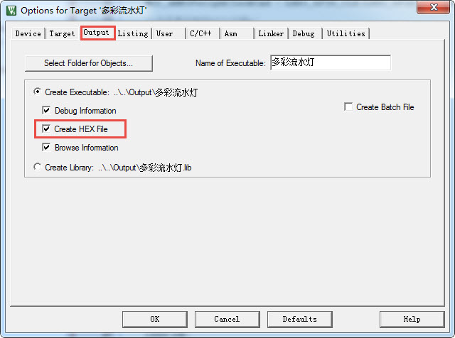
<span class="anchor" id="_Ref445729803"></span>图 1‑34 生成hex文件的配置

###### 生成bin文件

使用MDK生成bin文件需要使用fromelf命令，在MDK的“Options For Target-&gt;Users”中加入图 1‑35中的命令。

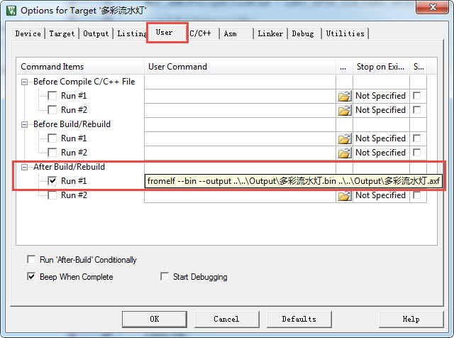
<span class="anchor" id="_Ref445730833"></span>图 1‑35 使用fromelf指令生成bin文件

图中的指令内容为：

“fromelf --bin --output ..\\..\\Output\\多彩流水灯.bin ..\\..\\Output\\多彩流水灯.axf”

该指令是根据本机及工程的配置而写的，在不同的系统环境或不同的工程中，指令内容都不一样，我们需要理解它，才能为自己的工程定制指令，首先看看fromelf的帮助，见图 1‑36。


<span class="anchor" id="_Ref445731297"></span>图 1‑36 fromelf的帮助

我们在MDK输入的指令格式是遵守fromelf帮助里的指令格式说明的，其格式为：

“fromelf \[options\] input\_file”

其中optinos是指令选项，一个指令支持输入多个选项，每个选项之间使用空格隔开，我们的实例中使用“--bin”选项设置输出bin文件，使用“--output file”选项设置输出文件的名字为“..\\..\\Output\\多彩流水灯.bin”，这个名字是一个相对路径格式，如果不了解如何使用“..\\”表示路径，可使用MDK命令输入框后面的文件夹图标打开文件浏览器选择文件，在命令的最后使用“..\\..\\Output\\多彩流水灯.axf”作为命令的输入文件。具体的格式分解见图 1‑37。


<span class="anchor" id="_Ref445733083"></span>图 1‑37 fromelf命令格式分解

fromelf需要根据工程的\*.axf文件输入来转换得到bin文件，所以在命令的输入文件参数中要选择本工程对应的\*.axf文件，在MDK命令输入栏中，我们把fromelf指令放置在“After Build/Rebuild”(工程构建完成后执行)一栏也是基于这个考虑，这样设置后，工程构建完成生成了最新的\*.axf文件，MDK再执行fromelf指令，从而得到最新的bin文件。

设置完成生成hex的选项或添加了生成bin的用户指令后，点击工程的编译(build)按钮，重新编译工程，成功后可看到图 1‑38中的输出。打开相应的目录即可找到文件，若找不到bin文件，请查看提示输出栏执行指令的信息，根据信息改正fromelf指令。

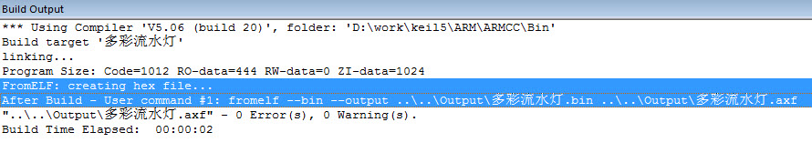
<span class="anchor" id="_Ref445733747"></span>图 1‑38 fromelf生成hxe及bin文件的提示

其中bin文件是纯二进制数据，无特殊格式，接下来我们了解一下hex文件格式。

###### hex文件格式

hex是Intel公司制定的一种使用ASCII文本记录机器码或常量数据的文件格式，这种文件常常用来记录将要存储到ROM中的数据，绝大多数下载器支持该格式。

一个hex文件由多条记录组成，而每条记录由五个部分组成，格式形如“**:llaaaatt\[dd…\]**cc”，例如本“多彩流水灯”工程生成的hex文件前几条记录见代码清单 1‑9。

<span class="anchor" id="_Ref445736756"></span>代码清单 1‑9 Hex文件实例(多彩流水灯.hex文件，可直接用记事本打开)
```C 

 <strong>:020000040800F2</strong>

 <strong>:1000000000040020C10100081B030008A30200082F</strong>

 <strong>:100010001903000809020008690400080000000034</strong>

 <strong>:100020000000000000000000000000003D03000888</strong>

 <strong>:100030000B020008000000001D0300081504000862</strong>

 :<strong>10004000DB010008DB010008DB010008DB01000820</strong>

```
记录的各个部分介绍如下：

-   “**:**” ：每条记录的开头都使用冒号来表示一条记录的开始；

-   **ll** ：以16进制数表示这条记录的主体数据区的长度(即后面\[**dd…\]**的长度)；

-   **aaaa**:表示这条记录中的内容应存放到FLASH中的起始地址；

-   **tt**：表示这条记录的类型，它包含中的各种类型；

表 1‑5 tt值所代表的类型说明

| tt的值 | 代表的类型                                     |
|--------|------------------------------------------------|
| 00     | 数据记录                                       |
| 01     | 本文件结束记录                                 |
| 02     | 扩展地址记录                                   |
| 04     | 扩展线性地址记录(表示后面的记录按个这地址递增) |
| 05     | 表示一个线性地址记录的起始(只适用于ARM)        |

-   **dd**：表示一个字节的数据，一条记录中可以有多个字节数据，ll区表示了它有多少个字节的数据；

-   **cc**：表示本条记录的校验和，它是前面所有16进制数据 (除冒号外，两个为一组)的和对256取模运算的结果的补码。

例如，代码清单 1‑9中的第一条记录解释如下：

1.  02：表示这条记录数据区的长度为2字节；

2.  0000：表示这条记录要存储到的地址；

3.  04：表示这是一条扩展线性地址记录；

4.  0800：由于这是一条扩展线性地址记录，所以这部分表示地址的高16位，与前面的“0000”结合在一起，表示要扩展的线性地址为“0x0800 0000”，这正好是STM32内部FLASH的首地址；

5.  F2：表示校验和，它的值为(0x02+0x00+0x00+0x04+0x08+0x00)%256的值再取补码。

&gt; 再来看第二条记录：

1.  10：表示这条记录数据区的长度为2字节；

2.  0000：表示这条记录所在的地址，与前面的扩展记录结合，表示这条记录要存储的FLASH首地址为(0x0800 0000+0x0000)；

3.  00：表示这是一条数据记录，数据区的是地址；

4.  00040020C10100081B030008A3020008：这是要按地址存储的数据；

5.  2F:校验和

为了更清楚地对比bin、hex及axf文件的差异，我们来查看这些文件内部记录的信息来进行对比。

###### hex、bin及axf文件的区别与联系

bin、hex及axf文件都包含了指令代码，但它们的信息丰富程度是不一样的。

-   bin文件是最直接的代码映像，它记录的内容就是要存储到FLASH的二进制数据(机器码本质上就是二进制数据)，在FLASH中是什么形式它就是什么形式，没有任何辅助信息，包括大小端格式也没有，因此下载器需要有针对芯片FLASH平台的辅助文件才能正常下载(一般下载器程序会有匹配的这些信息)；

-   hex文件是一种使用十六进制符号表示的代码记录，记录了代码应该存储到FLASH的哪个地址，下载器可以根据这些信息辅助下载；

-   axf文件在前文已经解释，它不仅包含代码数据，还包含了工程的各种信息，因此它也是三个文件中最大的。

&gt; 同一个工程生成的bin、hex及axf文件的大小见图 1‑39。


<span class="anchor" id="_Ref445734743"></span>图 1‑39 同一个工程的bin、bex及axf文件大小

实际上，这个工程要烧写到FLASH的内容总大小为1456字节，然而在Windows中查看的bin文件却比它大( bin文件是FLASH的代码映像，大小应一致)，这是因为Windows文件显示单位的原因，使用右键查看文件的属性，可以查看它实际记录内容的大小，见图 1‑40。

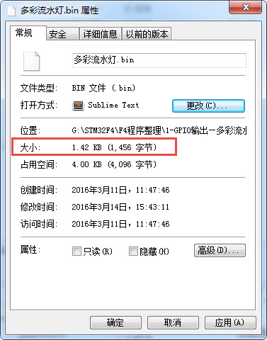
<span class="anchor" id="_Ref445735385"></span>图 1‑40 bin文件大小

接下来我们打开本工程的“多彩流水灯.bin”、“多彩流水灯.hex”及由“多彩流水灯.axf”使用fromelf工具输出的反汇编文件“多彩流水灯\_axf\_elfInfo\_c.txt” 文件，清晰地对比它们的差异，见图 1‑41。如果您想要亲自阅读自己电脑上的bin文件，推荐使用sublime软件打开，它可以把二进制数以ASCII码呈现出来，便于阅读。

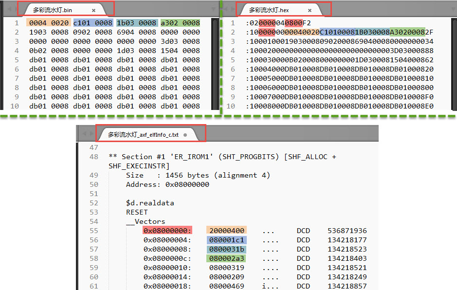
<span class="anchor" id="_Ref445741677"></span>图 1‑41 同一个工程的bin、hex及axf文件对代码的记录

在“多彩流水灯\_axf\_elfInfo\_c.txt”文件中不仅可以看到代码数据，还有具体的标号、地址以及反汇编得到的代码，虽然它不是\*.axf文件的原始内容，但因为它是通过\*.axf文件fromelf工具生成的，我们可认为\*.axf文件本身记录了大量这些信息，它的内容非常丰富，熟悉汇编语言的人可轻松阅读。

在hex文件中包含了地址信息以及地址中的内容，而在bin文件中仅包含了内容，连存储的地址信息都没有。观察可知，bin、hex及axf文件中的数据内容都是相同的，它们存储的都是机器码。这就是它们三都之间的区别与联系。

由于文件中存储的都是机器码，见图 1‑42，该图是我根据axf文件的GPIO\_Init函数的机器码，在bin及hex中找到的对应位置。所以经验丰富的人是有可能从bin或hex文件中恢复出汇编代码的，只是成本较高，但不是不可能。

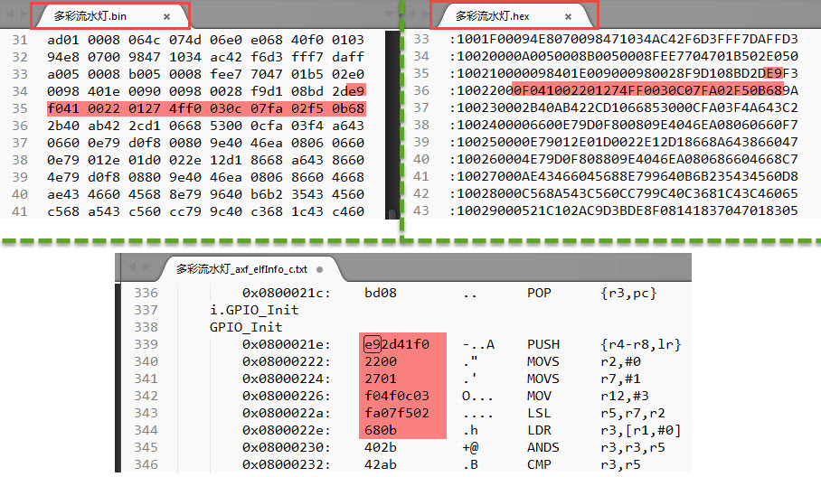
<span class="anchor" id="_Ref445744684"></span>图 1‑42 GPIO\_Init函数的代码数据在三个文件中的表示

如果芯片没有做任何加密措施，使用下载器可以直接从芯片读回它存储在FLASH中的数据，从而得到bin映像文件，根据芯片型号还原出部分代码即可进行修改，甚至不用修改代码，直接根据目标产品的硬件PCB，抄出一样的板子，再把bin映像下载芯片，直接山寨出目标产品，所以在实际的生产中，一定要注意做好加密措施。由于axf文件中含有大量的信息，且直接使用fromelf即可反汇编代码，所以更不要随便泄露axf文件。lib文件也能反使用fromelf文件反汇编代码，不过它不能还原出C代码，由于lib文件的主要目的是为了保护C源代码，也算是达到了它的要求。

##### htm静态调用图文件

在Output目录下，有一个以工程文件命名的后缀为\*.bulid\_log.htm及\*.htm文件，如“多彩流水灯.bulid\_log.htm”及“多彩流水灯.htm”，它们都可以使用浏览器打开。其中\*.build\_log.htm是工程的构建过程日志，而\*.htm是链接器生成的静态调用图文件。

在静态调用图文件中包含了整个工程各种函数之间互相调用的关系图，而且它还给出了静态占用最深的栈空间数量以及它对应的调用关系链。

例如图 1‑43是“多彩流水灯.htm”文件顶部的说明。

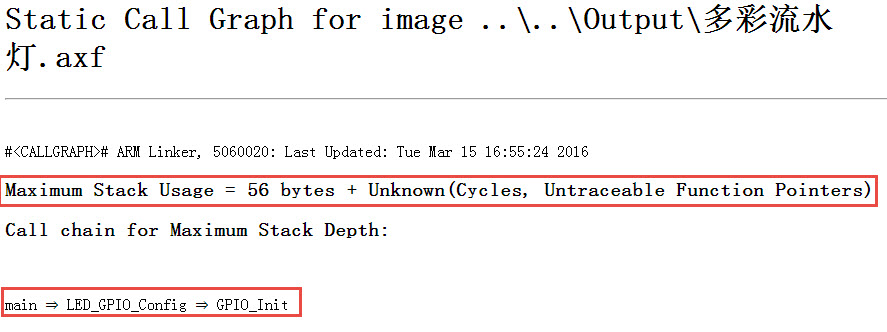
<span class="anchor" id="_Ref445885743"></span>图 1‑43“多彩流水灯.htm”中的静态占用最深的栈空间说明

该文件说明了本工程的静态栈空间最大占用56字节(Maximum Stack Usage:56bytes)，这个占用最深的静态调用为“main-&gt;LED\_GPIO\_Config-&gt;GPIO\_Init”。注意这里给出的空间只是静态的栈使用统计，链接器无法统计动态使用情况，例如链接器无法知道递归函数的递归深度。在本文件的后面还可查询到其它函数的调用情况及其它细节。

利用这些信息，我们可以大致了解工程中应该分配多少空间给栈，有空间余量的情况下，一般会设置比这个静态最深栈使用量大一倍，在STM32中可修改启动文件改变堆栈的大小；如果空间不足，可从本文件中了解到调用深度的信息，然后优化该代码。

注意：

查看了各个工程的静态调用图文件统计后，我们发现本书提供的一些比较大规模的工程例子，静态栈调用最大深度都已超出STM32启动文件默认的栈空间大小0x00000400，即1024字节，但在当时的调试过程中却没有发现错误，因此我们也没有修改栈的默认大小(有一些工程调试时已发现问题，它们的栈空间就已经被我们改大了)，虽然这些工程实际运行并没有错误，但这可能只是因为它使用的栈溢出RAM空间恰好没被程序其它部分修改而已。所以，建议您在实际的大型工程应用中(特别是使用了各种外部库时，如Lwip/emWin/Fatfs等)，要查看本静态调用图文件，了解程序的栈使用情况，给程序分配合适的栈空间。

#### Listing目录下的文件

在Listing目录下包含了\*.map及\*.lst文件，它们都是文本格式的，可使用Windows的记事本软件打开。其中lst文件仅包含了一些汇编符号的链接信息，我们重点分析map文件。

##### map文件说明

map文件是由链接器生成的，它主要包含交叉链接信息，查看该文件可以了解工程中各种符号之间的引用以及整个工程的Code、RO-data、RW-data以及ZI-data的详细及汇总信息。它的内容中主要包含了“节区的跨文件引用”、“删除无用节区”、“符号映像表”、“存储器映像索引”以及“映像组件大小”，各部分介绍如下：

###### 节区的跨文件引用

打开“多彩流水灯.map”文件，可看到它的第一部分——节区的跨文件引用(Section Cross References)，见代码清单 1‑10。

<span class="anchor" id="_Ref445798602"></span>代码清单 1‑10 节区的跨文件引用(部分，多彩流水灯.map文件)
```C 

 ==============================================================================

 <strong>Section Cross References</strong>


 <strong>startup_stm32f429_439xx.o(RESET) refers to startup_stm32f429_439xx.o(STACK) for __initial_sp</strong>

 startup_stm32f429_439xx.o(RESET) refers to startup_stm32f429_439xx.o(.text) for Reset_Handler

 startup_stm32f429_439xx.o(RESET) refers to stm32f4xx_it.o(i.NMI_Handler) for NMI_Handler

 startup_stm32f429_439xx.o(RESET) refers to stm32f4xx_it.o(i.HardFault_Handler) for HardFault_Handler

 /**...以下部分省略****/


 <strong>main.o(i.main) refers to bsp_led.o(i.LED_GPIO_Config) for LED_GPIO_Config</strong>

 main.o(i.main) refers to stm32f4xx_gpio.o(i.GPIO_ResetBits) for GPIO_ResetBits

 main.o(i.main) refers to main.o(i.Delay) for Delay

 main.o(i.main) refers to stm32f4xx_gpio.o(i.GPIO_SetBits) for GPIO_SetBits

 bsp_led.o(i.LED_GPIO_Config) refers to stm32f4xx_rcc.o(i.RCC_AHB1PeriphClockCmd) for RCC_AHB1PeriphClockCmd

 <strong>bsp_led.o(i.LED_GPIO_Config) refers to stm32f4xx_gpio.o(i.GPIO_Init) for GPIO_Init</strong>

 bsp_led.o(i.LED_GPIO_Config) refers to stm32f4xx_gpio.o(i.GPIO_ResetBits) for GPIO_ResetBits

 /**...以下部分省略****/

 ======================================================================


```
在这部分中，详细列出了各个\*.o文件之间的符号引用。由于\*.o文件是由asm或c/c++源文件编译后生成的，各个文件及文件内的节区间互相独立，链接器根据它们之间的互相引用链接起来，链接的详细信息在这个“Section Cross References”一一列出。

例如，开头部分说明的是startup\_stm32f429\_439xx.o文件中的“RESET”节区分为它使用的“\_\_initial\_sp” 符号引用了同文件“STACK”节区。

也许我们对启动文件不熟悉，不清楚这究竟是什么，那我们继续浏览，可看到main.o文件的引用说明，如说明main.o文件的i.main节区为它使用的LED\_GPIO\_Config符号引用了bsp\_led.o文件的i.LED\_GPIO\_Config节区。

同样地，下面还有bsp\_led.o文件的引用说明，如说明了bsp\_led.o文件的i.LED\_GPIO\_Config节区为它使用的GPIO\_Init符号引用了stm32f4xx\_gpio.o文件的i.GPIO\_Init节区。

可以了解到，这些跨文件引用的符号其实就是源文件中的函数名、变量名。有时在构建工程的时候，编译器会输出 “Undefined symbol xxx (referred from xxx.o)” 这样的提示，该提示的原因就是在链接过程中，某个文件无法在外部找到它引用的标号，因而产生链接错误。例如，见图 1‑44，我们把bsp\_led.c文件中定义的函数LED\_GPIO\_Config改名为LED\_GPIO\_ConfigABCD，而不修改main.c文件中的调用，就会出现main文件无法找到LED\_GPIO\_Config符号的提示。

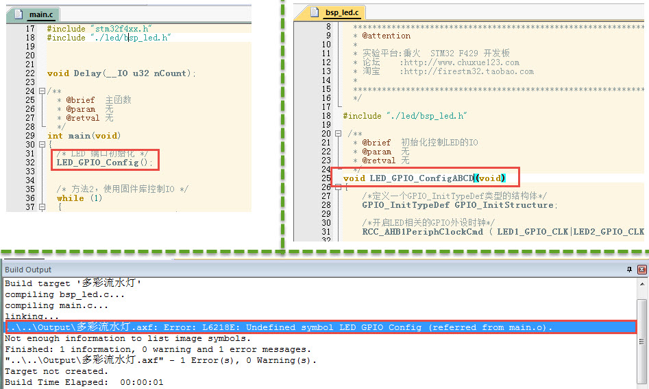
<span class="anchor" id="_Ref445800828"></span>图 1‑44 找不到符号的错误提示

###### 删除无用节区

map文件的第二部分是删除无用节区的说明(Removing Unused input sections from the image.)，见代码清单 1‑11。

<span class="anchor" id="_Ref445801377"></span>代码清单 1‑11 删除无用节区(部分，多彩流水灯.map文件)
```C 

 =================================================================

 <strong>Removing Unused input sections from the image.</strong>


 <strong>Removing startup_stm32f429_439xx.o(HEAP), (512 bytes).</strong>

 Removing system_stm32f4xx.o(.rev16_text), (4 bytes).

 Removing system_stm32f4xx.o(.revsh_text), (4 bytes).

 Removing system_stm32f4xx.o(.rrx_text), (6 bytes).

 Removing system_stm32f4xx.o(i.SystemCoreClockUpdate), (136 bytes).

 Removing system_stm32f4xx.o(.data), (20 bytes).

 Removing misc.o(.rev16_text), (4 bytes).

 Removing misc.o(.revsh_text), (4 bytes).

 Removing misc.o(.rrx_text), (6 bytes).

 Removing misc.o(i.NVIC_Init), (104 bytes).

 Removing misc.o(i.NVIC_PriorityGroupConfig), (20 bytes).

 Removing misc.o(i.NVIC_SetVectorTable), (20 bytes).

 Removing misc.o(i.NVIC_SystemLPConfig), (28 bytes).

 Removing misc.o(i.SysTick_CLKSourceConfig), (28 bytes).

 <strong>Removing stm32f4xx_adc.o(.rev16_text), (4 bytes).</strong>

 <strong>Removing stm32f4xx_adc.o(.revsh_text), (4 bytes).</strong>

 <strong>Removing stm32f4xx_adc.o(.rrx_text), (6 bytes).</strong>

 <strong>Removing stm32f4xx_adc.o(i.ADC_AnalogWatchdogCmd), (16 bytes).</strong>

 <strong>Removing stm32f4xx_adc.o(i.ADC_AnalogWatchdogSingleChannelConfig), (12 bytes).</strong>

 <strong>Removing stm32f4xx_adc.o(i.ADC_AnalogWatchdogThresholdsConfig), (6 bytes).</strong>

 <strong>Removing stm32f4xx_adc.o(i.ADC_AutoInjectedConvCmd), (24 bytes).</strong>

 /**...以下部分省略****/

 ========================================================================

```
这部分列出了在链接过程它发现工程中未被引用的节区，这些未被引用的节区将会被删除(指不加入到\*.axf文件，不是指在\*.o文件删除)，这样可以防止这些无用数据占用程序空间。

例如，上面的信息中说明startup\_stm32f429\_439xx.o中的HEAP(在启动文件中定义的用于动态分配的“堆”区)以及 stm32f4xx\_adc.o的各个节区都被删除了，因为在我们这个工程中没有使用动态内存分配，也没有引用任何stm32f4xx\_adc.c中的内容。由此也可以知道，虽然我们把STM32标准库的各个外设对应的c库文件都添加到了工程，但不必担心这会使工程变得臃肿，因为未被引用的节区内容不会被加入到最终的机器码文件中。

###### 符号映像表

map文件的第三部分是符号映像表(Image Symbol Table)，见代码清单 1‑12。

<span class="anchor" id="_Ref445803535"></span>代码清单 1‑12 符号映像表(部分，多彩流水灯.map文件)
```C 

 ==============================================================================

 <strong>Image Symbol Table</strong>


 Local Symbols


 <strong>Symbol Name Value Ov Type Size Object(Section)</strong>

 ../clib/microlib/init/entry.s 0x00000000 Number 0 entry.o ABSOLUTE

 ../clib/microlib/init/entry.s 0x00000000 Number 0 entry9a.o ABSOLUTE

 ../clib/microlib/init/entry.s 0x00000000 Number 0 entry9b.o ABSOLUTE

 /*...省略部分*/

 <strong>LED_GPIO_Config 0x080002a5 Thumb Code 106 bsp_led.o(i.LED_GPIO_Config)</strong>

 MemManage_Handler 0x08000319 Thumb Code 2 stm32f4xx_it.o(i.MemManage_Handler)

 NMI_Handler 0x0800031b Thumb Code 2 stm32f4xx_it.o(i.NMI_Handler)

 PendSV_Handler 0x0800031d Thumb Code 2 stm32f4xx_it.o(i.PendSV_Handler)

 RCC_AHB1PeriphClockCmd 0x08000321 Thumb Code 22 stm32f4xx_rcc.o(i.RCC_AHB1PeriphClockCmd)

 SVC_Handler 0x0800033d Thumb Code 2 stm32f4xx_it.o(i.SVC_Handler)

 SysTick_Handler 0x08000415 Thumb Code 2 stm32f4xx_it.o(i.SysTick_Handler)

 SystemInit 0x08000419 Thumb Code 62 system_stm32f4xx.o(i.SystemInit)

 UsageFault_Handler 0x08000469 Thumb Code 2 stm32f4xx_it.o(i.UsageFault_Handler)

 __scatterload_copy 0x0800046b Thumb Code 14 handlers.o(i.__scatterload_copy)

 __scatterload_null 0x08000479 Thumb Code 2 handlers.o(i.__scatterload_null)

 __scatterload_zeroinit 0x0800047b Thumb Code 14 handlers.o(i.__scatterload_zeroinit)

 <strong>main 0x08000489 Thumb Code 270 main.o(i.main)</strong>

 /*...省略部分*/

 ==============================================================================

```
这个表列出了被引用的各个符号在存储器中的具体地址、占据的空间大小等信息。如我们可以查到LED\_GPIO\_Config符号存储在0x080002a5地址，它属于Thumb Code类型，大小为106字节，它所在的节区为bsp\_led.o文件的i.LED\_GPIO\_Config节区。

###### 存储器映像索引

map文件的第四部分是存储器映像索引(Memory Map of the image)，见代码清单 1‑13。

<span class="anchor" id="_Ref445804198"></span>代码清单 1‑13 存储器映像索引(部分，多彩流水灯.map文件)
```C 

 ==============================================================================

 <strong>Memory Map of the image</strong>


 Image Entry point : 0x080001ad

 Load Region LR_IROM1 (Base: 0x08000000, Size: 0x000005b0, Max: 0x00100000, ABSOLUTE)


 <strong>Execution Region ER_IROM1 (Base: 0x08000000, Size: 0x000005b0, Max: 0x00100000, ABSOLUTE)</strong>


 <strong>Base Addr Size Type Attr Idx E Section Name Object</strong>


 0x08000000 0x000001ac Data RO 3 RESET startup_stm32f429_439xx.o

 /*..省略部分*/

 0x0800020c 0x00000012 Code RO 5161 i.Delay main.o

 0x0800021e 0x0000007c Code RO 2046 i.GPIO_Init stm32f4xx_gpio.o

 0x0800029a 0x00000004 Code RO 2053 i.GPIO_ResetBits stm32f4xx_gpio.o

 0x0800029e 0x00000004 Code RO 2054 i.GPIO_SetBits stm32f4xx_gpio.o

 0x080002a2 0x00000002 Code RO 5196 i.HardFault_Handler stm32f4xx_it.o

 <strong>0x080002a4 0x00000074 Code RO 5269 i.LED_GPIO_Config bsp_led.o</strong>

 0x08000318 0x00000002 Code RO 5197 i.MemManage_Handler stm32f4xx_it.o

 /*..省略部分*/

 0x08000488 0x00000118 Code RO 5162 i.main main.o

 0x080005a0 0x00000010 Data RO 5309 Region$$Table anon$$obj.o


 <strong>Execution Region RW_IRAM1 (Base: 0x20000000, Size: 0x00000400, Max: 0x00030000, ABSOLUTE)</strong>


 <strong>Base Addr Size Type Attr Idx E Section Name Object</strong>


 <strong>0x20000000 0x00000400 Zero RW 1 STACK startup_stm32f429_439xx.o</strong>

 ==============================================================================

```
本工程的存储器映像索引分为ER\_IROM1及RW\_IRAM1部分，它们分别对应STM32内部FLASH及SRAM的空间。相对于符号映像表，这个索引表描述的单位是节区，而且它描述的主要信息中包含了节区的类型及属性，由此可以区分Code、RO-data、RW-data及ZI-data。

例如，从上面的表中我们可以看到i.LED\_GPIO\_Config节区存储在内部FLASH的0x080002a4地址，大小为0x00000074，类型为Code，属性为RO。而程序的STACK节区(栈空间)存储在SRAM的0x20000000地址，大小为0x00000400，类型为Zero，属性为RW（即RW-data）。

###### 映像组件大小 

map文件的最后一部分是包含映像组件大小的信息(Image component sizes)，这也是最常查询的内容，见代码清单 1‑14。

<span class="anchor" id="_Ref445806518"></span>代码清单 1‑14 映像组件大小(部分，多彩流水灯.map文件)
```C 

 ==============================================================================

 <strong>Image component sizes</strong>


 <strong>Code (inc. data) RO Data RW Data ZI Data Debug Object Name</strong>


 116 10 0 0 0 578 bsp_led.o

 298 10 0 0 0 1459 main.o

 36 8 428 0 1024 932 startup_stm32f429_439xx.o

 132 0 0 0 0 2432 stm32f4xx_gpio.o

 18 0 0 0 0 3946 stm32f4xx_it.o

 28 6 0 0 0 645 stm32f4xx_rcc.o

 292 34 0 0 0 253101 system_stm32f4xx.o


 ----------------------------------------------------------------------

 926 68 444 0 1024 263093 Object Totals

 0 0 16 0 0 0 (incl. Generated)

 6 0 0 0 0 0 (incl. Padding)


 /*...省略部分*/

 ==============================================================================

 <em>*Code (inc. data) RO Data RW Data ZI Data Debug *</em>


 <strong>1012 84 444 0 1024 262637 Grand Totals</strong>

 1012 84 444 0 1024 262637 ELF Image Totals

 <strong>1012 84 444 0 0 0 ROM Totals</strong>

 ==============================================================================

 <strong>Total RO Size (Code + RO Data) 1456 ( 1.42kB)</strong>

 <strong>Total RW Size (RW Data + ZI Data) 1024 ( 1.00kB)</strong>

 <strong>Total ROM Size (Code + RO Data + RW Data) 1456 ( 1.42kB)</strong>

 ==============================================================================

```
这部分包含了各个使用到的\*.o文件的空间汇总信息、整个工程的空间汇总信息以及占用不同类型存储器的空间汇总信息，它们分类描述了具体占据的Code、RO-data、RW-data及ZI-data的大小，并根据这些大小统计出占据的ROM总空间。

我们仅分析最后两部分信息，如Grand Totals一项，它表示整个代码占据的所有空间信息，其中Code类型的数据大小为1012字节，这部分包含了84字节的指令数据(inc .data)已算在内，另外RO-data占444字节，RW-data占0字节，ZI-data占1024字节。在它的下面两行有一项ROM Totals信息，它列出了各个段所占据的ROM空间，除了ZI-data不占ROM空间外，其余项都与Grand Totals中相等(RW-data也占据ROM空间，只是本工程中没有RW-data类型的数据而已)。

最后一部分列出了只读数据(RO)、可读写数据(RW)及占据的ROM大小。其中只读数据大小为1456字节，它包含Code段及RO-data段; 可读写数据大小为1024字节，它包含RW-data及ZI-data段；占据的ROM大小为1456字节，它除了Code段和RO-data段，还包含了运行时需要从ROM加载到RAM的RW-data数据。

综合整个map文件的信息，可以分析出，当程序下载到STM32的内部FLASH时，需要使用的内部FLASH是从0x0800 0000地址开始的大小为1456字节的空间；当程序运行时，需要使用的内部SRAM是从0x20000000地址开始的大小为1024字节的空间。

粗略一看，发现这个小程序竟然需要1024字节的SRAM，实在说不过去，但仔细分析map文件后，可了解到这1024字节都是STACK节区的空间(即栈空间)，栈空间大小是在启动文件中定义的，这1024字节是默认值(0x00000400)。它是提供给C语言程序局部变量申请使用的空间，若我们确认自己的应用程序不需要这么大的栈，完全可以修改启动文件，把它改小一点，查看前面讲解的htm静态调用图文件可了解静态的栈调用情况，可以用它作为参考。

#### sct分散加载文件的格式与应用

##### sct分散加载文件简介

当工程按默认配置构建时，MDK会根据我们选择的芯片型号，获知芯片的内部FLASH及内部SRAM存储器概况，生成一个以工程名命名的后缀为\*.sct的分散加载文件(Linker Control File，scatter loading)，链接器根据该文件的配置分配各个节区地址，生成分散加载代码，因此我们通过修改该文件可以定制具体节区的存储位置。

例如可以设置源文件中定义的所有变量自动按地址分配到外部SDRAM，这样就不需要再使用关键字“\_\_attribute\_\_”按具体地址来指定了；利用它还可以控制代码的加载区与执行区的位置，例如可以把程序代码存储到单位容量价格便宜的NAND-FLASH中，但在NAND-FLASH中的代码是不能像内部FLASH的代码那样直接提供给内核运行的，这时可通过修改分散加载文件，把代码加载区设定为NAND-FLASH的程序位置，而程序的执行区设定为SDRAM中的位置，这样链接器就会生成一个配套的分散加载代码，该代码会把NAND-FLASH中的代码加载到SDRAM中，内核再从SDRAM中运行主体代码，大部分运行Linux系统的代码都是这样加载的。

##### 分散加载文件的格式

下面先来看看MDK默认使用的sct文件，在Output目录下可找到“多彩流水灯.sct”，该文件记录的内容见代码清单 1‑15。

<span class="anchor" id="_Ref445889532"></span>代码清单 1‑15 默认的分散加载文件内容(“多彩流水灯.sct”)
```C 

 ; *************************************************************

 ; *** Scatter-Loading Description File generated by uVision ***

 ; *************************************************************


 <strong>LR_IROM1 0x08000000 0x00100000 {</strong> ; 注释:加载域，基地址 空间大小

 <strong>ER_IROM1 0x08000000 0x00100000 {</strong> ; 注释:加载地址 = 执行地址

 <strong>*.o (RESET, +First)</strong>

 <strong>*(InRoot$$Sections)</strong>

 <strong>.ANY (+RO)</strong>

 <strong>}</strong>

 <strong>RW_IRAM1 0x20000000 0x00030000 {</strong> ; 注释:可读写数据

 <strong>.ANY (+RW +ZI)</strong>

 <strong>}</strong>

 <strong>}</strong>


```
在默认的sct文件配置中仅分配了Code、RO-data、RW-data及ZI-data这些大区域的地址，链接时各个节区(函数、变量等)直接根据属性排列到具体的地址空间。

sct文件中主要包含描述加载域及执行域的部分，一个文件中可包含有多个加载域，而一个加载域可由多个部分的执行域组成。同等级的域之间使用花括号“{}”分隔开，最外层的是加载域，第二层“{}”内的是执行域，其整体结构见图 1‑45。


<span class="anchor" id="_Ref445907329"></span>图 1‑45 分散加载文件的整体结构

###### 加载域

<span class="anchor" id="OLE_LINK17"><span class="anchor" id="OLE_LINK18"></span></span>sct文件的加载域格式见代码清单 1‑16。

<span class="anchor" id="_Ref445913835"></span>代码清单 1‑16 加载域格式
```C 

 //方括号中的为选填内容

 加载域名 (基地址 | (<span class="anchor" id="OLE_LINK1"><span class="anchor" id="OLE_LINK2"></span></span>"+" 地址偏移)) [属性列表] [最大容量]

 "{"

 执行区域描述+

 "}"

```
<span class="anchor" id="OLE_LINK19"><span class="anchor" id="OLE_LINK20"></span></span>配合前面代码清单 1‑15中的分散加载文件内容，各部分介绍如下：

-   加载域名：名称，在map文件中的描述会使用该名称来标识空间。如本例中只有一个加载域，该域名为LR\_IROM1。

-   基地址+地址偏移：这部分说明了本加载域的基地址，可以使用+号连接一个地址偏移，算进基地址中，整个加载域以它们的结果为基地址。如本例中的加载域基地址为0x08000000，刚好是STM32内部FLASH的基地址。

-   属性列表：属性列表说明了加载域的是否为绝对地址、N字节对齐等属性，该配置是可选的。本例中没有描述加载域的属性。

-   最大容量：最大容量说明了这个加载域可使用的最大空间，该配置也是可选的，如果加上这个配置后，当链接器发现工程要分配到该区域的空间比容量还大，它会在工程构建过程给出提示。本例中的加载域最大容量为0x00100000，即1MB，正是本型号STM32内部FLASH的空间大小。

###### 执行域

sct文件的执行域格式见代码清单 1‑17。

<span class="anchor" id="_Ref445913767"></span>代码清单 1‑17 执行域格式
```C 

 //方括号中的为选填内容

 执行域名 (基地址 | "+" 地址偏移) [属性列表] [最大容量 ]

 "{"

 输入节区描述

 "}"

```
执行域的格式与加载域是类似的，区别只是输入节区的描述有所不同，在代码清单 1‑15的例子中包含了ER\_IROM1及RW\_IRAM两个执行域，它们分别对应描述了STM32的内部FLASH及内部SRAM的基地址及空间大小。而它们内部的“输入节区描述”说明了哪些节区要存储到这些空间，链接器会根据它来处理编排这些节区。

###### 输入节区描述

配合加载域及执行域的配置，在相应的域配置“输入节区描述”即可控制该节区存储到域中，其格式见代码清单 1‑18。

<span class="anchor" id="_Ref446081006"></span>代码清单 1‑18 输入节区描述的几种格式
```C 

 //除模块选择样式部分外，其余部分都可选选填

 模块选择样式"("输入节区样式",""+"输入节区属性")"

 模块选择样式"("输入节区样式",""+"节区特性")"


 模块选择样式"("输入符号样式",""+"节区特性")"

 模块选择样式"("输入符号样式",""+"输入节区属性")"

```
配合前面代码清单 1‑15中的分散加载文件内容，各部分介绍如下：

-   模块选择样式：模块选择样式可用于选择o及lib目标文件作为输入节区，它可以直接使用目标文件名或“\*”通配符，也可以使用“.ANY”。例如，使用语句“bsp\_led.o”可以选择bsp\_led.o文件，使用语句“\*.o”可以选择所有o文件，使用“\*.lib”可以选择所有lib文件，使用“\*”或“.ANY”可以选择所有的o文件及lib文件。其中“.ANY”选择语句的优先级是最低的，所有其它选择语句选择完剩下的数据才会被“.ANY”语句选中。

-   输入节区样式：我们知道在目标文件中会包含多个节区或符号，通过输入节区样式可以选择要控制的节区。

&gt; 示例文件中“(RESET，+First)”语句的RESET就是输入节区样式，它选择了名为RESET的节区，并使用后面介绍的节区特性控制字“+First”表示它要存储到本区域的第一个地址。示例文件中的“\*(InRoot$$Sections)”是一个链接器支持的特殊选择符号，它可以选择所有标准库里要求存储到root区域的节区，如\_\_main.o、\_\_scatter\*.o等内容。

-   输入符号样式：同样地，使用输入符号样式可以选择要控制的符号，符号样式需要使用“:gdef:”来修饰。例如可以使用“\*(:gdef:Value\_Test)”来控制选择符号“Value\_Test”。

-   输入节区属性：通过在模块选择样式后面加入输入节区属性，可以选择样式中不同的内容，每个节区属性描述符前要写一个“+”号，使用空格或“，”号分隔开，可以使用的节区属性描述符见表 1‑6。

<span class="anchor" id="_Ref445972942"></span>表 1‑6 属性描述符及其意义

| 节区属性描述符 | 说明                    |
|----------------|-------------------------|
| RO-CODE及CODE  | 只读代码段              |
| RO-DATA及CONST | 只读数据段              |
| RO及TEXT       | 包括RO-CODE及RO-DATA    |
| RW-DATA        | 可读写数据段            |
| RW-CODE        | 可读写代码段            |
| RW及DATA       | 包括RW-DATA及RW-CODE    |
| ZI及BSS        | 初始化为0的可读写数据段 |
| XO             | 只可执行的区域          |
| ENTRY          | 节区的入口点            |

&gt; 例如，示例文件中使用“.ANY(+RO)”选择剩余所有节区RO属性的内容都分配到执行域ER\_IROM1中，使用“.ANY(+RW +ZI)”选择剩余所有节区RW及ZI属性的内容都分配到执行域RW\_IRAM1中。

-   节区特性：节区特性可以使用“+FIRST”或“+LAST”选项配置它要存储到的位置，FIRST存储到区域的头部，LAST存储到尾部。通常重要的节区会放在头部，而CheckSum(校验和)之类的数据会放在尾部。

&gt; 例如示例文件中使用“(RESET,+First)”选择了RESET节区，并要求把它放置到本区域第一个位置，而RESET是工程启动代码中定义的向量表，见代码清单 1‑19，该向量表中定义的堆栈顶和复位向量指针必须要存储在内部FLASH的前两个地址，这样STM32才能正常启动，所以必须使用FIRST控制它们存储到首地址。

<span class="anchor" id="_Ref445972530"></span>代码清单 1‑19 startup_stm32f429_439xx.s文件中定义的RESET区(部分)
```C 

 ; Vector Table Mapped to Address 0 at Reset

 <strong>AREA RESET, DATA, READONLY</strong>

 EXPORT __Vectors

 EXPORT __Vectors_End

 EXPORT __Vectors_Size


 __Vectors <strong>DCD __initial_sp</strong> ; Top of Stack

 <strong>DCD Reset_Handler</strong> ; Reset Handler

 DCD NMI_Handler ; NMI Handler

```
总的来说，我们的sct示例文件配置如下：程序的加载域为内部FLASH的0x08000000，最大空间为0x00100000；程序的执行基地址与加载基地址相同，其中RESET节区定义的向量表要存储在内部FLASH的首地址，且所有o文件及lib文件的RO属性内容都存储在内部FLASH中；程序执行时RW及ZI区域都存储在以0x20000000为基地址，大小为0x00030000的空间(192KB)，这部分正好是STM32内部主SRAM的大小。

链接器根据sct文件链接，链接后各个节区、符号的具体地址信息可以在map文件中查看。

##### 通过MDK配置选项来修改sct文件

了解sct文件的格式后，可以手动编辑该文件控制整个工程的分散加载配置，但sct文件格式比较复杂，所以MDK提供了相应的配置选项可以方便地修改该文件，这些选项配置能满足基本的使用需求，本小节将对这些选项进行说明。

###### **选择sct文件的产生方式**

首先需要选择sct文件产生的方式，选择使用MDK生成还是使用用户自定义的sct文件。在MDK的“Options for Target-&gt;Linker-&gt;Use Memory Layout from Target Dialog”选项即可配置该选择，见图 1‑46。


<span class="anchor" id="_Ref445979295"></span>图 1‑46 选择使用MDK生成的sct文件

该选项的译文为“是否使用Target对话框中的存储器分布配置”，勾选后，它会根据“Options for Target”对话框中的选项生成sct文件，这种情况下，即使我们手动打开它生成的sct文件编辑也是无效的，因为每次构建工程的时候，MDK都会生成新的sct文件覆盖旧文件。该选项在MDK中是默认勾选的，若希望MDK使用我们手动编辑的sct文件构建工程，需要取消勾选，并通过Scatter File框中指定sct文件的路径，见图 1‑47。

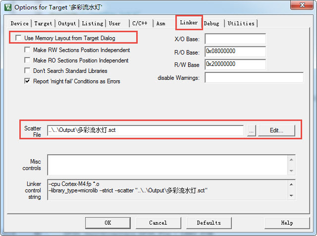
<span class="anchor" id="_Ref445985568"></span>图 1‑47 使用指定的sct文件构建工程

###### 通过Target对话框控制存储器分配

若我们在Linker中勾选了“使用Target对话框的存储器布局”选项，那么“Options for Target”对话框中的存储器配置就生效了。主要配置是在Device标签页中选择芯片的类型，设定芯片基本的内部存储器信息以及在Target标签页中细化具体的存储器配置(包括外部存储器)，见图 1‑48及图 1‑49。

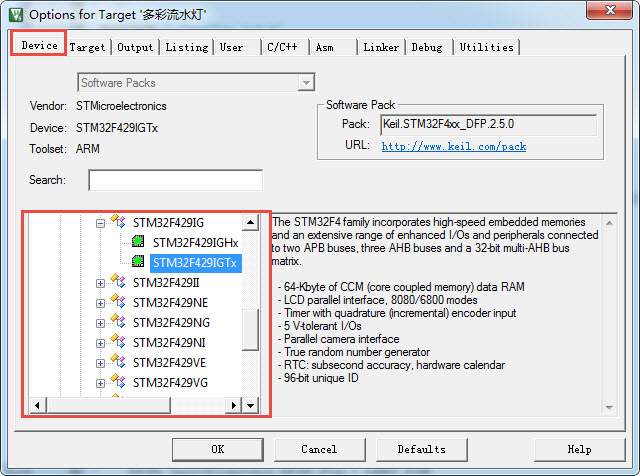
<span class="anchor" id="_Ref445987723"></span>图 1‑48 选择芯片类型

图中Device标签页中选定了芯片的型号为STM32F429IGTx，选中后，在Target标签页中的存储器信息会根据芯片更新。

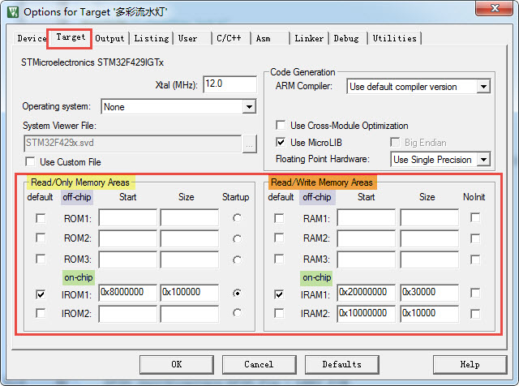
<span class="anchor" id="_Ref445987724"></span>图 1‑49 Target对话框中的存储器分配

在Target标签页中存储器信息分成只读存储器(Read/Only Memory Areas)和可读写存储器(Read/Write Memory Areas)两类，即ROM和RAM，而且它们又细分成了片外存储器(off-chip)和片内存储器(on-chip)两类。

例如，由于我们已经选定了芯片的型号，MDK会自动根据芯片型号填充片内的ROM及RAM信息，其中的IROM1起始地址为0x80000000，大小为0x100000，正是该STM32型号的内部FLASH地址及大小；而IRAM1起始地址为0x20000000，大小为0x30000，正是该STM32内部主SRAM的地址及大小。图中的IROM1及IRAM1前面都打上了勾，表示这个配置信息会被采用，若取消勾选，则该存储配置信息是不会被使用的。

在标签页中的IRAM2一栏默认也填写了配置信息，它的地址为0x10000000，大小为0x10000，这是STM32F4系列特有的内部64KB高速SRAM(被称为CCM)。当我们希望使用这部分存储空间的时候需要勾选该配置，另外要注意这部分高速SRAM仅支持CPU总线的访问，不能通过外设访问。

下面我们尝试修改Target标签页中的这些存储信息，例如，按照<span class="anchor" id="OLE_LINK21"><span class="anchor" id="OLE_LINK22"></span></span>图 1‑50中的1配置，把IRAM1的基地址改为0x20001000，然后编译工程，查看到工程的sct文件如代码清单 1‑20所示；当按照图 1‑50中的2配置时，同时使用IRAM1和IRAM2，然后编译工程，可查看到工程的sct文件如代码清单 1‑21所示。

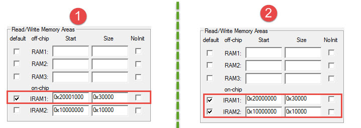
<span class="anchor" id="_Ref445991126"></span>图 1‑50 修改IRAM1的基地址及仅使用IRAM2的配置

<span class="anchor" id="_Ref445991217"></span>代码清单 1‑20 修改了IRAM1基地址后的sct文件内容
```C 

 LR_IROM1 0x08000000 0x00100000 { ; load region size_region

 ER_IROM1 0x08000000 0x00100000 { ; load address = execution address

 *.o (RESET, +First)

 *(InRoot$$Sections)

 .ANY (+RO)

 }

 <strong>RW_IRAM1 0x20001000 0x00030000 { ; RW data</strong>

 <strong>.ANY (+RW +ZI)</strong>

 <strong>}</strong>

 }

```
<span class="anchor" id="_Ref445991283"></span>代码清单 1‑21 仅使用IRAM2时的sct文件内容
```C 

 LR_IROM1 0x08000000 0x00100000 { ; load region size_region

 ER_IROM1 0x08000000 0x00100000 { ; load address = execution address

 *.o (RESET, +First)

 *(InRoot$$Sections)

 .ANY (+RO)

 }

 RW_IRAM1 0x20000000 0x00030000 { ; RW data

 .ANY (+RW +ZI)

 }

 <strong>RW_IRAM2 0x10000000 0x00010000 {</strong>

 <strong>.ANY (+RW +ZI)</strong>

 <strong>}</strong>

 }

```
可以发现，sct文件都根据Target标签页做出了相应的改变，除了这种修改外，在Target标签页上还控制同时使用IRAM1和IRAM2、加入外部RAM(如外接的SDRAM)，外部FLASH等。

###### 控制文件分配到指定的存储空间

设定好存储器的信息后，可以控制各个源文件定制到哪个部分存储器，在MDK的工程文件栏中，选中要配置的文件，右键，并在弹出的菜单中选择“Options for File xxxx”即可弹出一个文件配置对话框，在该对话框中进行存储器定制，见图 1‑51。

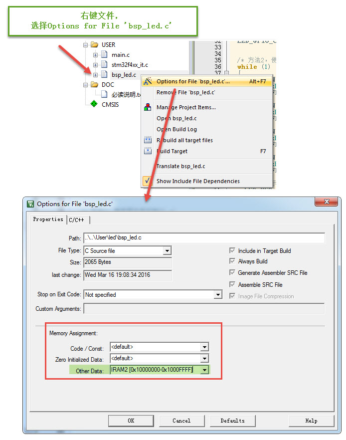
<span class="anchor" id="_Ref445993485"></span>图 1‑51 使用右键打开文件配置并把它的RW区配置成使用IRAM2

在弹出的对话框中有一个“Memory Assignment”区域(存储器分配)，在该区域中可以针对文件的各种属性内容进行分配，如Code/Const内容(RO)、Zero Initialized Data内容(ZI-data)以及Other Data内容(RW-data)，点击下拉菜单可以找到在前面Target页面配置的IROM1、IRAM1、IRAM2等存储器。例如图中我们把这个bsp\_led.c文件的Other Data属性的内容分配到了IRAM2存储器(在Target标签页中我们勾选了IRAM1及IRAM2)，当在bsp\_led.c文件定义了一些RW-data内容时(如初值非0的全局变量)，该变量将会被分配到IRAM2空间，配置完成后点击OK，然后编译工程，查看到的sct文件内容见代码清单 1‑22。

<span class="anchor" id="_Ref445994407"></span>代码清单 1‑22 修改bsp_led.c配置后的sct文件
```C 

 LR_IROM1 0x08000000 0x00100000 { ; load region size_region

 ER_IROM1 0x08000000 0x00100000 { ; load address = execution address

 *.o (RESET, +First)

 *(InRoot$$Sections)

 .ANY (+RO)

 }

 RW_IRAM1 0x20000000 0x00030000 { ; RW data

 .ANY (+RW +ZI)

 }

 <strong>RW_IRAM2 0x10000000 0x00010000 {</strong>

 <span class="anchor" id="OLE_LINK23"><span class="anchor" id="OLE_LINK24"></span></span><strong>bsp_led.o (+RW)</strong>

 <strong>.ANY (+RW +ZI)</strong>

 <strong>}</strong>

 }

```
可以看到在sct文件中的RW\_IRAM2执行域中增加了一个选择bsp\_led.o中RW内容的语句。

类似地，我们还可以设置某些文件的代码段被存储到特定的ROM中，或者设置某些文件使用的ZI-data或RW-data存储到外部SDRAM中(控制ZI-data到SDRAM时注意还需要修改启动文件设置堆栈对应的地址，原启动文件中的地址是指向内部SRAM的)。

虽然MDK的这些存储器配置选项很方便，但有很多高级的配置还是需要手动编写sct文件实现的，例如MDK选项中的内部ROM选项最多只可以填充两个选项位置，若想把内部ROM分成多片地址管理就无法实现了；另外MDK配置可控的最小粒度为文件，若想控制特定的节区也需要直接编辑sct文件。

接下来我们将讲解几个实验，通过编写sct文件定制存储空间。

### 实验：自动分配变量到外部SDRAM空间

由于内存管理对应用程序非常重要，若修改sct文件，不使用默认配置，对工程影响非常大，容易导致出错，所以我们使用两个实验配置来讲解sct文件的应用细节，希望您学习后不仅知其然而且知其所以然，清楚地了解修改后对应用程序的影响，还可以举一反三根据自己的需求进行存储器定制。

在本书前面的SDRAM实验中，当我们需要读写SDRAM存储的内容时，需要使用指针或者\_\_attribute\_\_((at(具体地址)))来指定变量的位置，当有多个这样的变量时，就需要手动计算地址空间了，非常麻烦。在本实验中我们将修改sct文件，让链接器自动分配全局变量到SDRAM的地址并进行管理，使得利用SDRAM的空间就跟内部SRAM一样简单。

#### 硬件设计

本小节中使用到的硬件跟“扩展外部SDRAM”实验中的一致，若不了解，请参考该章节的原理图说明。

#### 软件设计

本小节中提供的例程名为“SCT文件应用—自动分配变量到SDRAM”，学习时请打开该工程来理解，该工程是基于“<span class="anchor" id="OLE_LINK25"><span class="anchor" id="OLE_LINK26"></span></span>扩展外部SDRAM”实验改写而来的。

为方便讲解，本实验直接使用手动编写的sct文件，所以在MDK的“Options for Target-&gt;Linker-&gt;Use Memory Layout from Target Dialog”选项被取消勾选，取消勾选后可直接点击“Edit”按钮编辑工程的sct文件，也可到工程目录下打开编辑，见图 1‑52。

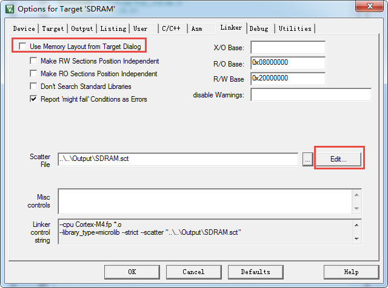
<span class="anchor" id="_Ref446062011"></span>图 1‑52 使用手动编写的sct文件

取消了这个勾选后，在MDK的Target对话框及文件配置的存储器分布选项都会失效，仅以sct文件中的为准，更改对话框及文件配置选项都不会影响sct文件的内容。

##### 编程要点

1.  修改启动文件，在\_\_main执行之前初始化SDRAM；

2.  在sct文件中增加外部SDRAM空间对应的执行域；

3.  使用节区选择语句选择要分配到SDRAM的内容；

4.  编写测试程序，编译正常后，查看map文件的空间分配情况。

##### 代码分析

###### 在\_\_main之前初始化SDRAM

在前面讲解ELF文件格式的小节中我们了解到，芯片启动后，会通过\_\_main函数调用分散加载代码\_\_scatterload，分散加载代码会把存储在FLASH中的RW-data复制到RAM中，然后在RAM区开辟一块ZI-data的空间，并将其初始化为0值。因此，为了保证在程序中定义到SDRAM中的变量能被正常初始化，我们需要在系统执行分散加载代码之前使SDRAM存储器正常运转，使它能够正常保存数据。

在本来的“扩展外部SDRAM”工程中，我们使用SDRAM\_Init函数初始化SDRAM，且该函数在main函数里才被调用，所以在SDRAM正常运转之前，分散加载过程复制到SDRAM中的数据都丢失了，因而需要在初始化SDRAM之后，需要重新给变量赋值才能正常使用(即定义变量时的初值无效，在调用SDRAM\_Init函数之后的赋值才有效)。

为了解决这个问题，可修改工程的startup\_stm32f429\_439xx.s启动文件，见代码清单 1‑23。

<span class="anchor" id="_Ref446072839"></span>代码清单 1‑23 修改启动文件中的Reset_handler函数(<span class="anchor" id="OLE_LINK27"><span class="anchor" id="OLE_LINK28"></span></span>startup_stm32f429_439xx.s文件)
```C 

 ; Reset handler

 Reset_Handler PROC

 EXPORT Reset_Handler [WEAK]

 IMPORT SystemInit

 IMPORT __main


 ;从外部文件引入声明

 <strong>IMPORT SDRAM_Init</strong>


 LDR R0, =SystemInit

 BLX R0


 ;在__main之前调用SDRAM_Init进行初始化

 <strong>LDR R0, =SDRAM_Init</strong>

 <strong>BLX R0</strong>


 LDR R0, =__main

 BX R0

 ENDP

```
在原来的启动文件中我们增加了上述加粗表示的代码，增加的代码中使用到汇编语法的IMPOR引入在bsp\_sdram.c文件中定义的SDRAM\_Init函数，接着使用LDR指令加载函数的代码地址到寄存器R0，最后使用BLX R0指令跳转到SDRAM\_Init的代码地址执行。

以上代码实现了Reset\_handler在执行\_\_main函数前先调用了我们自定义的SDRAM\_Init函数，从而为分散加载代码准备好正常的硬件工作环境。

###### sct文件初步应用

接下来修改sct文件，控制使得在C源文件中定义的全局变量都自动由链接器分配到外部SDRAM中，见代码清单 1‑24。

<span class="anchor" id="_Ref446075160"></span>代码清单 1‑24 配置sct文件(SDRAM.sct文件)
```C 

 ; *************************************************************

 ; *** Scatter-Loading Description File generated by uVision ***

 ; *************************************************************


 LR_IROM1 0x08000000 0x00100000 { ; 加载域

 ER_IROM1 0x08000000 0x00100000 { ; 加载地址 = 执行地址

 *.o (RESET, +First)

 *(InRoot$$Sections)

 .ANY (+RO)

 }


 RW_IRAM1 0x20000000 0x00030000 { ; 内部SRAM

 <strong>*.o(STACK)</strong> ;选择STACK节区，栈

 <strong>stm32f4xx_rcc.o(+RW)</strong> <span class="anchor" id="OLE_LINK29"><span class="anchor" id="OLE_LINK30"></span></span>;选择stm32f4xx_rcc的RW内容

 .ANY (+RW +ZI) <span class="anchor" id="OLE_LINK31"><span class="anchor" id="OLE_LINK32"></span></span>;其余的RW/ZI-data都分配到这里

 }


 <strong>RW_ERAM1 0xD0000000 0x00800000 {</strong> ; 外部SDRAM


 <strong>.ANY (+RW +ZI)</strong> ;其余的RW/ZI-data都分配到这里

 }

 }

```
加粗部分是本例子中增加的代码，我们从后面开始，先分析比较简单的SDRAM执行域部分。

-   RW\_ERAM1 0xD0000000 0x00800000{}

&gt; RW\_ERAM1是我们配置的SDRAM执行域。该执行域的名字是可以随便取的，最重要的是它的基地址及空间大小，这两个值与我们实验板配置的SDRAM基地址及空间大小一致，所以该执行域会被映射到SDRAM的空间。在RW\_ERAM1执行域内部，它使用“.ANY(+RW +ZI)”语句，选择了所有的RW/ZI类型的数据都分配到这个SDRAM区域，所以我们在工程中的C文件定义全局变量时，它都会被分配到这个SDRAM区域。

-   RW\_IRAM1执行域

&gt; RW\_IRAM1是STM32内部SRAM的执行域。我们在默认配置中增加了“\*.o(STACK)及stm32f4xx\_rcc.o(+RW)”语句。本来上面配置SDRAM执行域后已经达到使全局变量分配的目的，为何还要修改原内部SRAM的执行域呢？
&gt;
&gt; 这是由于我们在\_\_main之前调用的SDRAM\_Init函数调用了很多库函数，且这些函数内部定义了一些局部变量，而函数内的局部变量是需要分配到“栈”空间(STACK)，见图 1‑53，查看静态调用图文件“SDRAM.htm”可了解它使用了多少栈空间以及调用了哪些函数。
&gt;
&gt; 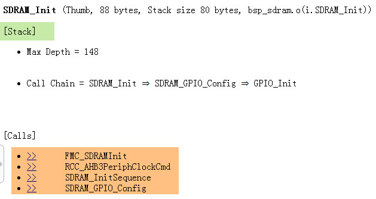
<span class="anchor" id="_Ref446077137"></span>图 1‑53 SDRAM\_Init的调用说明(SDRAM.htm文件)

&gt; 从文件中可了解到SDRAM\_Init使用的STACK的深度为148字节，它调用了FMC\_SDRAMInit、RCC\_AHB3PeriphClockCmd、SDRAM\_InitSequence及SDRAM\_GPIO\_Config等函数。由于它使用了栈空间，所以在SDRAM\_Init函数执行之前，栈空间必须要被准备好，然而在SDRAM\_Init函数执行之前，SDRAM芯片却并未正常工作，这样的矛盾导致栈空间不能被分配到SDRAM。
&gt;
&gt; 虽然内部SRAM的执行域RW\_IRAM1及SDRAM执行域RW\_ERAM1中都使用“.ANY(+RW +ZI)”语句选择了所有RW及ZI属性的内容，但对于符合两个相同选择语句的内容，链接器会优先选择使用空间较大的执行域，即这种情况下只有当SDRAM执行域的空间使用完了，RW/ZI属性的内容才会被分配到内部SRAM。
&gt;
&gt; 所以在大部分情况下，内部SRAM执行域中的“.ANY(+RW +ZI)”语句是不起作用的()，而栈节区(STACK)又属于ZI-data类，如果我们的内部SRAM执行域还是按原来的默认配置的话，栈节区会被分配到外部SDRAM，导致出错。为了避免这个问题，我们把栈节区使用“\*.o(STACK)”语句分配到内部SRAM的执行域。
&gt;
&gt; 增加“stm32f4xx\_rcc.o(+RW)”语句是因为SDRAM\_Init函数调用了<span class="anchor" id="OLE_LINK33"><span class="anchor" id="OLE_LINK34"></span></span>stm32f4xx\_rcc.c文件中的RCC\_AHB3PeriphClockCmd函数，而查看map文件后了解到stm32f4xx\_rcc.c定义了一些RW-data类型的变量，见图 1‑54。不管这些数据是否在SDRAM\_Init调用过程中使用到，保险起见，我们直接把这部分内容也分配到内部SRAM的执行区。

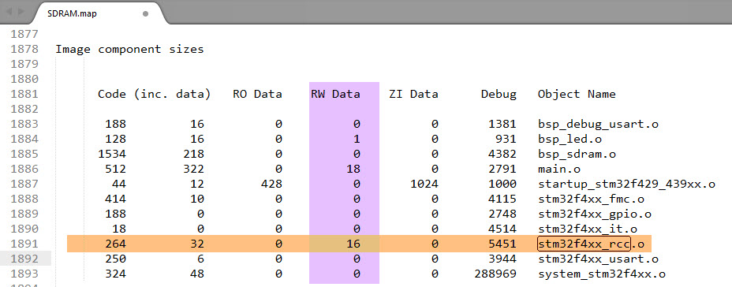
<span class="anchor" id="_Ref446085386"></span>图 1‑54 SDRAM.map文件中查看到stm32f4xx\_rcc.o文件的RW-data使用统计信息

###### 变量分配测试及结果

接下来查看本工程中的main文件，它定义了各种变量测试空间分配，见代码清单 1‑25。

<span class="anchor" id="_Ref446090409"></span>代码清单 1‑25 main文件
```C 


 //定义变量到SDRAM

 uint32_t testValue =0 ;

 //定义变量到SDRAM

 uint32_t testValue2 =7;


 //定义数组到SDRAM

 uint8_t <span class="anchor" id="OLE_LINK35"><span class="anchor" id="OLE_LINK36"></span></span>testGrup[100] ={0};

 //定义数组到SDRAM

 uint8_t testGrup2[100] ={1,2,3};


 /**

 * @brief 主函数

 * @param 无

 * @retval 无

 */

 int main(void)

 {

 uint32_t inerTestValue =10;

 /*SDRAM_Init已经在启动文件的Reset_handler中调用，进入main之前已经完成初始化*/

 // SDRAM_Init();


 /* LED 端口初始化 */

 LED_GPIO_Config();


 /* 初始化串口 */

 Debug_USART_Config();


 printf("\r\nSCT文件应用——自动分配变量到SDRAM实验\r\n");


 printf("\r\n使用“ uint32_t inerTestValue =10; ”语句定义的局部变量：\r\n");

 printf("结果：它的地址为：0x%x,变量值为：%d\r\n",(uint32_t)&amp;inerTestValue;,inerTestValue);


 printf("\r\n使用“uint32_t testValue =0 ;”语句定义的全局变量：\r\n");

 printf("结果：它的地址为：0x%x,变量值为：%d\r\n",(uint32_t)&amp;testValue;,testValue);


 printf("\r\n使用“uint32_t testValue2 =7 ; ”语句定义的全局变量：\r\n");

 printf("结果：它的地址为：0x%x,变量值为：%d\r\n",(uint32_t)&amp;testValue2;,testValue2);


 printf("\r\n使用“uint8_t testGrup[100] ={0};”语句定义的全局数组：\r\n");

 printf("结果：它的地址为：0x%x,变量值为：%d,%d,%d\r\n",(uint32_t)&amp;testGrup;,testGrup[0],testGrup[1],testGrup[2]);


 printf("\r\n使用“uint8_t testGrup2[100] ={1,2,3};”语句定义的全局数组：\r\n");

 printf("结果：它的地址为：0x%x,变量值为：%d，%d,%d\r\n",(uint32_t)&amp;testGrup2;,testGrup2[0],testGrup2[1],testGrup2[2]);


 uint32_t * pointer = (uint32_t*)malloc(sizeof(uint32_t)*3);

 if(pointer != NULL)

 {

 *(pointer)=1;

 *(++pointer)=2;

 *(++pointer)=3;


 printf("\r\n使用“ uint32_t *pointer = (uint32_t*)malloc(sizeof(uint32_t)*3); ”动态分配的变量\r\n");

printf("\r\n定义后的操作为：\r\n*(pointer++)=1;\r\n*(pointer++)=2;\r\n*pointer=3;");

 printf("结果：操作后它的地址为：0x%x,查看变量值操作：\r\n",(uint32_t)pointer);

 printf("*(pointer--)=%d, \r\n",*(pointer--));

 printf("*(pointer--)=%d, \r\n",*(pointer--));

 printf("*(pointer)=%d, \r\n",*(pointer));

 }

 else

 {

 printf("\r\n使用malloc动态分配变量出错！！！\r\n");

 }

 /*蓝灯亮*/

 LED_BLUE;

 while(1);

 }


```
代码中定义了局部变量、初值非0的全局变量及数组、初值为0的全局变量及数组以及动态分配内存，并把它们的值和地址通过串口打印到上位机，通过这些变量，我们可以测试栈、ZI/RW-data及堆区的变量是否能正常分配。构建工程后，首先查看工程的map文件观察变量的分配情况，见图 1‑55及图 1‑56。

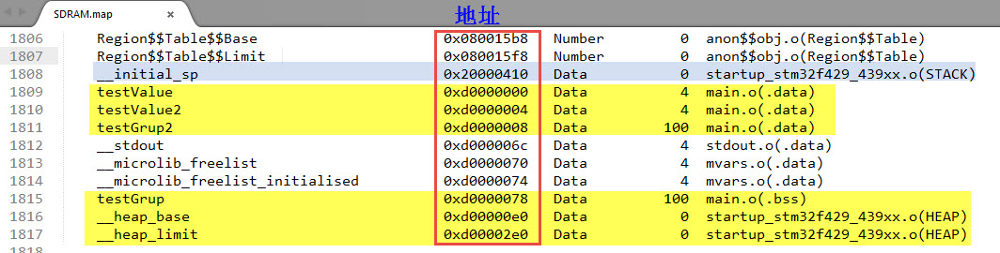
<span class="anchor" id="_Ref446158090"></span>图 1‑55在map文件中查看工程的存储分布1(SDRAM.map文件)

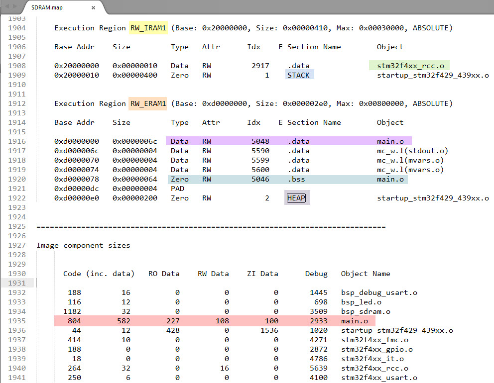
<span class="anchor" id="_Ref446092065"></span>图 1‑56 在map文件中查看工程的存储分布2(SDRAM.map文件)

从map文件中，可看到stm32f4xx\_rcc的RW-data及栈空间节区(STACK)都被分配到了RW\_IRAM1区域，即STM32的内部SRAM空间中；而main文件中定义的RW-data、ZI-data以及堆空间节区(HEAP)都被分配到了RW\_ERAM1区域，即我们扩展的SDRAM空间中，看起来一切都与我们的sct文件配置一致了。(堆空间属于ZI-data，由于没有像控制栈节区那样指定到内部SRAM，所以它被默认分配到SDRAM空间了；在main文件中我们定义了一个初值为0的全局变量testValue2及初值为0的数组testGrup\[100\]，它们本应占用的是104字节的ZI-data空间，但在map文件中却查看到它仅使用了100字节的ZI-data空间，这是因为链接器把testValue2分配为RW-data类型的变量了，这是链接器本身的特性，它对像testGrup\[100\]这样的数组才优化作为ZI-data分配，这不是我们sct文件导致的空间分配错误。)

接下来把程序下载到实验板进行测试，串口打印的调试信息如图 1‑57。

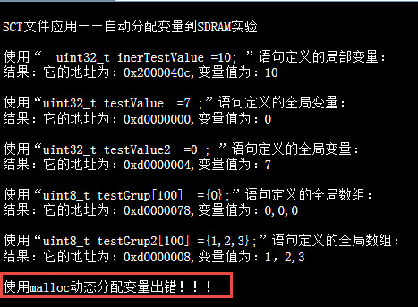
<span class="anchor" id="_Ref446093635"></span>图 1‑57 空间分配实验实测结果

从调试信息中可发现，除了对堆区使用malloc函数动态分配的空间不正常，其它变量都定义到了正确的位置，如内部变量定义在内部SRAM的栈区域，全局变量定义到了外部SDRAM的区域。

经过我的测试，即使在sct文件中使用“\*.o(HEAP)”语句指定堆区到内部SRAM或外部SDRAM区域，都无法正常使用malloc分配空间。另外，由于外部SDRAM的读写速度比内部SRAM的速度慢，所以我们更希望默认定义的变量先使用内部SRAM，当它的空间使用完毕后再把变量分配到外部SDRAM。

在下一小节中我们将改进sct的文件配置，解决这两个问题。

### 实验：优先使用内部SRAM并把堆区分配到SDRAM空间

本实验使用另一种方案配置sct文件，使得默认情况下优先使用内部SRAM空间，在需要的时候使用一个关键字指定变量存储到外部SDRAM，另外，我们还把系统默认的堆空间(HEAP)映射到外部SDRAM，从而可以使用C语言标准库的malloc函数动态从SDRAM中分配空间，利用标准库进行SDRAM的空间内存管理。

#### 硬件设计

本小节中使用到的硬件跟“扩展外部SDRAM”实验中的一致，若不了解，请参考该章节的原理图说明。

#### 软件设计

本小节中提供的例程名为“SCT文件应用—优先使用内部SRAM并把堆分配到SDRAM空间”，学习时请打开该工程来理解，该工程从上一小节的实验改写而来的，同样地，本工程只使用手动编辑的sct文件配置，不使用MDK选项配置，在“Options for Target-&gt;linker”的选项见图 1‑52。


图 1‑58 使用手动编写的sct文件

取消了这个默认的“Use Memory Layout from Target Dialog”勾选后，在MDK的Target对话框及文件配置的存储器分布选项都会失效，仅以sct文件中的为准，更改对话框及文件配置选项都不会影响sct文件的内容。

##### 编程要点

1.  修改启动文件，在\_\_main执行之前初始化SDRAM；

2.  在sct文件中增加外部SDRAM空间对应的执行域；

3.  在SDRAM中的执行域中选择一个自定义节区“EXRAM”；

4.  使用\_\_attribute\_\_关键字指定变量分配到节区“EXRAM”；

5.  使用宏封装\_\_attribute\_\_关键字，简化变量定义；

6.  根据需要，把堆区分配到内部SRAM或外部SDRAM中；

7.  编写测试程序，编译正常后，查看map文件的空间分配情况。

##### 代码分析

###### 在\_\_main之前初始化SDRAM

同样地，为了使定义到外部SDRAM的变量能被正常初始化，需要修改工程startup\_stm32f429\_439xx.s启动文件中的Reset\_handler函数，在\_\_main函数之前调用SDRAM\_Init函数使SDRAM硬件正常运转，见代码清单 1‑23。

代码清单 1‑26 修改启动文件中的Reset\_handler函数(startup\_stm32f429\_439xx.s文件)

1 ; Reset handler

2 Reset\_Handler PROC

3 EXPORT Reset\_Handler \[WEAK\]

4 IMPORT SystemInit

5 IMPORT \_\_main

6

7 ;从外部文件引入声明

8 **IMPORT SDRAM\_Init**

9

10 LDR R0, =SystemInit

11 BLX R0

12

13 ;在\_\_main之前调用SDRAM\_Init进行初始化

14 **LDR R0, =SDRAM\_Init**

15 **BLX R0**

16

17 LDR R0, =\_\_main

18 BX R0

19 ENDP

它与上一小节中的改动一样，当芯片上电运行Reset\_handler函数时，在执行\_\_main函数前先调用了我们自定义的SDRAM\_Init函数，从而为分散加载代码准备好正常的硬件工作环境。

###### sct文件配置

接下来分析本实验中的sct文件配置与上一小节有什么差异，见代码清单 1‑27。

<span class="anchor" id="_Ref446148923"></span>代码清单 1‑27 本实验的sct文件内容(SDRAM.sct)
```C 

 ; *************************************************************

 ; *** Scatter-Loading Description File generated by uVision ***

 ; *************************************************************

 LR_IROM1 0x08000000 0x00100000 { ; load region size_region

 ER_IROM1 0x08000000 0x00100000 { ; load address = execution address

 *.o (RESET, +First)

 *(InRoot$$Sections)

 .ANY (+RO)

 }


 RW_IRAM1 0x20000000 0x00030000 { ; 内部SRAM

 .ANY (+RW +ZI) ;其余的RW/ZI-data都分配到这里

 }


 <strong>RW_ERAM1 0xD0000000 0x00800000 {</strong> ; 外部SDRAM

 <strong>*.o(HEAP)</strong> ;选择堆区

 <strong>.ANY (EXRAM)</strong> ;选择EXRAM节区

 <strong>}</strong>

 }

```
本实验的sct文件中对内部SRAM的执行域保留了默认配置，没有作任何改动，新增了一个外部SDRAM的执行域，并且使用了“\*.o(HEAP)”语句把堆区分配到了SDRAM空间，使用“.ANY(EXRAM)”语句把名为“EXRAM”的节区分配到SDRAM空间。

这个“EXRAM”节区是由我们自定义的，在语法上就跟在C文件中定义全局变量类似，只要它跟工程中的其它原有节区名不一样即可。有了这个节区选择配置，当我们需要定义变量到外部SDRAM时，只需要指定该变量分配到该节区，它就会被分配到SDRAM空间。

本实验中的sct配置就是这么简单，接下来直接使用就可以了。

###### 指定变量分配到节区

当我们需要把变量分配到外部SDRAM时，需要使用\_\_attribute\_\_关键字指定节区，它的语法见代码清单 1‑28。

<span class="anchor" id="_Ref446148916"></span>代码清单 1‑28 指定变量定义到某节区的语法
```C 

 //使用 __attribute__ 关键字定义指定变量定义到某节区

 //语法: 变量定义 __attribute__ ((section ("节区名"))) = 变量值;

 uint32_t testValue __attribute__ ((section ("EXRAM"))) =7 ;


 //使用宏封装

 //设置变量定义到“EXRAM”节区的宏

 #define __EXRAM __attribute__ ((section ("EXRAM")))


 //使用该宏定义变量到SDRAM

 uint32_t testValue __EXRAM =7 ;


```
上述代码介绍了基本的指定节区语法：“变量定义 \_\_attribute\_\_ ((section ("节区名"))) = 变量值;”，它的主体跟普通的C语言变量定义语法无异，在赋值“=”号前(可以不赋初值)，加了个“\_\_attribute\_\_ ((section ("节区名")))”描述它要分配到的节区。本例中的节区名为“EXRAM”，即我们在sct文件中选择分配到SDRAM执行域的节区，所以该变量就被分配到SDRAM中了。

由于“\_\_attribute\_\_”关键字写起来比较繁琐，我们可以使用宏定义把它封装起来，简化代码。本例中我们把指定到“EXRAM”的描述语句“\_\_attribute\_\_ ((section ("EXRAM")))”封装成了宏“\_\_EXRAM”，应用时只需要使用宏的名字替换原来“\_\_attribute\_\_”关键字的位置即可，如“uint32\_t testValue \_\_EXRAM =7 ;”。有51单片机使用经验的读者会发现，这种变量定义方法就跟使用keil 51特有的关键字“xdata”定义变量到外部RAM空间差不多。

类似地，如果工程中还使用了其它存储器也可以用这样的方法实现变量分配，例如STM32的高速内部SRAM(CCM)，可以在sct文件增加该高速SRAM的执行域，然后在执行域中选择一个自定义节区，在工程源文件中使用“\_\_attribute\_\_”关键字指定变量到该节区，就可以可把变量分配到高速内部SRAM了。

根据我们sct文件的配置，如果定义变量时没有指定节区，它会默认优先使用内部SRAM，把变量定义到内部SRAM空间，而且由于局部变量是属于栈节区(STACK)，它不能使用“\_\_attribute\_\_”关键字指定节区。在本例中的栈节区被分配到内部SRAM空间。

###### 变量分配测试及结果

接下来查看本工程中的main文件，它定义了各种变量测试空间分配，见代码清单 1‑25。

代码清单 1‑29 main文件

1

2 //设置变量定义到“EXRAM”节区的宏

3 \#define \_\_EXRAM \_\_attribute\_\_ ((section ("EXRAM")))

4

5 //定义变量到SDRAM

6 uint32\_t testValue \_\_EXRAM =7 ;

7 //上述语句等效于：

8 //uint32\_t testValue \_\_attribute\_\_ ((section ("EXRAM"))) =7 ;

9

10 //定义变量到SRAM

11 uint32\_t testValue2 =7 ;

12

13 //定义数组到SDRAM

14 uint8\_t testGrup\[3\] \_\_EXRAM ={1,2,3};

15 //定义数组到SRAM

16 uint8\_t testGrup2\[3\] ={1,2,3};

17

18 /\*\*

19 \* @brief 主函数

20 \* @param 无

21 \* @retval 无

22 \*/

23 int main(void)

24 {

25 uint32\_t inerTestValue =10;

26 /\*SDRAM\_Init已经在启动文件的Reset\_handler中调用，进入main之前已经完成初始化\*/

27 // SDRAM\_Init();

28

29 /\* LED 端口初始化 \*/

30 LED\_GPIO\_Config();

31

32 /\* 初始化串口 \*/

33 Debug\_USART\_Config();

34

35 printf("\\r\\nSCT文件应用——自动分配变量到SDRAM实验\\r\\n");

36

37 printf("\\r\\n使用“ uint32\_t inerTestValue =10; ”语句定义的局部变量：\\r\\n");

38 printf("结果：它的地址为：0x%x,变量值为：%d\\r\\n",(uint32\_t)&amp;inerTestValue;,inerTestValue);

39

40 printf("\\r\\n使用“uint32\_t testValue \_\_EXRAM =7 ;”语句定义的全局变量：\\r\\n");

41 printf("结果：它的地址为：0x%x,变量值为：%d\\r\\n",(uint32\_t)&amp;testValue;,testValue);

42

43 printf("\\r\\n使用“uint32\_t testValue2 =7 ; ”语句定义的全局变量：\\r\\n");

44 printf("结果：它的地址为：0x%x,变量值为：%d\\r\\n",(uint32\_t)&amp;testValue2;,testValue2);

45

46

47 printf("\\r\\n使用“uint8\_t testGrup\[3\] \_\_EXRAM ={1,2,3};”语句定义的全局数组：\\r\\n");

48 printf("结果：它的地址为：0x%x,变量值为：%d,%d,%d\\r\\n", (uint32\_t)&amp;testGrup;,testGrup\[0\],testGrup\[1\],testGrup\[2\]);

49

50 printf("\\r\\n使用“uint8\_t testGrup2\[3\] ={1,2,3};”语句定义的全局数组：\\r\\n");

51 printf("结果：它的地址为：0x%x,变量值为：%d，%d,%d\\r\\n", (uint32\_t)&amp;testGrup2;,testGrup2\[0\],testGrup2\[1\],testGrup2\[2\]);

52

53 uint32\_t \*pointer = (uint32\_t\*)malloc(sizeof(uint32\_t)\*3);

54

55 if(pointer != NULL)

56 {

57 \*(pointer)=1;

58 \*(++pointer)=2;

59 \*(++pointer)=3;

60

61 printf("\\r\\n使用“ uint32\_t \*pointer = (uint32\_t\*)malloc(sizeof(uint32\_t)\*3); ”动态分配的变量\\r\\n");

62 printf("\\r\\n定义后的操作为：\\r\\n\*(pointer++)=1;\\r\\n\*(pointer++)=2;\\r\\n\*pointer=3;\\r\\n\\r\\n");

63 printf("结果：操作后它的地址为：0x%x,查看变量值操作：\\r\\n",(uint32\_t)pointer);

64 printf("\*(pointer--)=%d, \\r\\n",\*(pointer--));

65 printf("\*(pointer--)=%d, \\r\\n",\*(pointer--));

66 printf("\*(pointer)=%d, \\r\\n",\*(pointer));

free(pointer);

67 }

68 else

69 {

70 printf("\\r\\n使用malloc动态分配变量出错！！！\\r\\n");

71 }

72 /\*蓝灯亮\*/

73 LED\_BLUE;

74 while(1);

75 }

代码中定义了普通变量、指定到EXRAM节区的变量并使用动态分配内存，还把它们的值和地址通过串口打印到上位机，通过这些变量，我们可以检查变量是否能正常分配。

构建工程后，查看工程的map文件观察变量的分配情况，见图 1‑56。

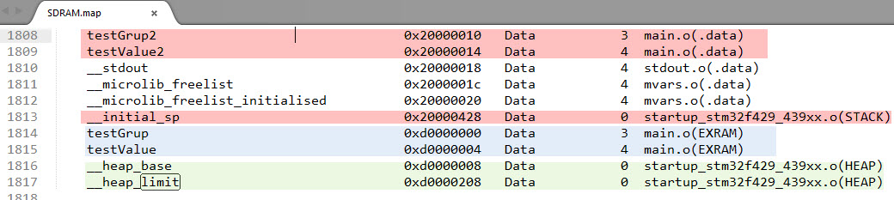

图 1‑59 在map文件中查看工程的存储分布(SDRAM.map文件)

从map文件中可看到普通变量及栈节区都被分配到了内部SRAM的地址区域，而指定到EXRAM节区的变量及堆空间都被分配到了外部SDRAM的地址区域，与我们的要求一致。

再把程序下载到实验板进行测试，串口打印的调试信息如图 1‑60。

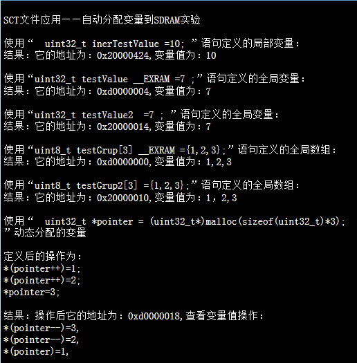
<span class="anchor" id="_Ref446158445"></span>图 1‑60 空间分配实验实测结果

从调试信息中可发现，实际运行结果也完全正常，本实验中的sct文件配置达到了优先分配变量到内部SRAM的目的，而且堆区也能使用malloc函数正常分配空间。

本实验中的sct文件配置方案完全可以应用到您的实际工程项目中，下面再进一步强调其它应用细节。

###### 使用malloc和free管理SDRAM的空间

SDRAM的内存空间非常大，为了管理这些空间，一些工程师会自己定义内存分配函数来管理SDRAM空间，这些分配过程本质上就是从SDRAM中动态分配内存。从本实验中可了解到我们完全可以直接使用C标准库的malloc从SDRAM中分配空间，只要在前面配置的基础上修改启动文件中的堆顶地址限制即可，见代码清单 1‑30。

<span class="anchor" id="_Ref446161194"></span>代码清单 1‑30 修改启动文件的堆顶地址(startup_stm32f429_439xx.s文件)
```C 

 Heap_Size EQU 0x00000200


 AREA HEAP, NOINIT, READWRITE, ALIGN=3


 __heap_base

 Heap_Mem SPACE Heap_Size

 <strong>__heap_limit EQU 0xd0800000</strong> ;设置堆空间的极限地址(SDRAM),

```
;0xd0000000+0x00800000

9

10 PRESERVE8

11 THUMB

C标准库的malloc函数是根据\_\_heap\_base及\_\_heap\_limit地址限制分配空间的，在以上的代码定义中，堆基地址\_\_heap\_base的由链接器自动分配未使用的基地址，而堆顶地址\_\_heap\_limit则被定义为外部SDRAM的最高地址0xD0000000+0x00800000(使用这种定义方式定义的\_\_heap\_limit值与Heap\_Size定义的大小无关)，经过这样配置之后，SDRAM内除EXRAM节区外的空间都被分配为堆区，所以malloc函数可以管理剩余的所有SDRAM空间。修改后，它生成的map文件信息见图 1‑61。

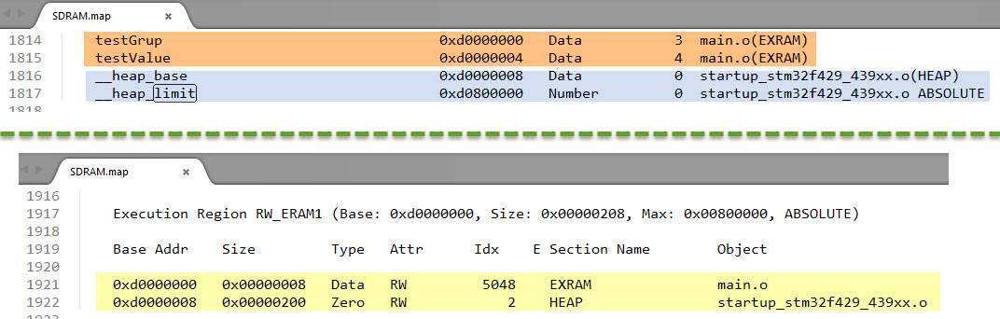
<span class="anchor" id="_Ref446162232"></span>图 1‑61 使用malloc管理剩余SDRAM空间

可看到\_\_heap\_base的地址紧跟在EXRAM之后，\_\_heap\_limit指向了SDRAM的最高地址，因此malloc函数就能利用所有SDRAM的剩余空间了。注意图中显示的HEAP节区大小为0x00000200字节，修改启动文件中的Heap\_Size大小可以改变该值，它的大小是不会影响malloc函数使用的，malloc实际可用的就是\_\_heap\_base与\_\_heap\_limit之间的空间。至于如何使Heap\_Size的值能自动根据\_\_heap\_limit与\_\_heap\_base的值自动生成，我还没找到方法，若您了解，请告知。

###### 把堆区分配到内部SRAM空间。

若您希望堆区(HEAP)按照默认配置，使它还是分配到内部SRAM空间，只要把“\*.o(HEAP)”选择语句从SDRAM的执行域删除掉即可，堆节区就会默认分配到内部SRAM，外部SDRAM仅选择EXRAM节区的内容进行分配，见代码清单 1‑31，若您更改了启动文件中堆的默认配置，主注意空间地址的匹配。

<span class="anchor" id="_Ref446159904"></span>代码清单 1‑31 按默认配置分配堆区到内部SRAM的sct文件范例
```C 

 LR_IROM1 0x08000000 0x00100000 { ; load region size_region

 ER_IROM1 0x08000000 0x00100000 { ; load address = execution address

 *.o (RESET, +First)

 *(InRoot$$Sections)

 .ANY (+RO)

 }

 <strong>RW_IRAM1 0x20000000 0x00030000 {</strong> ; 内部SRAM

 <strong>.ANY (+RW +ZI)</strong> ;其余的RW/ZI-data都分配到这里

 <strong>}</strong>


 <strong>RW_ERAM1 0xD0000000 0x00800000 {</strong> ; 外部SDRAM

 <strong>.ANY (EXRAM)</strong> ;选择EXRAM节区

 <strong>}</strong>

 }

```
###### 屏蔽链接过程的warning

在我们的实验配置的sct文件中使用了“\*.o(HEAP)”语句选择堆区，但有时我们的工程完全没有使用堆(如整个工程都没有使用malloc)，这时链接器会把堆占用的空间删除，构建工程后会输出警告提示该语句仅匹配到无用节区，见图 1‑62。

&gt; 
<span class="anchor" id="_Ref446164739"></span>图 1‑62 仅匹配到无用节区的warning

这并无什么大碍，但强迫症患者不希望看到warning，可以在“Options for Target-&gt;Linker-&gt;disable Warnings”中输入warning号屏蔽它。warning号可在提示信息中找到，如上图提示信息中“warning：L6329W”表示它的warning号为6329，把它输入到图 1‑63中的对话框中即可。

&gt; 
<span class="anchor" id="_Ref446165017"></span>图 1‑63 屏蔽链接过程的warning

###### 注意SDRAM用于显存的改变

根据本实验的sct文件配置，链接器会自动分配SDRAM的空间，而本书以前的一些章节讲解的实验使用SDRAM空间的方式非常简单粗暴，如果把这个sct文件配置直接应用到这些实验中可能会引起错误，例如我们的液晶驱动，见代码清单 1‑32。

<span class="anchor" id="_Ref446165883"></span>代码清单 1‑32 原液晶显示驱动使用的显存地址
```C 

 /* LCD Size (Width and Height) */

 #define LCD_PIXEL_WIDTH ((uint16_t)800)

 #define LCD_PIXEL_HEIGHT ((uint16_t)480)


 <strong>#define LCD_FRAME_BUFFER ((uint32_t)0xD0000000)</strong> //第一层首地址

 #define BUFFER_OFFSET ((uint32_t)800*480*3) //一层液晶的数据量

 #define LCD_PIXCELS ((uint32_t)800*480)


 /**

 * @brief 初始化LTD的 层 参数

 * - 设置显存空间

 * - 设置分辨率

 * @param None

 * @retval None

 */

 void LCD_LayerInit(void)

 {

 /*其它部分省略*/

 /* 配置本层的显存首地址 */

 LTDC_Layer_InitStruct.LTDC_CFBStartAdress = <strong>LCD_FRAME_BUFFER</strong>;

 /*其它部分省略*/

 }

```
在这段液晶驱动代码中，我们直接使用一个宏定义了SDRAM的地址，然后把它作为显存空间告诉LTDC外设(从0xD0000000地址开始的大小为800\*480\*3的内存空间)，然而这样的内存配置链接器是无法跟踪的，链接器在自动分配变量到SDRAM时，极有可能使用这些空间，导致出错。

解决方案之一是使用\_\_EXRAM定义一个数组空间作为显存，由链接器自动分配空间地址，最后把数组地址作为显存地址告诉LTDC外设即可，其它类似的应用都可以使用这种方案解决。

代码清单 1‑33 由链接器自动分配显存空间

1 \#define BUFFER\_OFFSET ((uint32\_t)800\*480\*3) //一层液晶的数据量

2 \#define LCD\_PIXCELS ((uint32\_t)800\*480)

3

4 **uint8\_t LCD\_FRAME\_BUFFER\[BUFFER\_OFFSET\] \_\_EXRAM;**

5

6 /\*\*

7 \* @brief 初始化LTD的 层 参数

8 \* - 设置显存空间

9 \* - 设置分辨率

10 \* @param None

11 \* @retval None

12 \*/

13 void LCD\_LayerInit(void)

14 {

15 /\*其它部分省略\*/

16 /\* 配置本层的显存首地址 \*/

17 LTDC\_Layer\_InitStruct.LTDC\_CFBStartAdress = **&amp;LCD;\_FRAME\_BUFFER; **

18 /\*其它部分省略\*/

19 }

总而言之，当不再使用默认的sct文件配置时，一定要注意修改后会引起内存空间发生什么变化，小心这些变化导致的存储器问题。

###### 如何把栈空间也分配到SDRAM

前面提到因为SDRAM\_Init初始化函数本身使用了栈空间(STACK)，而在执行SDRAM\_Init函数之前SDRAM并未正常工作，这样的矛盾导致无法把栈分配到SDRAM。其实换一个思路，只要我们的SDRAM初始化过程不使用栈空间，SDRAM正常运行后栈才被分配到SDRAM空间，这样就没有问题了。

由于原来的SDRAM\_Init实现的SDRAM初始化过程使用了STM32标准库函数，它不可避免地使用了栈空间(定义了局部变量)，要完全不使用栈空间完成SDRAM的初始化，只能使用纯粹的寄存器方式配置。在STM32标准库的“system\_stm32f4xx.c”文件已经给出了类似的解决方案，SystemInit\_ExtMemCtl函数，见代码清单 1‑34。

<span class="anchor" id="_Ref446173012"></span>代码清单 1‑34 SystemInit_ExtMemCtl函数(system_stm32f4xx.c文件)
```C 

 #ifdef DATA_IN_ExtSDRAM

 /**

 * @brief Setup the external memory controller.

 * Called in startup_stm32f4xx.s before jump to main.

 * This function configures the external SDRAM mounted on STM324x9I_EVAL board

 * This SDRAM will be used as program data memory (including heap and stack).

 * @param None

 * @retval None

 */

 void SystemInit_ExtMemCtl(void)

 {

 register uint32_t tmpreg = 0, timeout = 0xFFFF;

 register uint32_t index;


 /* Enable GPIOC, GPIOD, GPIOE, GPIOF, GPIOG, GPIOH and GPIOI interface

 clock */

 RCC-&gt;AHB1ENR |= 0x000001FC;


 /* Connect PCx pins to FMC Alternate function */

 GPIOC-&gt;AFR[0] = 0x0000000c;

 GPIOC-&gt;AFR[1] = 0x00007700;

 /* Configure PCx pins in Alternate function mode */

 GPIOC-&gt;MODER = 0x00a00002;

 /* Configure PCx pins speed to 50 MHz */

 GPIOC-&gt;OSPEEDR = 0x00a00002;

 /* Configure PCx pins Output type to push-pull */


 /**********************具体配置省略*************************/

 }

 #endif /* DATA_IN_ExtSDRAM */

```
该函数没有使用栈空间，仅使用register关键字定义了两个分配到内核寄存器的变量，其余配置均通过直接操作寄存器完成。这个函数针对ST的一个官方评估编写的，在其它硬件平台直接使用可能有错误，若有需要可仔细分析它的代码再根据自己的硬件平台进行修改。

这个函数是使用条件编译语句“\#ifdef DATA\_IN\_ExtSDRAM”包装起来的，默认情况下这个函数并不会被编译，需要使用这个函数时只要定义这个宏即可。

定义了DATA\_IN\_ExtSDRAM宏之后，SystemInit\_ExtMemCtl函数会被SystemInit函数调用，见代码清单 1‑35，而我们知道SystemInit会在启动文件中的Reset\_handler函数中执行。

<span class="anchor" id="_Ref446173963"></span>代码清单 1‑35 SystemInit函数对SystemInit_ExtMemCtl的调用(system_stm32f4xx.c文件)
```C 

 /**

 * @brief Setup the microcontroller system

 * Initialize the Embedded Flash Interface, the PLL and update the

 * SystemFrequency variable.

 * @param None

 * @retval None

 */

 void SystemInit(void)

 {


 /******部分代码省略******/

 #if defined(DATA_IN_ExtSRAM) || defined(DATA_IN_ExtSDRAM)

 SystemInit_ExtMemCtl();

 #endif /* DATA_IN_ExtSRAM || DATA_IN_ExtSDRAM */

 /******部分代码省略******/

 }

```
所以，如果希望把栈空间分配到外部SDRAM，可按以下步骤操作：

-   修改sct文件，使用“\*.o(STACK)”语句把栈空间分配到SDRAM的执行域；

-   根据自己的硬件平台，修改SystemInit\_ExtMemCtl函数，该函数要实现SDRAM的初始化过程，且该函数不能使用栈空间；

-   定义DATA\_IN\_ExtSDRAM宏，从而使得SystemInit\_ExtMemCtl函数被加进编译，并被SystemInit调用；

-   由于Reset\_handler默认会调用SystemInit函数执行，所以不需要修改启动文件。

<span class="anchor" id="OLE_LINK11"><span class="anchor" id="OLE_LINK12"></span></span>

### 每课一问

1.  在工程中分别增加全局变量(0值及非0值)、局部变量，查看map文件，观察应用程序空间的变化。(定义的变量若不使用会被编译器优化；即使使用了变量，受编译器优化影响，空间变化也不一定完全与预计的一致，定义占用空间较大的变量观察，效果更明显，如<span class="anchor" id="OLE_LINK13"><span class="anchor" id="OLE_LINK14"></span></span>uint32\_t testValue\[50\]={0};或uint32\_t testValue\[50\]={0，1，2，3};)

2.  查看MDK的对armcc编译器的命令输入(图 1‑13)，查看修改MDK配置后，命令会如何变化变化(如修改芯片类型、是否使用浮点单元、编译优化等)。

3.  尝试修改分散加载文件，然后编译后在map文件中查看存储器索引表的变化。

4.  参考图 1‑37，在MDK中加入fromelf指令，控制它生成工程对应的bin文件。

5.  修改“自动分配变量到外部SDRAM”中的实验，把SDRAM的初始化过程放在main函数里(删掉启动文件中执行SDRAM\_Init的两条语句)，然后使用串口打印查看定义到SDRAM的变量内容是否正常。

在SRAM中调试代码
----------------

本章参考资料：《STM32F4xx 中文参考手册》、《STM32F4xx规格书》、《Cortex-M3权威指南》、《Cortex-M4 Technical Reference Manual》(跟M3大部分是相同的，读英文不习惯可先参考《Cortex-M3权威指南》)。

学习本章时，配合《STM32F4xx 中文参考手册》“存储器和总线结构”及“嵌入式FLASH接口”章节一起阅读，效果会更佳，特别是涉及到寄存器说明的部分。

### 在RAM中调试代码

一般情况下，我们在MDK中编写工程应用后，调试时都是把程序下载到芯片的内部FLASH运行测试的，代码的CODE及RW-data的内容被写入到内部FLASH中存储。但在某些应用场合下却不希望或不能修改内部FLASH的内容，这时就可以使用RAM调试功能了，它的本质是把原来存储在内部FLASH的代码(CODE及RW-data的内容)改为存储到SRAM中(内部SRAM或外部SDRAM均可)，芯片复位后从SRAM中加载代码并运行。

把代码下载到RAM中调试有如下优点：

-   下载程序非常快。RAM存储器的写入速度比在内部FLASH中要快得多，且没有擦除过程，因此在RAM上调试程序时程序几乎是秒下的，对于需要频繁改动代码的调试过程，能节约很多时间，省去了烦人的擦除与写入FLASH过程。另外，STM32的内部FLASH可擦除次数为1万次，虽然一般的调试过程都不会擦除这么多次导致FLASH失效，但这确实也是一个考虑使用RAM的因素。

<!-- -->

-   不改写内部FLASH的原有程序。

-   对于内部FLASH被锁定的芯片，可以把解锁程序下载到RAM上，进行解锁。

相对地，把代码下载到RAM中调试有如下缺点：

-   存储在RAM上的程序掉电后会丢失，不能像FLASH那样保存。

-   若使用STM32的内部SRAM存储程序，程序的执行速度与在FLASH上执行速度无异，但SRAM空间较小。

-   若使用外部扩展的SDRAM存储程序，程序空间非常大，但STM32读取SDRAM的速度比读取内部FLASH慢，这会导致程序总执行时间增加，因此在SDRAM中调试的程序无法完美仿真在内部FLASH运行时的环境。另外，由于STM32无法直接从SDRAM中启动且应用程序复制到SDRAM的过程比较复杂(下载程序前需要使STM32能正常控制SDRAM)，所以在很少会在STM32的SDRAM中调试程序。

### STM32的启动方式

在前面讲解的STM32启动代码章节了解到CM-4内核在离开复位状态后的工作过程如下，见图 2‑1：

1.  从地址0x00000000处取出栈指针MSP的初始值，该值就是栈顶的地址。

2.  从地址0x00000004处取出程序指针PC的初始值，该值指向复位后应执行的第一条指令。


<span class="anchor" id="_Ref446506902"></span>图 2‑1 复位序列

上述过程由内核自动设置运行环境并执行主体程序，因此它被称为自举过程。

虽然内核是固定访问0x00000000和0x00000004地址的，但实际上这两个地址可以被重映射到其它地址空间。以STM32F429为例，根据芯片引出的BOOT0及BOOT1引脚的电平情况，这两个地址可以被映射到内部FLASH、内部SRAM以及系统存储器中，不同的映射配置见表 2‑1。

<span class="anchor" id="_Ref446512605"></span>表 2‑1 BOOT引脚的不同设置对0地址的映射

| BOOT1 | BOOT0 | 映射到的存储器 | 0x00000000 
                                              
                                  地址映射到  | 0x00000004 
                                                           
                                               地址映射到  |
|-------|-------|----------------|------------|------------|
| x     | 0     | 内部FLASH      | 0x08000000 | 0x08000004 |
| 1     | 1     | 内部SRAM       | 0x20000000 | 0x20000004 |
| 0     | 1     | 系统存储器     | 0x1FFF0000 | 0x1FFF0004 |

内核在离开复位状态后会从映射的地址中取值给栈指针MSP及程序指针PC，然后执行指令，我们一般以存储器的类型来区分自举过程，例如内部FLASH启动方式、内部SRAM启动方式以及系统存储器启动方式。

1.  内部FLASH启动方式

&gt; 当芯片上电后采样到BOOT0引脚为低电平时， 0x00000000和0x00000004地址被映射到内部FLASH的首地址0x08000000和0x08000004。因此，内核离开复位状态后，读取内部FLASH的0x08000000地址空间存储的内容，赋值给栈指针MSP，作为栈顶地址，再读取内部FLASH的0x08000004地址空间存储的内容，赋值给程序指针PC，作为将要执行的第一条指令所在的地址。具备这两个条件后，内核就可以开始从PC指向的地址中读取指令执行了。

1.  内部SRAM启动方式

&gt; 类似地，当芯片上电后采样到BOOT0和BOOT1引脚均为高电平时，0x00000000和0x00000004地址被映射到内部SRAM的首地址0x20000000和0x20000004，内核从SRAM空间获取内容进行自举。
&gt;
&gt; 在实际应用中，由启动文件starttup\_stm32f429\_439xx.s决定了0x00000000和0x00000004地址存储什么内容，链接时，由分散加载文件(sct)决定这些内容的绝对地址，即分配到内部FLASH还是内部SRAM。（下一小节将以实例讲解）

1.  系统存储器启动方式

&gt; 当芯片上电后采样到BOOT0引脚为高电平，BOOT1为低电平时，内核将从系统存储器的0x1FFF0000及0x1FFF0004获取MSP及PC值进行自举。系统存储器是一段特殊的空间，用户不能访问，ST公司在芯片出厂前就在系统存储器中固化了一段代码。因而使用系统存储器启动方式时，内核会执行该代码，该代码运行时，会为ISP提供支持(In System Program)，如检测USART1/3、CAN2及USB通讯接口传输过来的信息，并根据这些信息更新自己内部FLASH的内容，达到升级产品应用程序的目的，因此这种启动方式也称为ISP启动方式。

### 内部FLASH的启动过程

下面我们以最常规的内部FLASH启动方式来分析自举过程，主要理解MSP和PC内容是怎样被存储到0x08000000和0x08000004这两个地址的。

见图 2‑2 ，这是STM32F4默认的启动文件的代码，启动文件的开头定义了一个大小为0x400的栈空间，且栈顶的使用标号“\_\_initial\_sp”来表示；在图下方定义了一个名为“Reset\_Handler”的子程序，它就是我们总是提到的在芯片启动后第一个执行的代码。在汇编语法中，程序的名字和标号都包含它所在的地址，因此，我们的目标是把“\_\_initial\_sp”和“Reset\_Handler”赋值到0x08000000和0x08000004地址空间存储，这样内核自举的时候就可以获得栈顶地址以及第一条要执行的指令了。在启动代码的中间部分，使用了汇编关键字“DCD” 把“\_\_initial\_sp”和“Reset\_Handler”定义到了最前面的地址空间。

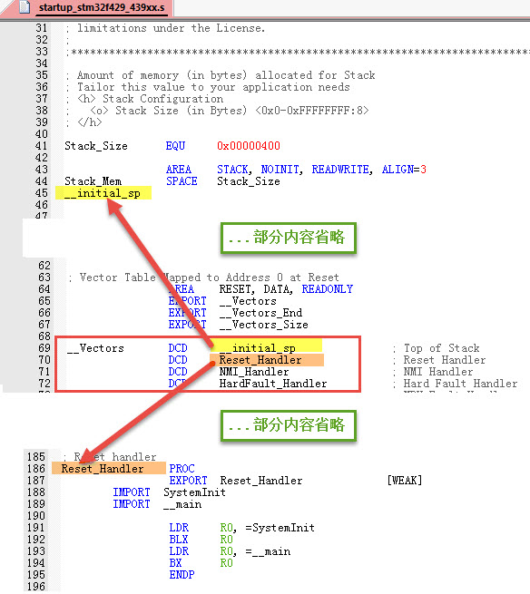
<span class="anchor" id="_Ref446510987"></span>图 2‑2 启动代码中存储的MSP及PC指针内容

在启动文件中把设置栈顶及首条指令地址到了最前面的地址空间，但这并没有指定绝对地址，各种内容的绝对地址是由链接器根据分散加载文件(\*.sct)分配的，STM32F429IGT6型号的默认分散加载文件配置见代码清单 2‑1。

<span class="anchor" id="_Ref446518789"></span>代码清单 2‑1 默认分散加载文件的空间配置
```C 

 ; *************************************************************

 ; *** Scatter-Loading Description File generated by uVision ***

 ; *************************************************************


 LR_IROM1 <strong>0x08000000</strong> 0x00100000 { ; load region size_region

 ER_IROM1 <strong>0x08000000</strong> 0x00100000 { ; load address = execution address

 *.o (RESET, +First)

 *(InRoot$$Sections)

 .ANY (+RO)

 }

 RW_IRAM1 0x20000000 UNINIT 0x00030000 { ; RW data

 .ANY (+RW +ZI)

 }

 }


```
分散加载文件把加载区和执行区的首地址都设置为0x08000000，正好是内部FLASH的首地址，因此汇编文件中定义的栈顶及首条指令地址会被存储到0x08000000和0x08000004的地址空间。

类似地，如果我们修改分散加载文件，把加载区和执行区的首地址设置为内部SRAM的首地址0x20000000，那么栈顶和首条指令地址将会被存储到0x20000000和0x20000004的地址空间了。

为了进一步消除疑虑，我们可以查看反汇编代码及map文件信息来了解各个地址空间存储的内容，见图 2‑3，这是多彩流水灯工程编译后的信息，它的启动文件及分散加载文件都按默认配置。其中反汇编代码是使用fromelf工具从axf文件生成的，具体过程可参考前面的章节了解。


<span class="anchor" id="_Ref446510990"></span>图 2‑3 从反汇编代码及map文件查看存储器的内容

从反汇编代码可了解到，这个工程的0x08000000地址存储的值为0x20000400，0x08000004地址存储的值为0x080001C1，查看map文件，这两个值正好是栈顶地址\_\_initial\_sp以及首条指令Reset\_Handler的地址。下载器会根据axf文件(bin、hex类似)存储相应的内容到内部FLASH中。

由此可知，BOOT0为低电平时，内核复位后，从0x08000000读取到栈顶地址为0x20000400，了解到子程序的栈空间范围，再从0x08000004读取到第一条指令的存储地址为0x080001C1，于是跳转到该地址执行代码，即从ResetHandler开始运行，运行SystemInit、\_\_main(包含分散加载代码)，最后跳转到C语言的main函数。

对比在内部FLASH中运行代码的过程，可了解到若希望在内部SRAM中调试代码，需要设置启动方式为从内部SRAM启动，修改分散加载文件控制代码空间到内部SRAM地址以及把生成程序下载到芯片的内部SRAM中。

### 实验：在内部SRAM中调试代码

本实验将演示如何设置工程选项实现在内部SRAM中调试代码，实验的示例代码名为“RAM调试—多彩流水灯”，学习以下内容时请打开该工程来理解，它是从普通的多彩流水灯例程改造而来的。

#### 硬件设计

本小节中使用到的流水灯硬件不再介绍，主要讲解与SRAM调试相关的硬件配置。在SRAM上调试程序，需要修改STM32芯片的启动方式，见图 2‑4。

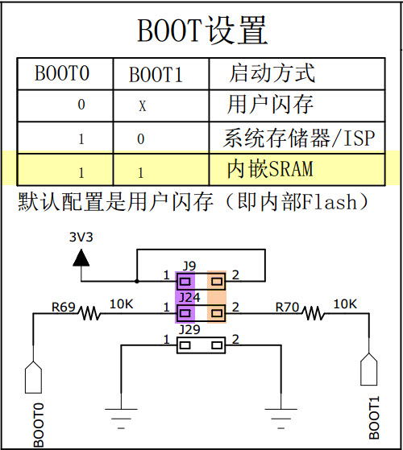
<span class="anchor" id="_Ref446343734"></span>图 2‑4 实验板的boot引脚配置

在我们的实验板左侧有引出STM32芯片的BOOT0和BOOT1引脚，可使用跳线帽设置它们的电平从而控制芯片的启动方式，它支持从内部FLASH启动、系统存储器启动以及内部SRAM启动方式。

本实验在SRAM中调试代码，因此把BOOT0和BOOT1引脚都使用跳线帽连接到3.3V，使芯片从SRAM中启动。

#### 软件设计

<span class="anchor" id="OLE_LINK45"><span class="anchor" id="OLE_LINK46"></span></span>本实验的工程从普通的多彩流水灯工程改写而来，主要修改了分散加载文件及一些程序的下载选项。

##### 主要步骤

1.  在原工程的基础上创建一个调试版本；

2.  修改分散加载文件，使链接器把代码分配到内部SRAM空间；

3.  添加宏修改STM32的向量表地址；

4.  修改仿真器和下载器的配置，使程序能通过下载器存储到内部SRAM；

5.  根据使用情况选择是否需要使用仿真器命令脚本文件\*.ini；

6.  尝试给SRAM下载程序或仿真调试。

##### 创建工程的调试版本

由于在SRAM中运行的代码一般只是用于调试，调试完毕后，在实际生产环境中仍然使用在内部FLASH中运行的代码，因此我们希望能够便捷地在调试版和发布版代码之间切换。MDK的“Manage Project Items”可实现这样的功能，使用它可管理多个不同配置的工程，见图 2‑5，点击“Manage Project Items”按钮，在弹出对话框左侧的“Project Target”一栏包含了原工程的名字，如图中的原工程名为“多彩流水灯”，右侧是该工程包含的文件。为了便于调试，我们在左侧的“Project Target”一栏添加一个工程名，如图中输入“SRAM\_调试”，输入后点击OK即可，这个“SRAM\_调试”版本的工程会复制原“多彩流水灯”工程的配置，后面我们再进行修改。

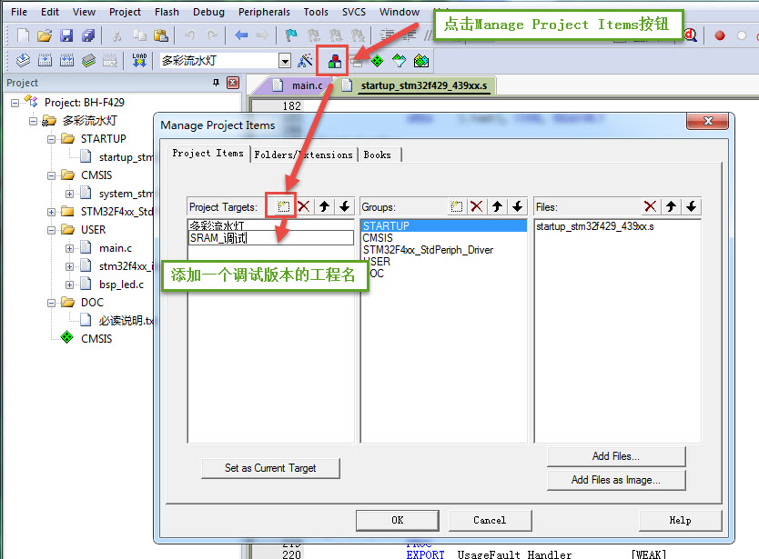
<span class="anchor" id="_Ref446605594"></span>图 2‑5 使用Manage Project Items添加一个工程配置

当需要切换工程版本时，点击MDK工程名的下拉菜单可选择目标工程，在不同的工程中，所有配置都是独立的，例如芯片型号、下载配置等等，但如果两个工程共用了同一个文件，对该文件的修改会同时影响两个工程，例如这两个工程都使用同一个main文件，我们在main文件修改代码，两个工程都会被修改。

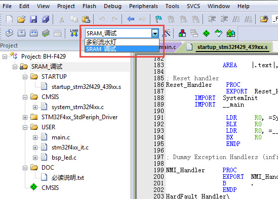

图 2‑6 切换工程

在下面的教程中我们将切换到“SRAM\_调试”版本的工程，配置出一个代码会被存储到SRAM的多彩流水灯工程。

##### 配置分散加载文件

为方便讲解，本工程的分散加载只使用手动编辑的sct文件配置，不使用MDK的对话框选项配置，在“Options for Target-&gt;linker”的选项见图 2‑7。

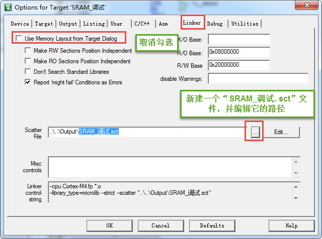
<span class="anchor" id="_Ref446608547"></span>图 2‑7 使用新建的“SRAM\_调试.sct”文件

为了防止“多彩流水灯”工程的分散加载文件被影响，我们在工程的Output路径下新建了一个名为“SRAM\_调试.sct”的文件，并在上图中把它配置为“SRAM\_调试”工程专用的分散加载文件，该文件的内容见代码清单 2‑2，若不了解分散加载文件的使用，请参考前面的章节。

<span class="anchor" id="_Ref446609106"></span>代码清单 2‑2 分散加载文件配置(SRAM_调试.sct)
```C 

 ; *************************************************************

 ; *** Scatter-Loading Description File generated by uVision ***

 ; *************************************************************


 LR_IROM1 <strong>0x20000000 0x00010000</strong> { ; load region size_region

 ER_IROM1 <strong>0x20000000 0x00010000</strong> { ; load address = execution address

 *.o (RESET, +First)

 *(InRoot$$Sections)

 .ANY (+RO)

 }

 RW_IRAM1 <strong>0x20010000 0x00020000</strong> { ; RW data

 .ANY (+RW +ZI)

 }

 }


```
在这个分散加载文件配置中，把原本分配到内部FLASH空间的加载域和执行域改到了以地址0x20000000开始的64KB(0x00010000)空间，而RW data空间改到了以地址0x20010000开始的128KB空间 (0x00020000)。也就是说，它把STM32的内部SRAM分成了虚拟ROM区域以及RW data数据区域，链接器会根据它的配置给工程中的各种内容分配到SRAM地址。

在具体的应用中，虚拟ROM及RW区域的大小可根据自己的程序定制，配置完毕编译工程后可在map文件中查看具体的空间地址分配。

##### 配置中断向量表

由于startup\_stm32f429\_439xx.s文件中的启动代码不是指定到绝对地址的，经过它由链接器决定应存储到内部FLASH还是SRAM，所以SRAM版本工程中的启动文件不需要作任何修改。

重点在于启动文件定义的中断向量表被存储到内部FLASH和内部SRAM时，这两种情况对内核的影响是不同的，内核会根据它的“向量表偏移寄存器VTOR”配置来获取向量表，即中断服务函数的入口。VTOR寄存器是由启动文件中Reset\_Handle中调用的库函数SystemInit配置的，见代码清单 2‑3。

<span class="anchor" id="_Ref446611277"></span>代码清单 2‑3 SystemInit函数(system_stm32f4xx.c文件)
```C 

 /**

 * @brief Setup the microcontroller system

 * Initialize the Embedded Flash Interface, the PLL and update the

 * SystemFrequency variable.

 * @param None

 * @retval None

 */

 void SystemInit(void)

 {

 /* ..其它代码部分省略 */


 /* Configure the Vector Table location add offset address ----*/

 #ifdef VECT_TAB_SRAM

 SCB-&gt;VTOR = SRAM_BASE | VECT_TAB_OFFSET; /* 向量表存储在SRAM */

 #else

 SCB-&gt;VTOR = FLASH_BASE | VECT_TAB_OFFSET; /* 向量表存储在内部FLASH */

 #endif

 }

```
代码中根据是否存储宏定义VECT\_TAB\_SRAM来决定VTOR的配置，默认情况下代码中没有定义宏VECT\_TAB\_SRAM，所以VTOR默认情况下指示向量表是存储在内部FLASH空间的。

由于本工程的分散加载文件配置，在启动文件中定义的中断向量表会被分配到SRAM空间，所以我们要定义这个宏，使得SystemInit函数修改VTOR寄存器，向内核指示向量表被存储到内部SRAM空间了，见图 2‑8，在“Options for Target-&gt; c/c++ -&gt;Define”框中输入宏VECT\_TAB\_SRAM，注意它与其它宏之间要使用英文逗号分隔开。

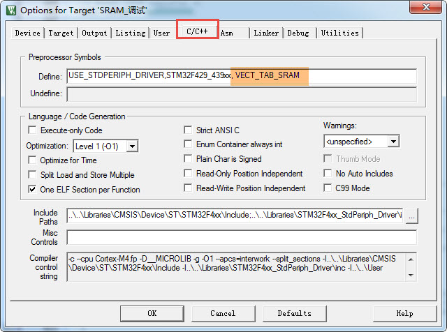
<span class="anchor" id="_Ref446611839"></span>图 2‑8 在c/c++编译选项中加入宏VECT\_TAB\_SRAM

配置完成后重新编译工程，即可生成存储到SRAM空间地址的代码指令。

##### 修改FLASH下载配置

得到SRAM版本的代码指令后，为了把它下载到芯片的SRAM中，还需要修改下载器的配置，见图 2‑9，“Options for Target-&gt;Utilities-&gt;Settings”中的选项。

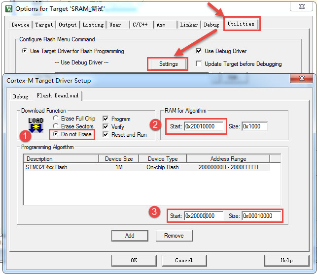
<span class="anchor" id="_Ref446612741"></span>图 2‑9 下载配置

这个配置对话框原本是用于设置芯片内部FLASH信息的，当我们点击MDK的（下载、LOAD）按钮时，它会从此处加载配置然后下载程序到FLASH中，而在上图中我们把它的配置修改成下载到内部SRAM了，各个配置的解释如下：

-   把“Download Function”中的擦除选项配置为“Do not Erase”。这是因为数据写入到内部SRAM中不需要像FLASH那样先擦除后写入。在本工程中，如果我们不选择“Do not Erase”的话，会因为擦除过程导致下载出错。

-   “RAM for Algorithm”一栏是指“编程算法”(Programming Algorithm)可使用的RAM空间，下载程序到FLASH时运行的编程算法需要使用RAM空间，在默认配置中它的首地址为0x20000000，即内部SRAM的首地址，但由于我们的分散加载文件配置，0x20000000地址开始的64KB实际为虚拟ROM空间，实际的RAM空间是从地址0x20010000开始的，所以这里把算法RAM首地址更改为本工程中实际作为RAM使用的地址。若编程算法使用的RAM地址与虚拟ROM空间地址重合的话，会导致下载出错。

-   “Programming Algorithm”一栏中是设置内部FLASH的编程算法，编程算法主要描述了FLASH的地址、大小以及扇区等信息，MDK根据这些信息把程序下载到芯片的FLASH中，不同的控制器芯片一般会有不同的编程算法。由于MDK没有内置SRAM的编程算法，所以我们直接在原来的基础上修改它的基地址和空间大小，把它改成虚拟ROM的空间信息。

从这个例子可了解到，这里的配置是跟我们的分散加载文件的实际RAM空间和虚拟ROM空间信息是一致的，若您的分散加载文件采用不同的配置，这个下载选项也要作出相应的修改，不能照抄本例子的空间信息。

这个配置是针对程序下载的，配置完成后点击MDK的按钮（下载、LOAD），程序会被下载到STM32的内部SRAM中，复位后程序会正常运行 (前提是BOOT0和BOOT要被设置为SRAM启动) 。芯片掉电后这个存储在SRAM的程序会丢失，想恢复的话必须要重新下载程序。

##### 仿真器的配置

上面的下载配置使得程序能够加载到SRAM中全速运行，但作为SRAM版本的程序，其功能更着重于调试，也就是说我们希望它能支持平时使用按钮(调试、debug)时进行的硬件在线调试、单步运行等功能。

要实现调试功能，还要在“Options for Target-&gt;Debug-&gt;Settings”中进行配置，见图 2‑10。


<span class="anchor" id="_Ref446615984"></span>图 2‑10 设置仿真前检查代码并下载程序到FLASH中

在图中我们需要勾选“Verify Code Download”及“Download to FLASH”选项，也就是说点击调试按钮后，本工程的程序会被下载到内部SRAM中，只有勾选了这两个选项才能正常仿真。(至于为什么FLASH版本的程序不需要勾选，不太清楚)

经过这样的配置后，硬件仿真时与平时内部FLASH版本的程序无异，支持软件复位、单步运行、全速运行以及查看各种变量值等 (同样地，前提是BOOT0和BOOT要被设置为SRAM启动) 。

##### 不需要修改BOOT引脚的仿真配置

假如您使用的硬件平台中BOOT0和BOOT1引脚电平已被固定，设置为内部FLASH启动，不方便改成SRAM方式，可以使用如下方法配置调试选项实现在SRAM调试：

1.  与上述步骤一样，勾选“Verify Code Download”及“Download to FLASH”选项；

2.  见图 2‑11，在“Options for Target-&gt;Debug”对话框中取消勾选“Load Application at startup”选项。点击“Initialization File”文本框右侧的文件浏览按钮，在弹出的对话框中新建一个名为“Debug\_RAM.ini”的文件；


<span class="anchor" id="_Ref446616910"></span>图 2‑11 新建一个ini文件

1.  在Debug\_RAM.ini文件中输入如代码清单 2‑4中的内容。

<span class="anchor" id="_Ref446617391"><span class="anchor" id="_Ref446617387"></span></span>代码清单 2‑4 Debug_RAM.ini文件内容
```C 

 /***********************************************************/

 /* Debug_RAM.ini: Initialization File for Debugging from Internal RAM */

 /******************************************************/

 /* This file is part of the uVision/ARM development tools. */

 /* Copyright (c) 2005-2014 Keil Software. All rights reserved. */

 /* This software may only be used under the terms of a valid, current, */

 /* end user licence from KEIL for a compatible version of KEIL software */

 /*development tools. Nothing else gives you the right to use this software */

 /***************************************************/


 FUNC void Setup (void) {

 SP = _RDWORD(0x20000000); // 设置栈指针SP，把0x20000000地址中的内容赋值到SP。

 PC = _RDWORD(0x20000004); // 设置程序指针PC，把0x20000004地址中的内容赋值到PC。

 XPSR = 0x01000000; // 设置状态寄存器指针xPSR

 _WDWORD(0xE000ED08, 0x20000000); // Setup Vector Table Offset Register

 }


 LOAD %L INCREMENTAL // 下载axf文件到RAM

 Setup(); //调用上面定义的setup函数设置运行环境


 //g, main //跳转到main函数，本示例调试时不需要从main函数执行，注释掉了，程序从启动代码开始执行

```
上述配置过程是控制MDK执行仿真器的脚本文件Debug\_RAM.ini，而该脚本文件在下载了程序到SRAM后，初始化了SP指针(即MSP)和PC指针分别指向了0x20000000和0x20000004，这样的操作等效于从SRAM复位。

有了这样的配置，即使BOOT0和BOOT1引脚不设置为SRAM启动也能正常仿真了，但点击下载按钮把程序下载到SRAM然后按复位是不能全速运行的(这种运行方式脱离了仿真器的控制，SP和PC指针无法被初始化指向SRAM)。

上述Debug\_RAM.ini文件是从STM32F4的MDK芯片包里复制过来的，若您感兴趣可到MDK安装目录搜索该文件名，该文件的语法可以从MDK的帮助手册的“µVision User's Guide-&gt;Debug Commands”章节学习。

1.  每课一问

<!-- -->

1.  在内部FLASH运行的程序与在SRAM运行的程序主要差异有哪些？

读写内部FLASH 
--------------

本章参考资料：《STM32F4xx参考手册》、《STM32F4xx规格书》、库说明文档《stm32f4xx\_dsp\_stdperiph\_lib\_um.chm》。

### STM32的内部FLASH简介 

在STM32芯片内部有一个FLASH存储器，它主要用于存储代码，我们在电脑上编写好应用程序后，使用下载器把编译后的代码文件烧录到该内部FLASH中，由于FLASH存储器的内容在掉电后不会丢失，芯片重新上电复位后，内核可从内部FLASH中加载代码并运行，见图 3‑1。

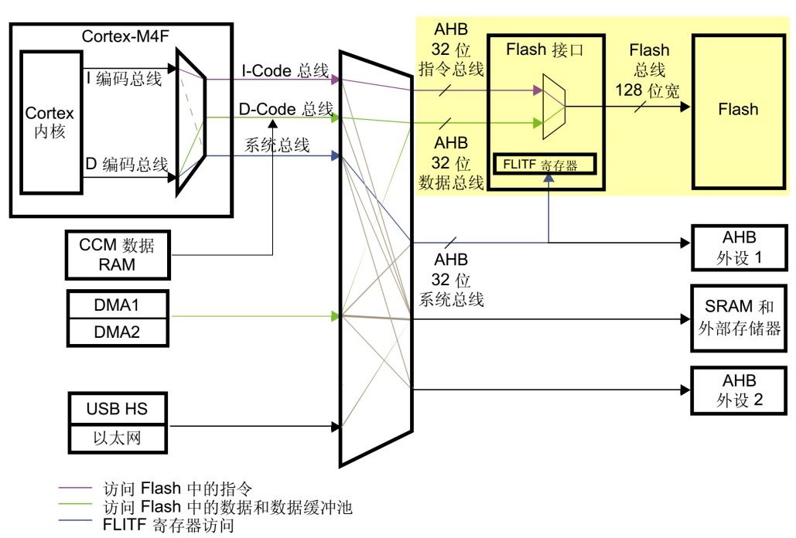
<span class="anchor" id="_Ref444785714"></span>图 3‑1 STM32的内部框架图

除了使用外部的工具（如下载器）读写内部FLASH外，STM32芯片在运行的时候，也能对自身的内部FLASH进行读写，因此，若内部FLASH存储了应用程序后还有剩余的空间，我们可以把它像外部SPI-FLASH那样利用起来，存储一些程序运行时产生的需要掉电保存的数据。

由于访问内部FLASH的速度要比外部的SPI-FLASH快得多，所以在紧急状态下常常会使用内部FLASH存储关键记录；为了防止应用程序被抄袭，有的应用会禁止读写内部FLASH中的内容，或者在第一次运行时计算加密信息并记录到某些区域，然后删除自身的部分加密代码，这些应用都涉及到内部FLASH的操作。

##### 内部FLASH的构成

STM32的内部FLASH包含主存储器、系统存储器、OTP区域以及选项字节区域，它们的地址分布及大小见表 3‑1。

<span class="anchor" id="_Ref444787364"></span>表 3‑1 STM32内部FLASH的构成

| 区域       | 块                        | 名称                      | 块地址                    | 大小       |
|------------|---------------------------|---------------------------|---------------------------|------------|
| 主存储器   | 块1                       | 扇区0                     | 0x0800 0000 - 0x0800 3FFF | 16 Kbytes  |
|            |                           | 扇区1                     | 0x0800 4000 - 0x0800 7FFF | 16 Kbytes  |
|            |                           | 扇区2                     | 0x0800 8000 - 0x0800 BFFF | 16 Kbytes  |
|            |                           | 扇区3                     | 0x0800 C000 - 0x0800 FFFF | 16 Kbyte   |
|            |                           | 扇区4                     | 0x0801 0000 - 0x0801 FFFF | 64 Kbytes  |
|            |                           | 扇区5                     | 0x0802 0000 - 0x0803 FFFF | 128 Kbytes |
|            |                           | 扇区6                     | 0x0804 0000 - 0x0805 FFFF | 128 Kbytes |
|            |                           | 扇区7                     | 0x0806 0000 - 0x0807 FFFF | 128 Kbytes |
|            |                           | 扇区8                     | 0x0808 0000 - 0x0809 FFFF | 128 Kbytes |
|            |                           | 扇区9                     | 0x080A 0000 - 0x080B FFFF | 128 Kbytes |
|            |                           | 扇区10                    | 0x080C 0000 - 0x080D FFFF | 128 Kbytes |
|            |                           | 扇区11                    | 0x080E 0000 - 0x080F FFFF | 128 Kbytes |
|            | 块2                       | 扇区12                    | 0x0810 0000 - 0x0810 3FFF | 16 Kbytes  |
|            |                           | 扇区13                    | 0x0810 4000 - 0x0810 7FFF | 16 Kbytes  |
|            |                           | 扇区14                    | 0x0810 8000 - 0x0810 BFFF | 16 Kbytes  |
|            |                           | 扇区15                    | 0x0810 C000 - 0x0810 FFFF | 16 Kbyte   |
|            |                           | 扇区16                    | 0x0811 0000 - 0x0811 FFFF | 64 Kbytes  |
|            |                           | 扇区17                    | 0x0812 0000 - 0x0813 FFFF | 128 Kbytes |
|            |                           | 扇区18                    | 0x0814 0000 - 0x0815 FFFF | 128 Kbytes |
|            |                           | 扇区19                    | 0x0816 0000 - 0x0817 FFFF | 128 Kbytes |
|            |                           | 扇区20                    | 0x0818 0000 - 0x0819 FFFF | 128 Kbytes |
|            |                           | 扇区21                    | 0x081A 0000 - 0x081B FFFF | 128 Kbytes |
|            |                           | 扇区22                    | 0x081C 0000 - 0x081D FFFF | 128 Kbytes |
|            |                           | 扇区23                    | 0x081E 0000 - 0x081F FFFF | 128 Kbytes |
| 系统存储区 | 0x1FFF 0000 - 0x1FFF 77FF | 30 Kbytes                 |
| OTP区域    | 0x1FFF 7800 - 0x1FFF 7A0F | 528 bytes                 |
| 选项字节   | 块1　                     | 0x1FFF C000 - 0x1FFF C00F | 16 bytes                  |
|            | 块2　                     | 0x1FFE C000 - 0x1FFE C00F | 16 bytes                  |

各个存储区域的说明如下：

-   主存储器

&gt; 一般我们说STM32内部FLASH的时候，都是指这个主存储器区域，它是存储用户应用程序的空间，芯片型号说明中的1M FLASH、2M FLASH都是指这个区域的大小。主存储器分为两块，共2MB，每块内分12个扇区，其中包含4个16KB扇区、1个64KB扇区和7个128KB的扇区。如我们实验板中使用的STM32F429IGT6型号芯片，它的主存储区域大小为1MB，所以它只包含有表中的扇区0-扇区11。
&gt;
&gt; 与其它FLASH一样，在写入数据前，要先按扇区擦除，而有的时候我们希望能以小规格操纵存储单元，所以STM32针对1MB FLASH的产品还提供了一种双块的存储格式，见表 3‑2。(2M的产品按表 3‑1的格式)

<span class="anchor" id="_Ref444847263"></span>表 3‑2 1MB产品的双块存储格式

| 1M字节单块存储器的扇区分配(默认) | 1M字节双块存储器的扇区分配 |
|----------------------------------|----------------------------|
| DB1M=0                           | DB1M=1                     |
| 主存储器                         | 扇区号                     |
| 1MB                              | 扇区0                      |
|                                  | 扇区1                      |
|                                  | 扇区2                      |
|                                  | 扇区3                      |
|                                  | 扇区4                      |
|                                  | 扇区5                      |
|                                  | 扇区6                      |
|                                  | 扇区7                      |
|                                  | 扇区8                      |
|                                  | 扇区9                      |
|                                  | 扇区10                     |
|                                  | 扇区11                     |
|                                  | -                          |
|                                  | -                          |
|                                  | -                          |
|                                  | -                          |

&gt; 通过配置FLASH选项控制寄存器FLASH\_OPTCR的DB1M位，可以切换这两种格式，切换成双块模式后，扇区8-11的空间被转移到扇区12-19中，扇区细分了，总容量不变。
&gt;
&gt; 注意如果您使用的是STM32F40x系列的芯片，它没有双块存储格式，也不存在扇区12-23，仅STM32F42x/43x系列产品才支持扇区12-23。

-   系统存储区

&gt; 系统存储区是用户不能访问的区域，它在芯片出厂时已经固化了启动代码，它负责实现串口、USB以及CAN等ISP烧录功能。

-   OTP区域

&gt; OTP(One Time Program)，指的是只能写入一次的存储区域，容量为512字节，写入后数据就无法再更改，OTP常用于存储应用程序的加密密钥。

-   选项字节

&gt; 选项字节用于配置FLASH的读写保护、电源管理中的BOR级别、软件/硬件看门狗等功能，这部分共32字节。可以通过修改FLASH的选项控制寄存器修改。

### 对内部FLASH的写入过程

##### 解锁

由于内部FLASH空间主要存储的是应用程序，是非常关键的数据，为了防止误操作修改了这些内容，芯片复位后默认会结FLASH上锁，这个时候不允许设置FLASH的控制寄存器，并且不能对修改FLASH中的内容。

所以对FLASH写入数据前，需要先给它解锁。解锁的操作步骤如下：

1.  往Flash 密钥寄存器 FLASH\_KEYR中写入 KEY1 = 0x45670123

2.  再往Flash 密钥寄存器 FLASH\_KEYR中写入 KEY2 = 0xCDEF89AB

##### 数据操作位数

在内部FLASH进行擦除及写入操作时，电源电压会影响数据的最大操作位数，该电源电压可通过配置FLASH\_CR 寄存器中的 PSIZE位改变，见表 3‑3。

<span class="anchor" id="_Ref444867226"></span>表 3‑3 数据操作位数

| 电压范围       | 2.7 - 3.6 V   
                                 
                  (使用外部Vpp)  | 2.7 - 3.6 V | 2.1 – 2.7 V | 1.8 – 2.1 V |
|----------------|---------------|-------------|-------------|-------------|
| 位数           | 64            | 32          | 16          | 8           |
| PSIZE(1:0)配置 | 11b           | 10b         | 01b         | 00b         |

最大操作位数会影响擦除和写入的速度，其中64位宽度的操作除了配置寄存器位外，还需要在Vpp引脚外加一个8-9V的电压源，且其供电时间不得超过一小时，否则FLASH可能损坏，所以64位宽度的操作一般是在量产时对FLASH写入应用程序时才使用，大部分应用场合都是用32位的宽度。

##### 擦除扇区

在写入新的数据前，需要先擦除存储区域，STM32提供了扇区擦除指令和整个FLASH擦除(批量擦除)的指令，批量擦除指令仅针对主存储区。

扇区擦除的过程如下：

1.  检查 FLASH\_SR 寄存器中的“忙碌寄存器位 BSY”，以确认当前未执行任何 Flash 操作；

2.  在 FLASH\_CR 寄存器中，将“激活扇区擦除寄存器位SER ”置 1，并设置“扇区编号寄存器位SNB”，选择要擦除的扇区；

3.  将 FLASH\_CR 寄存器中的“开始擦除寄存器位 STRT ”置 1，开始擦除；

4.  等待 BSY 位被清零时，表示擦除完成。

##### 写入数据

擦除完毕后即可写入数据，写入数据的过程并不是仅仅使用指针向地址赋值，赋值前还还需要配置一系列的寄存器，步骤如下：

1.  检查 FLASH\_SR 中的 BSY 位，以确认当前未执行任何其它的内部 Flash 操作；

2.  将 FLASH\_CR 寄存器中的 “激活编程寄存器位PG” 置 1；

3.  针对所需存储器地址（主存储器块或 OTP 区域内）执行数据写入操作；

4.  等待 BSY 位被清零时，表示写入完成。

### 查看工程的空间分布

由于内部FLASH本身存储有程序数据，若不是有意删除某段程序代码，一般不应修改程序空间的内容，所以在使用内部FLASH存储其它数据前需要了解哪一些空间已经写入了程序代码，存储了程序代码的扇区都不应作任何修改。通过查询应用程序编译时产生的“\*.map”后缀文件，可以了解程序存储到了哪些区域，它在工程中的打开方式见图 3‑2，也可以到工程目录中的“Listing”文件夹中找到。

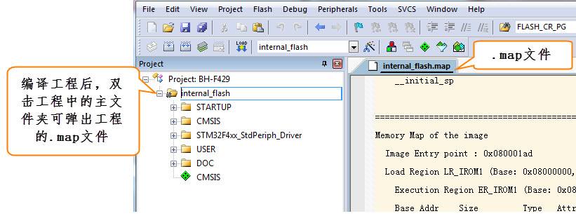
<span class="anchor" id="_Ref444940125"></span>图 3‑2 打开工程的.map文件

打开map文件后，查看文件最后部分的区域，可以看到一段以“Memory Map of the image”开头的记录(若找不到可用查找功能定位)，见代码清单 3‑1。

<span class="anchor" id="_Ref444940433"></span>代码清单 3‑1 map文件中的存储映像分布说明
```C 

 =======================================================================

 Memory Map of the image //存储分布映像


 Image Entry point : 0x080001ad


 /*程序ROM加载空间*/

 <strong>Load Region LR_IROM1 (Base: 0x08000000, Size: 0x00000b50, Max: 0x00100000, ABSOLUTE)</strong>


 /*程序ROM执行空间*/

 <strong>Execution Region ER_IROM1 (Base: 0x08000000, Size: 0x00000b3c, Max: 0x00100000, ABSOLUTE)</strong>


 /*地址分布列表*/

 <strong>Base Addr Size Type Attr Idx E Section Name Object</strong>


 0x08000000 0x000001ac Data RO 3 RESET startup_stm32f429_439xx.o

 0x080001ac 0x00000000 Code RO 5359 * .ARM.Collect$$$$00000000 mc_w.l(entry.o)

 0x080001ac 0x00000004 Code RO 5622 .ARM.Collect$$$$00000001 mc_w.l(entry2.o)

 0x080001b0 0x00000004 Code RO 5625 .ARM.Collect$$$$00000004 mc_w.l(entry5.o)

 0x080001b4 0x00000000 Code RO 5627 .ARM.Collect$$$$00000008 mc_w.l(entry7b.o)

 0x080001b4 0x00000000 Code RO 5629 .ARM.Collect$$$$0000000A mc_w.l(entry8b.o)

 /*...此处省略大部分内容*/

 0x08000948 0x0000000e Code RO 4910 i.USART_GetFlagStatus stm32f4xx_usart.o

 0x08000956 0x00000002 PAD

 0x08000958 0x000000bc Code RO 4914 i.USART_Init stm32f4xx_usart.o

 0x08000a14 0x00000008 Code RO 4924 i.USART_SendData stm32f4xx_usart.o

 0x08000a1c 0x00000002 Code RO 5206 i.UsageFault_Handler stm32f4xx_it.o

 0x08000a1e 0x00000002 PAD

 0x08000a20 0x00000010 Code RO 5363 i.__0printf$bare mc_w.l(printfb.o)

 0x08000a30 0x0000000e Code RO 5664 i.__scatterload_copy mc_w.l(handlers.o)

 0x08000a3e 0x00000002 Code RO 5665 i.__scatterload_null mc_w.l(handlers.o)

 0x08000a40 0x0000000e Code RO 5666 i.__scatterload_zeroinit mc_w.l(handlers.o)

 0x08000a4e 0x00000022 Code RO 5370 i._printf_core mc_w.l(printfb.o)

 0x08000a70 0x00000024 Code RO 5275 i.fputc bsp_debug_usart.o

 0x08000a94 0x00000088 Code RO 5161 i.main main.o

 <strong>0x08000b1c 0x00000020 Data RO 5662 Region$$Table anon$$obj.o</strong>


```
这一段是某工程的ROM存储器分布映像，在STM32芯片中，ROM区域的内容就是指存储到内部FLASH的代码。

##### 程序ROM的加载与执行空间

上述说明中有两段分别以“Load Region LR\_ROM1”及“Execution Region ER\_IROM1”开头的内容，它们分别描述程序的加载及执行空间。在芯片刚上电运行时，会加载程序及数据，例如它会从程序的存储区域加载到程序的执行区域，还把一些已初始化的全局变量从ROM复制到RAM空间，以便程序运行时可以修改变量的内容。加载完成后，程序开始从执行区域开始执行。

在上面map文件的描述中，我们了解到加载及执行空间的基地址(Base)都是0x08000000，它正好是STM32内部FLASH的首地址，即STM32的程序存储空间就直接是执行空间；它们的大小(Size)分别为0x00000b50及0x00000b3c，执行空间的ROM比较小的原因就是因为部分RW-data类型的变量被拷贝到RAM空间了；它们的最大空间(Max)均为0x00100000，即1M字节，它指的是内部FLASH的最大空间。

计算程序占用的空间时，需要使用加载区域的大小进行计算，本例子中应用程序使用的内部FLASH是从0x08000000至(0x08000000+0x00000b50)地址的空间区域。

##### ROM空间分布表

在加载及执行空间总体描述之后，紧接着一个ROM详细地址分布表，它列出了工程中的各个段(如函数、常量数据)所在的地址Base Addr及占用的空间Size，列表中的Type说明了该段的类型，CODE表示代码，DATA表示数据，而PAD表示段之间的填充区域，它是无效的内容，PAD区域往往是为了解决地址对齐的问题。

观察表中的最后一项，它的基地址是0x08000b1c，大小为0x00000020，可知它占用的最高的地址空间为0x08000b3c，跟执行区域的最高地址0x00000b3c一样，但它们比加载区域说明中的最高地址0x8000b50要小，所以我们以加载区域的大小为准。对比表 3‑1的内部FLASH扇区地址分布表，可知仅使用扇区0就可以完全存储本应用程序，所以从扇区1(地址0x08004000)后的存储空间都可以作其它用途，使用这些存储空间时不会篡改应用程序空间的数据。

### 操作内部FLASH的库函数

为简化编程，STM32标准库提供了一些库函数，它们封装了对内部FLASH写入数据操作寄存器的过程。

##### FLASH解锁、上锁函数

对内部FLASH解锁、上锁的函数见代码清单 3‑2。

<span class="anchor" id="_Ref444953372"></span>代码清单 3‑2 FLASH解锁、上锁
```C 


 #define FLASH_KEY1 ((uint32_t)0x45670123)

 #define FLASH_KEY2 ((uint32_t)0xCDEF89AB)

 /**

 * @brief Unlocks the FLASH control register access

 * @param None

 * @retval None

 */

 void FLASH_Unlock(void)

 {

 if ((FLASH-&gt;CR &amp; FLASH_CR_LOCK) != RESET) {

 /* Authorize the FLASH Registers access */

 FLASH-&gt;KEYR = FLASH_KEY1;

 FLASH-&gt;KEYR = FLASH_KEY2;

 }

 }


 /**

 * @brief Locks the FLASH control register access

 * @param None

 * @retval None

 */

 void FLASH_Lock(void)

 {

 /* Set the LOCK Bit to lock the FLASH Registers access */

 FLASH-&gt;CR |= FLASH_CR_LOCK;

 }

```
解锁的时候，它对FLASH\_KEYR寄存器写入两个解锁参数，上锁的时候，对FLASH\_CR寄存器的FLASH\_CR\_LOCK位置1。

##### 设置操作位数及擦除扇区

解锁后擦除扇区时可调用FLASH\_EraseSector完成，见代码清单 3‑3。

<span class="anchor" id="_Ref444954462"></span>代码清单 3‑3 擦除扇区
```C 

 /**

 * @brief Erases a specified FLASH Sector.

 *

 * @note If an erase and a program operations are requested simultaneously,

 * the erase operation is performed before the program one.

 *

 * @param FLASH_Sector: The Sector number to be erased.

 *

 * @note For STM32F42xxx/43xxx devices this parameter can be a value between

 * FLASH_Sector_0 and FLASH_Sector_23.

 *

 * @param VoltageRange: The device voltage range which defines the erase parallelism.

 * This parameter can be one of the following values:

 * @arg VoltageRange_1: when the device voltage range is 1.8V to 2.1V,

 * the operation will be done by byte (8-bit)

 * @arg VoltageRange_2: when the device voltage range is 2.1V to 2.7V,

 * the operation will be done by half word (16-bit)

 * @arg VoltageRange_3: when the device voltage range is 2.7V to 3.6V,

 * the operation will be done by word (32-bit)

 * @arg VoltageRange_4: when the device voltage range is 2.7V to 3.6V + External Vpp,

 * the operation will be done by double word (64-bit)

 *

 * @retval FLASH Status: The returned value can be: FLASH_BUSY, FLASH_ERROR_PROGRAM,

 * FLASH_ERROR_WRP, FLASH_ERROR_OPERATION or FLASH_COMPLETE.

 */

 FLASH_Status FLASH_EraseSector(uint32_t FLASH_Sector, uint8_t VoltageRange)

 {

 uint32_t tmp_psize = 0x0;

 FLASH_Status status = FLASH_COMPLETE;


 /* Check the parameters */

 assert_param(IS_FLASH_SECTOR(FLASH_Sector));

 assert_param(IS_VOLTAGERANGE(VoltageRange));


 if (VoltageRange == VoltageRange_1) {

 tmp_psize = FLASH_PSIZE_BYTE;

 } else if (VoltageRange == VoltageRange_2) {

 tmp_psize = FLASH_PSIZE_HALF_WORD;

 } else if (VoltageRange == VoltageRange_3) {

 tmp_psize = FLASH_PSIZE_WORD;

 } else {

 tmp_psize = FLASH_PSIZE_DOUBLE_WORD;

 }

 /* Wait for last operation to be completed */

 status = FLASH_WaitForLastOperation();


 if (status == FLASH_COMPLETE) {

 /* if the previous operation is completed, proceed to erase the sector */

 FLASH-&gt;CR &amp;= CR_PSIZE_MASK;

 FLASH-&gt;CR |= tmp_psize;

 FLASH-&gt;CR &amp;= SECTOR_MASK;

 FLASH-&gt;CR |= FLASH_CR_SER | FLASH_Sector;

 FLASH-&gt;CR |= FLASH_CR_STRT;


 /* Wait for last operation to be completed */

 status = FLASH_WaitForLastOperation();


 /* if the erase operation is completed, disable the SER Bit */

 FLASH-&gt;CR &amp;= (~FLASH_CR_SER);

 FLASH-&gt;CR &amp;= SECTOR_MASK;

 }

 /* Return the Erase Status */

 return status;

 }

```
本函数包含两个输入参数，分别是要擦除的扇区号和工作电压范围，选择不同电压时实质是选择不同的数据操作位数，参数中可输入的宏在注释里已经给出。函数根据输入参数配置PSIZE位，然后擦除扇区，擦除扇区的时候需要等待一段时间，它使用FLASH\_WaitForLastOperation等待，擦除完成的时候才会退出FLASH\_EraseSector函数。

##### 写入数据

对内部FLASH写入数据不像对SDRAM操作那样直接指针操作就完成了，还要设置一系列的寄存器，利用FLASH\_ProgramWord、FLASH\_ProgramHalfWord和FLASH\_ProgramByte函数可按字、半字及字节单位写入数据，见代码清单 3‑4。

<span class="anchor" id="_Ref444956201"></span>代码清单 3‑4 写入数据
```C 


 /**

 * @brief Programs a word (32-bit) at a specified address.

 *

 * @note This function must be used when the device voltage range is from 2.7V to 3.6V.

 *

 * @note If an erase and a program operations are requested simultaneously,

 * the erase operation is performed before the program one.

 *

 * @param Address: specifies the address to be programmed.

 * This parameter can be any address in Program memory zone or in OTP zone.

 * @param Data: specifies the data to be programmed.

 * @retval FLASH Status: The returned value can be: FLASH_BUSY, FLASH_ERROR_PROGRAM,

 * FLASH_ERROR_WRP, FLASH_ERROR_OPERATION or FLASH_COMPLETE.

 */

 FLASH_Status FLASH_ProgramWord(uint32_t Address, uint32_t Data)

 {

 FLASH_Status status = FLASH_COMPLETE;


 /* Check the parameters */

 assert_param(IS_FLASH_ADDRESS(Address));


 /* Wait for last operation to be completed */

 status = FLASH_WaitForLastOperation();


 if (status == FLASH_COMPLETE) {

/* if the previous operation is completed, proceed to program the new data */

 FLASH-&gt;CR &amp;= CR_PSIZE_MASK;

 FLASH-&gt;CR |= FLASH_PSIZE_WORD;

 FLASH-&gt;CR |= FLASH_CR_PG;


 *(__IO uint32_t*)Address = Data;


 /* Wait for last operation to be completed */

 status = FLASH_WaitForLastOperation();


 /* if the program operation is completed, disable the PG Bit */

 FLASH-&gt;CR &amp;= (~FLASH_CR_PG);

 }

 /* Return the Program Status */

 return status;

 }

```
看函数代码可了解到，使用指针进行赋值操作前设置了数据操作宽度，并设置了PG寄存器位，在赋值操作后，调用了FLASH\_WaitForLastOperation函数等待写操作完毕。HalfWord和Byte操作宽度的函数执行过程类似。

### 实验：读写内部FLASH 

在本小节中我们以实例讲解如何使用内部FLASH存储数据。

#### 硬件设计

本实验仅操作了STM32芯片内部的FLASH空间，无需额外的硬件。

#### 软件设计

本小节讲解的是“内部FLASH编程”实验，请打开配套的代码工程阅读理解。<span class="anchor" id="OLE_LINK47"><span class="anchor" id="OLE_LINK48"></span></span>为了方便展示及移植，我们把操作内部FLASH相关的代码都编写到“bsp\_internalFlash.c”及“bsp\_internalFlash.h”文件中，这些文件是我们自己编写的，不属于标准库的内容，可根据您的喜好命名文件。

##### 程序设计要点

1.  对内部FLASH解锁；

2.  找出空闲扇区，擦除目标扇区；

3.  进行读写测试。

##### 代码分析

###### 硬件定义

读写内部FLASH不需要用到任何外部硬件，不过在擦写时常常需要知道各个扇区的基地址，我们把这些基地址定义到bsp\_internalFlash.h文件中，见代码清单 3‑5。

<span class="anchor" id="_Ref444532022"></span>代码清单 3‑5 各个扇区的基地址(bsp_internalFlash.h文件)
```C 


 /* 各个扇区的基地址 */

 #define ADDR_FLASH_SECTOR_0 ((uint32_t)0x08000000)

 #define ADDR_FLASH_SECTOR_1 ((uint32_t)0x08004000)

 #define ADDR_FLASH_SECTOR_2 ((uint32_t)0x08008000)

 #define ADDR_FLASH_SECTOR_3 ((uint32_t)0x0800C000)

 #define ADDR_FLASH_SECTOR_4 ((uint32_t)0x08010000)

 #define ADDR_FLASH_SECTOR_5 ((uint32_t)0x08020000)

 #define ADDR_FLASH_SECTOR_6 ((uint32_t)0x08040000)

 #define ADDR_FLASH_SECTOR_7 ((uint32_t)0x08060000)

 #define ADDR_FLASH_SECTOR_8 ((uint32_t)0x08080000)

 #define ADDR_FLASH_SECTOR_9 ((uint32_t)0x080A0000)

 #define ADDR_FLASH_SECTOR_10 ((uint32_t)0x080C0000)

 #define ADDR_FLASH_SECTOR_11 ((uint32_t)0x080E0000)


 #define ADDR_FLASH_SECTOR_12 ((uint32_t)0x08100000)

 #define ADDR_FLASH_SECTOR_13 ((uint32_t)0x08104000)

 #define ADDR_FLASH_SECTOR_14 ((uint32_t)0x08108000)

 #define ADDR_FLASH_SECTOR_15 ((uint32_t)0x0810C000)

 #define ADDR_FLASH_SECTOR_16 ((uint32_t)0x08110000)

 #define ADDR_FLASH_SECTOR_17 ((uint32_t)0x08120000)

 #define ADDR_FLASH_SECTOR_18 ((uint32_t)0x08140000)

 #define ADDR_FLASH_SECTOR_19 ((uint32_t)0x08160000)

 #define ADDR_FLASH_SECTOR_20 ((uint32_t)0x08180000)

 #define ADDR_FLASH_SECTOR_21 ((uint32_t)0x081A0000)

 #define ADDR_FLASH_SECTOR_22 ((uint32_t)0x081C0000)

 #define ADDR_FLASH_SECTOR_23 ((uint32_t)0x081E0000)

```
这些宏跟表 3‑1中的地址说明一致。

###### 根据扇区地址计算SNB寄存器的值

在擦除操作时，需要向FLASH控制寄存器FLASH\_CR的SNB位写入要擦除的扇区号，固件库把各个扇区对应的寄存器值使用宏定义到了stm32f4xx\_flash.h文件。为了便于使用，我们自定义了一个GetSector函数，根据输入的内部FLASH地址，找出其所在的扇区，并返回该扇区对应的SNB位寄存器值，见代码清单 3‑6。

<span class="anchor" id="_Ref444532476"></span>代码清单 3‑6 写入到SNB寄存器位的值（stm32f4xx_flash.h及bsp_internalFlash.c文件）
```C 

 /*固件库定义的用于扇区写入到SNB寄存器位的宏(stm32f4xx_flash.h文件)*/

 #define FLASH_Sector_0 ((uint16_t)0x0000)

 #define FLASH_Sector_1 ((uint16_t)0x0008)

 #define FLASH_Sector_2 ((uint16_t)0x0010)

 #define FLASH_Sector_3 ((uint16_t)0x0018)

 #define FLASH_Sector_4 ((uint16_t)0x0020)

 #define FLASH_Sector_5 ((uint16_t)0x0028)

 #define FLASH_Sector_6 ((uint16_t)0x0030)

 #define FLASH_Sector_7 ((uint16_t)0x0038)

 #define FLASH_Sector_8 ((uint16_t)0x0040)

 #define FLASH_Sector_9 ((uint16_t)0x0048)

 #define FLASH_Sector_10 ((uint16_t)0x0050)

 #define FLASH_Sector_11 ((uint16_t)0x0058)

 #define FLASH_Sector_12 ((uint16_t)0x0080)

 #define FLASH_Sector_13 ((uint16_t)0x0088)

 #define FLASH_Sector_14 ((uint16_t)0x0090)

 #define FLASH_Sector_15 ((uint16_t)0x0098)

 #define FLASH_Sector_16 ((uint16_t)0x00A0)

 #define FLASH_Sector_17 ((uint16_t)0x00A8)

 #define FLASH_Sector_18 ((uint16_t)0x00B0)

 #define FLASH_Sector_19 ((uint16_t)0x00B8)

 #define FLASH_Sector_20 ((uint16_t)0x00C0)

 #define FLASH_Sector_21 ((uint16_t)0x00C8)

 #define FLASH_Sector_22 ((uint16_t)0x00D0)

 #define FLASH_Sector_23 ((uint16_t)0x00D8)


 /*定义在bsp_internalFlash.c文件中的函数*/

 /**

 * @brief 根据输入的地址给出它所在的sector

 * 例如：

 uwStartSector = GetSector(FLASH_USER_START_ADDR);

 uwEndSector = GetSector(FLASH_USER_END_ADDR);

 * @param Address：地址

 * @retval 地址所在的sector

 */

 static uint32_t GetSector(uint32_t Address)

 {

 uint32_t sector = 0;


 if ((Address &lt; ADDR_FLASH_SECTOR_1) &amp;&amp; (Address &gt;= ADDR_FLASH_SECTOR_0)) {

 sector = FLASH_Sector_0;

 } else if ((Address &lt; ADDR_FLASH_SECTOR_2) &amp;&amp; (Address &gt;= ADDR_FLASH_SECTOR_1)) {

 sector = FLASH_Sector_1;

 }


 /*此处省略扇区2-扇区21的内容*/


 else if ((Address &lt; ADDR_FLASH_SECTOR_23) &amp;&amp; (Address &gt;= ADDR_FLASH_SECTOR_22)) {

 sector = FLASH_Sector_22;

 } else { /*(Address &lt; FLASH_END_ADDR) &amp;&amp; (Address &gt;= ADDR_FLASH_SECTOR_23))*/

 sector = FLASH_Sector_23;

 }

 return sector;

 }

```
代码中固件库定义的宏FLASH\_Sector\_0-23对应的值是跟寄存器说明一致的，见图 3‑3。

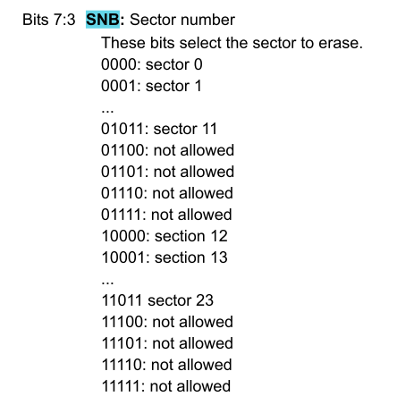
<span class="anchor" id="_Ref445109184"></span>图 3‑3 FLASH\_CR寄存器的SNB位的值

GetSector函数根据输入的地址与各个扇区的基地址进行比较，找出它所在的扇区，并使用固件库中的宏，返回扇区对应的SNB值。

###### 读写内部FLASH

一切准备就绪，可以开始对内部FLASH进行擦写，这个过程不需要初始化任何外设，只要按解锁、擦除及写入的流程走就可以了，见代码清单 3‑7。

<span class="anchor" id="_Ref444537310"></span>代码清单 3‑7 对内部地FLASH进行读写测试(bsp_internalFlash.c文件)
```C 


 /*准备写入的测试数据*/

 #define DATA_32 ((uint32_t)0x00000000)

 /* 要擦除内部FLASH的起始地址 */

 #define FLASH_USER_START_ADDR ADDR_FLASH_SECTOR_8

 /* 要擦除内部FLASH的结束地址 */

 #define FLASH_USER_END_ADDR ADDR_FLASH_SECTOR_12


 /**

 * @brief InternalFlash_Test,对内部FLASH进行读写测试

 * @param None

 * @retval None

 */

 int InternalFlash_Test(void)

 {

 /*要擦除的起始扇区(包含)及结束扇区(不包含)，如8-12，表示擦除8、9、10、11扇区*/

 uint32_t uwStartSector = 0;

 uint32_t uwEndSector = 0;


 uint32_t uwAddress = 0;

 uint32_t uwSectorCounter = 0;


 __IO uint32_t uwData32 = 0;

 __IO uint32_t uwMemoryProgramStatus = 0;


 /* FLASH 解锁 ********************************/

 /* 使能访问FLASH控制寄存器 */

 FLASH_Unlock();


 /* 擦除用户区域 (用户区域指程序本身没有使用的空间，可以自定义)**/

 /* 清除各种FLASH的标志位 */

 FLASH_ClearFlag(FLASH_FLAG_EOP | FLASH_FLAG_OPERR | FLASH_FLAG_WRPERR |

 FLASH_FLAG_PGAERR | FLASH_FLAG_PGPERR|FLASH_FLAG_PGSERR);


 uwStartSector = GetSector(FLASH_USER_START_ADDR);

 uwEndSector = GetSector(FLASH_USER_END_ADDR);


 /* 开始擦除操作 */

 uwSectorCounter = uwStartSector;

 while (uwSectorCounter &lt;= uwEndSector) {

 /* VoltageRange_3 以“字”的大小进行操作 */

 if (FLASH_EraseSector(uwSectorCounter, VoltageRange_3) != FLASH_COMPLETE) {

 /*擦除出错，返回，实际应用中可加入处理 */

 return -1;

 }

 /* 计数器指向下一个扇区 */

 if (uwSectorCounter == FLASH_Sector_11) {

 uwSectorCounter += 40;

 } else {

 uwSectorCounter += 8;

 }

 }


 /* 以“字”的大小为单位写入数据 ********************************/

 uwAddress = FLASH_USER_START_ADDR;


 while (uwAddress &lt; FLASH_USER_END_ADDR) {

 if (FLASH_ProgramWord(uwAddress, DATA_32) == FLASH_COMPLETE) {

 uwAddress = uwAddress + 4;

 } else {

 /*写入出错，返回，实际应用中可加入处理 */

 return -1;

 }

 }


 /* 给FLASH上锁，防止内容被篡改*/

 FLASH_Lock();


 /* 从FLASH中读取出数据进行校验***************************************/

 /* MemoryProgramStatus = 0: 写入的数据正确

 MemoryProgramStatus != 0: 写入的数据错误，其值为错误的个数 */

 uwAddress = FLASH_USER_START_ADDR;

 uwMemoryProgramStatus = 0;


 while (uwAddress &lt; FLASH_USER_END_ADDR) {

 uwData32 = *(__IO uint32_t*)uwAddress;


 if (uwData32 != DATA_32) {

 uwMemoryProgramStatus++;

 }


 uwAddress = uwAddress + 4;

 }

 /* 数据校验不正确 */

 if (uwMemoryProgramStatus) {

 return -1;

 } else { /*数据校验正确*/

 return 0;

 }

 }


```
该函数的执行过程如下：

1.  调用FLASH\_Unlock解锁；

2.  调用FLASH\_ClearFlag清除各种标志位；

3.  调用GetSector根据起始地址及结束地址计算要擦除的扇区；

4.  调用FLASH\_EraseSector擦除扇区，擦除时按字为单位进行操作；

5.  调用FLASH\_ProgramWord函数向起始地址至结束地址的存储区域都写入数值“DATA\_32”；

6.  调用FLASH\_Lock上锁；

7.  使用指针读取数据内容并校验。

###### main函数

最后我们来看看main函数的执行流程，见代码清单 3‑8。

<span class="anchor" id="_Ref444538123"></span>代码清单 3‑8 main函数(main.c文件)
```C 

 /**

 * @brief 主函数

 * @param 无

 * @retval 无

 */

 int main(void)

 {

 /*初始化USART，配置模式为 115200 8-N-1*/

 Debug_USART_Config();

 LED_GPIO_Config();


 LED_BLUE;

 /*调用printf函数，因为重定向了fputc，printf的内容会输出到串口*/

 printf("this is a usart printf demo. \r\n");

 printf("\r\n 欢迎使用秉火 STM32 F429 开发板。\r\n");

 printf("正在进行读写内部FLASH实验，请耐心等待\r\n");


 if (InternalFlash_Test()==0) {

 LED_GREEN;

 printf("读写内部FLASH测试成功\r\n");


 } else {

 printf("读写内部FLASH测试失败\r\n");

 LED_RED;

 }

 }

```
main函数中初始化了用于指示调试信息的LED及串口后，直接调用了InternalFlash\_Test函数，进行读写测试并根据测试结果输出调试信息。

#### 下载验证

用USB线连接开发板“USB TO UART”接口跟电脑，在电脑端打开串口调试助手，把编译好的程序下载到开发板。在串口调试助手可看到擦写内部FLASH的调试信息。

### 每课一问

1.  尝试擦除应用程序所在的内部FLASH扇区，观察实验现象。

2.  使用C语言的“const uint8\_t value；”和“volatile const uint8\_t value”语句定义的变量value有什么区别？若定义后使用内部FLASH操作擦除value的存储空间，再读取value的值，哪种定义能正常读取？

设置FLASH的读写保护及解除 
--------------------------

本章参考资料：《STM32F4xx参考手册》、《STM32F4xx规格书》、库说明文档《stm32f4xx\_dsp\_stdperiph\_lib\_um.chm》以及《Proprietary code read-out protection on microcontrollers》。

### 选项字节与读写保护

在实际发布的产品中，在STM32芯片的内部FLASH存储了控制程序，如果不作任何保护措施的话，可以使用下载器直接把内部FLASH的内容读取回来，得到bin或hex文件格式的代码拷贝，别有用心的厂商即可利用该代码文件山寨产品。为此，STM32芯片提供了多种方式保护内部FLASH的程序不被非法读取，但在默认情况下该保护功能是不开启的，若要开启该功能，需要改写内部FLASH选项字节(Option Bytes)中的配置。

#### 选项字节的内容

选项字节是一段特殊的FLASH空间，STM32芯片会根据它的内容进行读写保护、复位电压等配置，选项字节的构成见表 4‑1。

<span class="anchor" id="_Ref446667296"></span>表 4‑1 选项字节的构成

| 地址        | \[63:16\] | \[15:0\]                        |
|-------------|-----------|---------------------------------|
| 0x1FFF C000 | 保留      | ROP 和用户选项字节 (RDP &amp; USER) |
| 0x1FFF C008 | 保留      | 扇区 0 到 11 的写保护 nWRP 位   |
| 0x1FFE C000 | 保留      | 保留                            |
| 0x1FFE C008 | 保留      | 扇区 12 到 23 的写保护 nWRP 位  |

选项字节具体的数据位配置说明见表 4‑2。

<span class="anchor" id="_Ref446668930"></span>表 4‑2 选项字节具体的数据位配置说明

| 选项字节（字，地址 0x1FFF C000）        |
|-----------------------------------------|
| RDP： 读保护选项字节。                  
 读保护用于保护 Flash 中存储的软件代码。  |
| 位 15:8                                 |
| USER： 用户选项字节                     
 此字节用于配置以下功能：                 
 选择看门狗事件：硬件或软件               
 进入停止模式时产生复位事件               
 进入待机模式时产生复位事件               |
| 位 7                                    |
| 位 6                                    |
| 位 5                                    |
| 位 4                                    |
| 位 3:2                                  |
| 位 1:0                                  |
| 选项字节（字，地址 0x1FFF C008）        |
| 位15                                    |
| 位14                                    |
| 位 13:12                                |
| nWRP： Flash 写保护选项字节。           
 扇区 0 到 11 可采用写保护。              |
| 位 11:0                                 |
| 选项字节（字，地址 0x1FFE C000）        |
| 位 15:0                                 |
| 选项字节（字，地址 0x1FFE C008）        |
| 位 15:12                                |
| nWRP： Flash 写保护选项字节。           
 扇区 12 到 23 可采用写保护。             |
| 位 11:0                                 |

我们主要讲解选项字节配置中的RDP位和PCROP位，它们分别用于配置读保护级别及代码读出保护。

#### RDP读保护级别

修改选项字节的RDP位的值可设置内部FLASH为以下保护级别：

-   0xAA：级别0，无保护

&gt; 这是STM32的默认保护级别，它没有任何读保护，读取内部FLASH及“备份SRAM”的内容都没有任何限制。(注意这里说的“备份SRAM”是指STM32备份域的SRAM空间，不是指主SRAM，下同)

-   其它值：级别1，使能读保护

&gt; <span class="anchor" id="OLE_LINK37"><span class="anchor" id="OLE_LINK38"></span></span>把RDP配置成除0xAA或0xCC外的任意数值， 都会使能级别1的读保护。在这种保护下，若使用调试功能(使用下载器、仿真器)或者从内部SRAM自举时都不能对内部FLASH及备份SRAM作任何访问(读写、擦除都被禁止)；而如果STM32是从内部FLASH自举时，它允许对内部FLASH及备份SRAM的任意访问。
&gt;
&gt; 也就是说，在级别1模式下，任何尝试从外部访问内部FLASH内容的操作都被禁止，例如无法通过下载器读取它的内容，或编写一个从内部SRAM启动的程序，若该程序读取内部FLASH，会被禁止。而如果是芯片自己访问内部FLASH，是完全没有问题的，例如前面的“读写内部FLASH”实验中的代码自己擦写内部FLASH空间的内容，即使处于级别1的读保护，也能正常擦写。
&gt;
&gt; 当芯片处于级别1的时候，可以把选项字节的RDP位重新设置为0xAA，恢复级别0。在恢复到级别0前，芯片会自动擦除内部FLASH及备份SRAM的内容，即降级后原内部FLASH的代码会丢失。在级别1时使用SRAM自举的程序也可以访问选项字节进行修改，所以如果原内部FLASH的代码没有解除读保护的操作时，可以给它加载一个SRAM自举的程序进行保护降级，后面我们将会进行这样的实验。

-   0xCC：级别2，禁止调试

&gt; 把RDP配置成0xCC值时，会进入最高级别的读保护，且设置后无法再降级，它会永久禁止用于调试的JTAG接口(相当于熔断)。在该级别中，除了具有级别1的所有保护功能外，进一步禁止了从SRAM或系统存储器的自举(即平时使用的串口ISP下载功能也失效)，JTAG调试相关的功能被禁止，选项字节也不能被修改。它仅支持从内部FLASH自举时对内部FLASH及SRAM的访问(读写、擦除)。
&gt;
&gt; 由于设置了级别2后无法降级，也无法通过JTAG、串口ISP等方式更新程序，所以使用这个级别的保护时一般会在程序中预留“后门”以更新应用程序，若程序中没有预留后门，芯片就无法再更新应用程序了。所谓的“后门”是一种IAP程序(In Application Program)，它通过某个通讯接口获取将要更新的程序内容，然后利用内部FLASH擦写操作把这些内容烧录到自己的内部FLASH中，实现应用程序的更新。

不同级别下的访问限制见图 4‑1。


<span class="anchor" id="_Ref446679770"></span>图 4‑1 不同级别下的访问限制

&gt; 不同保护级别之间的状态转换见图 4‑2。

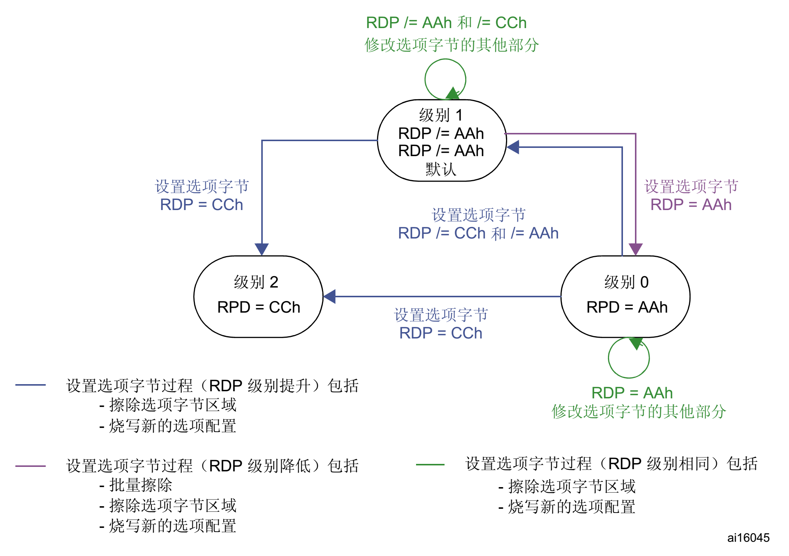
<span class="anchor" id="_Ref446679883"></span>图 4‑2 不同级别间的状态转换

#### PCROP代码读出保护

在STM32F42xx及STM32F43xx系列的芯片中，除了可使用RDP对整片FLASH进行读保护外，还有一个专用的代码读出保护功能（Proprietary code readout protection，下面简称PCROP），它可以为内部FLASH的某几个指定扇区提供保护功能，所以它可以用于保护一些IP代码，方便提供给另一方进行二次开发，见图 4‑3。

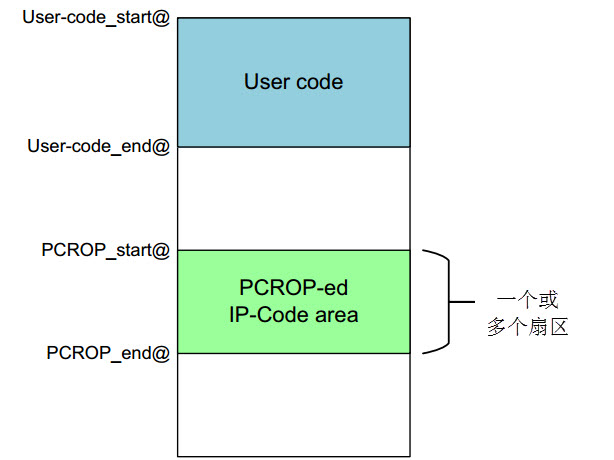
<span class="anchor" id="_Ref446681546"></span>图 4‑3 PCROP保护功能

当SPMOD位设置为0时(默认值)，nWRPi位用于指定要进行写保护的扇区，这可以防止错误的指针操作导致FLASH 内容的改变，若扇区被写保护，通过调试器也无法擦除该扇区的内容；当SPMOD位设置为1时，nWRPi位用于指定要进行PCROP保护的扇区。其中PCROP功能可以防止指定扇区的FLASH内容被读出，而写保护仅可以防止误写操作，不能被防止读出。

当要关闭PCROP功能时，必须要使芯片从读保护级别1降为级别0，同时对SPMOD位置0，才能正常关闭；若芯片原来的读保护为级别0，且使能了PCROP保护，要关闭PCROP时也要先把读保护级别设置为级别1，再在降级的同时设置SPMOD为0。

### 修改选项字节的过程

修改选项字节的内容可修改各种配置，但是，当应用程序运行时，无法直接通过选项字节的地址改写它们的内容，例如，接使用指针操作地址0x1FFFC0000的修改是无效的。要改写其内容时必须设置<span class="anchor" id="OLE_LINK39"><span class="anchor" id="OLE_LINK40"></span></span>寄存器FLASH\_OPTCR及FLASH\_OPTCR1中的对应数据位，寄存器的与选项字节对应位置见图 4‑4及图 4‑5，详细说明请查阅《STM32参考手册》。


<span class="anchor" id="_Ref446683419"></span>图 4‑4 FLASH\_OPTCR寄存器说明(nWRP表示0-11扇区)


<span class="anchor" id="_Ref446683420"></span>图 4‑5 FLASH\_OPTCR1寄存器说明(nWRP表示12-23扇区)

默认情况下，FLASH\_OPTCR寄存器中的第0位OPTLOCK值为1，它表示选项字节被上锁，需要解锁后才能进行修改，当寄存器的值设置完成后，对FLASH\_OPTCR寄存器中的第1位OPTSTRT值设置为1，硬件就会擦除选项字节扇区的内容，并把FLASH\_OPTCR/1寄存器中包含的值写入到选项字节。

所以，修改选项字节的配置步骤如下：

1.  解锁，在 Flash 选项密钥寄存器 (FLASH\_OPTKEYR) 中写入 OPTKEY1 = 0x0819 2A3B；接着在 Flash 选项密钥寄存器 (FLASH\_OPTKEYR) 中写入 OPTKEY2 = 0x4C5D 6E7F。

2.  检查 FLASH\_SR 寄存器中的 BSY 位，以确认当前未执行其它Flash 操作。

3.  在 FLASH\_OPTCR 和/或 FLASH\_OPTCR1 寄存器中写入选项字节值。

4.  将 FLASH\_OPTCR 寄存器中的选项启动位 (OPTSTRT) 置 1。

5.  等待 BSY 位清零，即写入完成。

### 操作选项字节的库函数

为简化编程，STM32标准库提供了一些库函数，它们封装了修改选项字节时操作寄存器的过程。

##### 选项字节解锁、上锁函数

对选项字节解锁、上锁的函数见代码清单 4‑1。

<span class="anchor" id="_Ref446686459"></span>代码清单 4‑1选项字节解锁、上锁
```C 


 #define FLASH_OPT_KEY1 ((uint32_t)0x08192A3B)

 #define FLASH_OPT_KEY2 ((uint32_t)0x4C5D6E7F)


 /**

 * @brief Unlocks the FLASH Option Control Registers access.

 * @param None

 * @retval None

 */

 void FLASH_OB_Unlock(void)

 {

 if((FLASH-&gt;OPTCR &amp; FLASH_OPTCR_OPTLOCK) != RESET)

 {

 /* Authorizes the Option Byte register programming */

 FLASH-&gt;OPTKEYR = FLASH_OPT_KEY1;

 FLASH-&gt;OPTKEYR = FLASH_OPT_KEY2;

 }

 }


 /**

 * @brief Locks the FLASH Option Control Registers access.

 * @param None

 * @retval None

 */

 void FLASH_OB_Lock(void)

 {

 /* Set the OPTLOCK Bit to lock the FLASH Option Byte Registers access */

 FLASH-&gt;OPTCR |= <span class="anchor" id="OLE_LINK41"><span class="anchor" id="OLE_LINK42"></span></span>FLASH_OPTCR_OPTLOCK;

 }

```
解锁的时候，它对FLASH\_OPTCR寄存器写入两个解锁参数，上锁的时候，对FLASH\_ OPTCR寄存器的FLASH\_OPTCR\_OPTLOCK位置1。

##### 设置读保护级别

解锁后设置选项字节寄存器的RDP位可调用FLASH\_OB\_RDPConfig完成，见代码清单 4‑2。

<span class="anchor" id="_Ref446687010"></span>代码清单 4‑2 设置读保护级别
```C 

 /**

 * @brief Sets the read protection level.

 * @param OB_RDP: specifies the read protection level.

 * This parameter can be one of the following values:

 * @arg OB_RDP_Level_0: No protection

 * @arg OB_RDP_Level_1: Read protection of the memory

 * @arg OB_RDP_Level_2: Full chip protection

 *

 * /!\ Warning /!\ When enabling OB_RDP level 2 it's no more possible to go back to level 1 or 0

 *

 * @retval None

 */

 void FLASH_OB_RDPConfig(uint8_t OB_RDP)

 {

 FLASH_Status status = FLASH_COMPLETE;


 /* Check the parameters */

 assert_param(IS_OB_RDP(OB_RDP));


 status = FLASH_WaitForLastOperation();


 if(status == FLASH_COMPLETE)

 {

 *(__IO uint8_t*)OPTCR_BYTE1_ADDRESS = OB_RDP;


 }

 }

```
该函数根据输入参数设置RDP寄存器位为相应的级别，其注释警告了若配置成OB\_RDP\_Level\_2会无法恢复。类似地，配置其它选项时也有相应的库函数，如FLASH\_OB\_PCROP1Config、FLASH\_OB\_WRP1Config分别用于设置要进行PCROP保护或WRP保护(写保护)的扇区。

##### 写入选项字节

调用上一步骤中的函数配置寄存器后，还要调用代码清单 4‑3中的FLASH\_OB\_Launch函数把寄存器的内容写入到选项字节中。

<span class="anchor" id="_Ref446687764"></span>代码清单 4‑3 写入选项字节
```C 

 /**

 * @brief Launch the option byte loading.

 * @param None

 * @retval FLASH Status: The returned value can be: FLASH_BUSY, FLASH_ERROR_PROGRAM,

 * FLASH_ERROR_WRP, FLASH_ERROR_OPERATION or FLASH_COMPLETE.

 */

 FLASH_Status FLASH_OB_Launch(void)

 {

 FLASH_Status status = FLASH_COMPLETE;


 /* Set the OPTSTRT bit in OPTCR register */

 *(__IO uint8_t *)OPTCR_BYTE0_ADDRESS |= FLASH_OPTCR_OPTSTRT;


 /* Wait for last operation to be completed */

 status = <span class="anchor" id="OLE_LINK43"><span class="anchor" id="OLE_LINK44"></span></span>FLASH_WaitForLastOperation();


 return status;

 }

```
该函数设置FLASH\_OPTCR\_OPTSTRT位后调用了FLASH\_WaitForLastOperation函数等待写入完成，并返回写入状态，若操作正常，它会返回FLASH\_COMPLETE。

### 实验：设置读写保护及解除

在本实验中我们将以实例讲解如何修改选项字节的配置，更改读保护级别、设置PCROP或写保护，最后把选项字节恢复默认值。

本实验要进行的操作比较特殊，在开发和调试的过程中都是在SRAM上进行的（使用SRAM启动方式）。例如，直接使用FLASH版本的程序进行调试时，如果该程序在运行后对扇区进行了写保护而没有解除的操作或者该解除操作不正常，此时将无法再给芯片的内部FLASH下载新程序，最终还是要使用SRAM自举的方式进行解除操作。所以在本实验中为便于修改选项字节的参数，我们统一使用SRAM版本的程序进行开发和学习，当SRAM版本调试正常后再改为FLASH版本。

关于在SRAM中调试代码的相关配置，请参考前面的章节。

注意：

若您在学习的过程中想亲自修改代码进行测试，请注意备份原工程代码。当芯片的FLASH被保护导致无法下载程序到FLASH时，可以下载本工程到芯片，并使用SRAM启动运行，即可恢复芯片至默认配置。但如果修改了读保护为级别2，采用任何方法都无法恢复！(除了这个配置，其它选项都可以大胆地修改测试。)

#### 硬件设计

本实验在SRAM中调试代码，因此把BOOT0和BOOT1引脚都使用跳线帽连接到3.3V，使芯片从SRAM中启动。

#### 软件设计

本实验的工程名称为“设置读写保护与解除”，学习时请打开该工程配合阅读，它是从“RAM调试—多彩流水灯”工程改写而来的。为了方便展示及移植，我们把操作内部FLASH相关的代码都编写到“<span class="anchor" id="OLE_LINK49"><span class="anchor" id="OLE_LINK50"></span></span>internalFlash\_reset.c”及“internalFlash\_reset.h”文件中，这些文件是我们自己编写的，不属于标准库的内容，可根据您的喜好命名文件。

##### 主要实验

1.  学习配置扇区写保护；

2.  学习配置PCROP保护；

3.  学习<span class="anchor" id="OLE_LINK51"><span class="anchor" id="OLE_LINK52"></span></span>配置读保护级别；

4.  学习如何恢复选项字节到默认配置；

##### 代码分析

###### 配置扇区写保护

我们先以代码清单 4‑4中的设置与解除写保护过程来学习如何配置选项字节。

<span class="anchor" id="_Ref446695057"></span>代码清单 4‑4 配置扇区写保护
```C 


 #define FLASH_WRP_SECTORS (OB_WRP_Sector_0|OB_WRP_Sector_1)

 __IO uint32_t SectorsWRPStatus = 0xFFF;


 /**

 * @brief WriteProtect_Test,普通的写保护配置

 * @param 运行本函数后会给扇区FLASH_WRP_SECTORS进行写保护，再重复一次会进行解写保护

 * @retval None

 */

 void WriteProtect_Test(void)

 {

 FLASH_Status status = FLASH_COMPLETE;

 {

 /* 获取扇区的写保护状态 */

 SectorsWRPStatus = FLASH_OB_GetWRP() &amp; FLASH_WRP_SECTORS;


 if (SectorsWRPStatus == 0x00)

 {

 /* 扇区已被写保护，执行解保护过程*/


 /* 使能访问OPTCR寄存器 */

 FLASH_OB_Unlock();


 /* 设置对应的nWRP位，解除写保护 */

 FLASH_OB_WRPConfig(FLASH_WRP_SECTORS, DISABLE);

 status=FLASH_OB_Launch();

 /* 开始对选项字节进行编程 */

 if (status != FLASH_COMPLETE)

 {

 FLASH_ERROR("对选项字节编程出错，解除写保护失败，status = %x",status);

 /* User can add here some code to deal with this error */

 while (1)

 {

 }

 }

 /* 禁止访问OPTCR寄存器 */

 FLASH_OB_Lock();


 /* 获取扇区的写保护状态 */

 SectorsWRPStatus = FLASH_OB_GetWRP() &amp; FLASH_WRP_SECTORS;


 /* 检查是否配置成功 */

 if (SectorsWRPStatus == FLASH_WRP_SECTORS)

 {

 FLASH_INFO("解除写保护成功！");

 }

 else

 {

 FLASH_ERROR("未解除写保护！");

 }

 }

 else

 { /* 若扇区未被写保护，开启写保护配置 */


 /* 使能访问OPTCR寄存器 */

 FLASH_OB_Unlock();


 /*使能 FLASH_WRP_SECTORS 扇区写保护 */

 FLASH_OB_WRPConfig(FLASH_WRP_SECTORS, ENABLE);


 status=FLASH_OB_Launch();

 /* 开始对选项字节进行编程 */

 if (status != FLASH_COMPLETE)

 {

 FLASH_ERROR("对选项字节编程出错，设置写保护失败，status = %x",status);

 while (1)

 {

 }

 }

 /* 禁止访问OPTCR寄存器 */

 <span class="anchor" id="OLE_LINK53"><span class="anchor" id="OLE_LINK54"></span></span>FLASH_OB_Lock();


 /* 获取扇区的写保护状态 */

 SectorsWRPStatus = FLASH_OB_GetWRP() &amp; FLASH_WRP_SECTORS;


 /* 检查是否配置成功 */

 if (SectorsWRPStatus == 0x00)

 {

 FLASH_INFO("设置写保护成功！");

 }

 else

 {

 FLASH_ERROR("设置写保护失败！");

 }

 }

 }

 }

```
本函数分成了两个部分，它根据目标扇区的状态进行操作，若原来扇区为非保护状态时就进行写保护，若为保护状态就解除保护。其主要操作过程如下：

-   调用FLASH\_OB\_GetWRP函数获取目标扇区的保护状态若扇区被写保护，则开始解除保护过程，否则开始设置写保护过程；

-   调用FLASH\_OB\_Unlock解锁选项字节的编程；

-   调用FLASH\_OB\_WRPConfig函数配置目标扇区关闭或打开写保护；

-   调用FLASH\_OB\_Launch函数把寄存器的配置写入到选项字节；

-   调用FLASH\_OB\_GetWRP函数检查是否配置成功；

-   调用FLASH\_OB\_Lock禁止修改选项字节。

###### 配置PCROP保护

配置PCROP保护的过程与配置写保护过程稍有区别，见代码清单 4‑5。

<span class="anchor" id="_Ref446697466"></span>代码清单 4‑5 配置PCROP保护(internalFlash_reset.c文件)
```C 


 /**

 * @brief SetPCROP,设置PCROP位，用于测试解锁

 * @note 使用有问题的串口ISP下载软件，可能会导致PCROP位置1，

 导致无法给芯片下载程序到FLASH，本函数用于把PCROP位置1，

 模拟出无法下载程序到FLASH的环境，以便用于解锁的程序调试。

 若不了解PCROP位的作用，请不要执行此函数！！

 * @param None

 * @retval None

 */

 void SetPCROP(void)

 {


 FLASH_Status status = FLASH_COMPLETE;


 FLASH_INFO();

 FLASH_INFO("正在设置PCROP保护，请耐心等待...");

 //选项字节解锁

 FLASH_OB_Unlock();


 //设置为PCROP模式

 FLASH_OB_PCROPSelectionConfig(OB_PcROP_Enable);

 //设置扇区0进行PCROP保护

 <span class="anchor" id="OLE_LINK55"><span class="anchor" id="OLE_LINK56"></span></span>FLASH_OB_PCROPConfig(OB_PCROP_Sector_10,ENABLE);

 //把寄存器设置写入到选项字节

 status =FLASH_OB_Launch();


 if (status != FLASH_COMPLETE)

 {

 FLASH_INFO("设置PCROP失败！");

 }

 else

 {

 FLASH_INFO("设置PCROP成功！");


 }

 //选项字节上锁

 FLASH_OB_Lock();

 }

```
该代码在解锁选项字节后，调用FLASH\_OB\_PCROPSelectionConfig函数把SPMOD寄存器位配置为PCROP模式，接着调用FLASH\_OB\_PCROPConfig函数配置目标保护扇区。

###### 恢复选项字节为默认值

当芯片被设置为读写保护或PCROP保护时，这时给芯片的内部FLASH下载程序时，可能会出现图 4‑6和图 4‑7的擦除FLASH失败的错误提示。

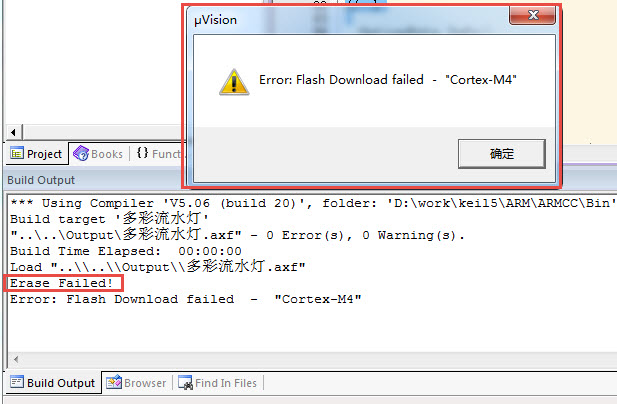
<span class="anchor" id="_Ref446701563"></span>图 4‑6 擦除失败提示

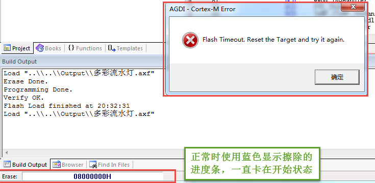
<span class="anchor" id="_Ref446701565"></span>图 4‑7 擦除进度条卡在开始状态

只要不是把读保护配置成了级别2保护，都可以使用SRAM启动运行代码清单 4‑6中的函数恢复选项字节为默认状态，使得FLASH下载能正常进行。

<span class="anchor" id="_Ref446701642"></span>代码清单 4‑6 恢复选项字节为默认值
```C 

 // @brief OPTCR register byte 0 (Bits[7:0]) base address

 #define OPTCR_BYTE0_ADDRESS ((uint32_t)0x40023C14)

 //@brief OPTCR register byte 1 (Bits[15:8]) base address

 #define OPTCR_BYTE1_ADDRESS ((uint32_t)0x40023C15)

 //@brief OPTCR register byte 2 (Bits[23:16]) base address

 #define OPTCR_BYTE2_ADDRESS ((uint32_t)0x40023C16)

 // @brief OPTCR register byte 3 (Bits[31:24]) base address

 #define OPTCR_BYTE3_ADDRESS ((uint32_t)0x40023C17)

 // @brief OPTCR1 register byte 0 (Bits[7:0]) base address

 #define OPTCR1_BYTE2_ADDRESS ((uint32_t)0x40023C1A)


 /**

 * @brief InternalFlash_Reset,恢复内部FLASH的默认配置

 * @param None

 * @retval None

 */

 int InternalFlash_Reset(void)

 {

 FLASH_Status status = FLASH_COMPLETE;


 /* 使能访问选项字节寄存器 */

 FLASH_OB_Unlock();


 /* 擦除用户区域 (用户区域指程序本身没有使用的空间，可以自定义)**/

 /* 清除各种FLASH的标志位 */

 FLASH_ClearFlag(FLASH_FLAG_EOP | FLASH_FLAG_OPERR | FLASH_FLAG_WRPERR |

 FLASH_FLAG_PGAERR | FLASH_FLAG_PGPERR|FLASH_FLAG_PGSERR);


 FLASH_INFO("\r\n");

 FLASH_INFO("正在准备恢复的条件，请耐心等待...");


 //确保把读保护级别设置为LEVEL1，以便恢复PCROP寄存器位

 //PCROP寄存器位从设置为0时，必须是读保护级别由LEVEL1转为LEVEL0时才有效，

 //否则修改无效

 FLASH_OB_RDPConfig(OB_RDP_Level_1);


 status=<span class="anchor" id="OLE_LINK57"><span class="anchor" id="OLE_LINK58"></span></span>FLASH_OB_Launch();


 status = FLASH_WaitForLastOperation();


 //设置为LEVEL0并恢复PCROP位


 FLASH_INFO("\r\n");

 FLASH_INFO("正在擦除内部FLASH的内容，请耐心等待...");


 //关闭PCROP模式

 <span class="anchor" id="OLE_LINK59"><span class="anchor" id="OLE_LINK60"></span></span>FLASH_OB_PCROPSelectionConfig(OB_PcROP_Disable);

 FLASH_OB_RDPConfig(OB_RDP_Level_0);


 status =FLASH_OB_Launch();


 //设置其它位为默认值

 <span class="anchor" id="OLE_LINK61"><span class="anchor" id="OLE_LINK62"></span></span>(*(__IO uint32_t *)(OPTCR_BYTE0_ADDRESS))=0x0FFFAAE9;

 (*(__IO uint16_t *)(OPTCR1_BYTE2_ADDRESS))=0x0FFF;

 status =FLASH_OB_Launch();

 if (status != FLASH_COMPLETE)

 {

 FLASH_ERROR("恢复选项字节默认值失败，错误代码：status=%X",status);

 }

 else

 {

 FLASH_INFO("恢复选项字节默认值成功！");

 }

 //禁止访问

 FLASH_OB_Lock();


 return status;

 }

```
这个函数进行了如下操作：

-   调用FLASH\_OB\_Unlock解锁选项字节的编程；

-   调用FLASH\_ClearFlag函数清除所有FLASH异常状态标志；

-   调用FLASH\_OB\_RDPConfig函数设置为读保护级别1，以便后面能正常关闭PCROP模式；

-   调用FLASH\_OB\_Launch写入选项字节并等待读保护级别设置完毕；

-   调用FLASH\_OB\_PCROPSelectionConfig函数关闭PCROP模式；

-   调用FLASH\_OB\_RDPConfig函数把读保护级别降为0；

-   调用FLASH\_OB\_Launch定稿选项字节并等待降级完毕，由于这个过程需要擦除内部FLASH的内容，等待的时间会比较长；

-   直接操作寄存器，使用“(\*(\_\_IO uint32\_t \*)(OPTCR\_BYTE0\_ADDRESS))=0x0FFFAAE9;”和“(\*(\_\_IO uint16\_t \*)(OPTCR1\_BYTE2\_ADDRESS))=0x0FFF;”语句把OPTCR及OPTCR1寄存器与选项字节相关的位都恢复默认值；

-   调用FLASH\_OB\_Launch函数等待上述配置被写入到选项字节；

-   恢复选项字节为默认值操作完毕。

###### main函数

最后来看看本实验的main函数，见。代码清单 4‑7。

<span class="anchor" id="_Ref446702490"></span>代码清单 4‑7 main函数
```C 

 /**

 * @brief 主函数

 * @param 无

 * @retval 无

 */

 int main(void)

 {

 /* LED 端口初始化 */

 LED_GPIO_Config();

 Debug_USART_Config();

 LED_BLUE;


 FLASH_INFO("本程序将会被下载到STM32的内部SRAM运行。");

 FLASH_INFO("下载程序前，请确认把实验板的BOOT0和BOOT1引脚都接到3.3V电源处！！");


 FLASH_INFO("\r\n");

 FLASH_INFO("----这是一个STM32芯片内部FLASH解锁程序----");

 FLASH_INFO("程序会把芯片的内部FLASH选项字节恢复为默认值");


 #if 0 //工程调试、演示时使用，正常解除时不需要运行此函数

 SetPCROP(); //修改PCROP位，仿真芯片被锁无法下载程序到内部FLASH的环境

 #endif


 #if 0 //工程调试、演示时使用，正常解除时不需要运行此函数

 WriteProtect_Test(); //修改写保护位，仿真芯片扇区被设置成写保护的的环境

 #endif


 /*恢复选项字节到默认值，解除保护*/

 if(<strong>InternalFlash_Reset</strong>()==FLASH_COMPLETE)

 {

 FLASH_INFO("选项字节恢复成功，请把BOOT0和BOOT1引脚都连接到GND，");

 FLASH_INFO("然后随便找一个普通的程序，下载程序到芯片的内部FLASH进行测试");

 LED_GREEN;

 }

 else

 {

 FLASH_INFO("选项字节恢复成功失败，请复位重试");

 LED_RED;

 }


 while (1);

 }

```
在main函数中，主要是调用了InternalFlash\_Reset函数把选项字节恢复成默认值，程序默认时没有调用SetPCROP和WriteProtect\_Test函数设置写保护，若您想观察实验现象，可修改条件编译的宏，使它加入到编译中。

##### 下载测试

把开发板的BOOT0和BOOT1引脚都使用跳线帽连接到3.3V电源处，使它以SRAM方式启动，然后用USB线连接开发板“USB TO UART”接口跟电脑，在电脑端打开串口调试助手，把编译好的程序下载到开发板并复位运行，在串口调试助手可看到调试信息。程序运行后，请耐心等待至开发板亮绿灯或串口调试信息提示恢复完毕再给开发板断电，否则由于恢复过程被中断，芯片内部FLASH会处于保护状态。

芯片内部FLASH处于保护状态时，可重新下载本程序到开发板以SRAM运行恢复默认配置。

### 每课一问

1.  分别设置芯片为读保护级别1、写保护及PCROP保护，然后给芯片的内部FLASH下载程序，观察实验现象。
